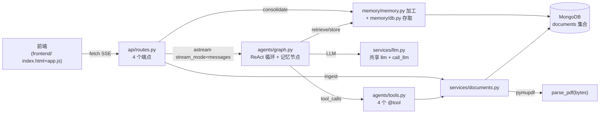

# Repository Guidelines

教学项目 **Agentic Search** —— 论文问答助手：原生 HTML/JS 前端 + FastAPI 后端（LangGraph ReAct agent + LangChain tool calling）+ pymupdf PDF 解析 + MongoDB + TMT 记忆。

> 这是个**教学项目**：`任务文档/` 下的中文文档（00→01→02→03→04）是设计意图的源头。改代码前，先确认它和对应模块文档是否一致——文档与代码有意保持同步。**四个模块（文档工具 / LangGraph Agent / HTML 前端 / TMT 记忆）代码均已落地**（`tests/test_memory.py` 属 04 第 6 步待写）。模块 4 定义**三层 TMT 记忆**（L1 事实 / L2 会话摘要 / L5 用户画像，L3/L4 因与 L2 同构被省略）：注入策略是配额制（L5 全局一条 + 本会话 L1/L2 ≤20 条），叙事以 oh-my-pi（omp）为标杆、TiMeM 论文为参考，**零向量依赖**（无 embedding/向量库）。

## 架构与数据流



核心是一个 **ReAct 循环 + 记忆节点**（`agents/graph.py` 的 `build_graph()`）：`StateGraph(MemoryState)` 四个节点——`retrieve_memory`（进循环前，按配额取记忆注入）→ `llm_call`（LLM 绑 4 个工具，每轮前置 persona SystemMessage，外包 `@retry(max_attempts=3)`）⇄ `tool_node`（`ToolNode`）→ `store_memory`（提取 L1 落库 + L2 阈值自动触发）→ `END`。条件边 `should_continue` 检查最后一条消息：有 `tool_calls` → 路由到 `tool_node`，否则 → `"store_memory"`，形成「调工具→喂回 LLM→再调」的循环，直到 LLM 给出纯文本回答。

数据流：(1) 提问 = `query` 端点 → `graph.astream(...)` → SSE 流式回；(2) 上传 = `ingest` 端点 → `parse_pdf(bytes)` → `store_doc` 入库；(3) agent 自主调工具读论文（`list_papers`/`read_paper`/`search_paper`/`extract_abstract`）；(4) 记忆 = `retrieve_memory` 进循环前注入 / `store_memory` 循环后提取 L1 并按阈值自动触发 L2 整合；(5) 整合 = `consolidate` 端点按 `level` 分流 L2/L5。

## 关键目录

```
任务文档/          教学文档（00-04 + 概念速查 + 项目概览），设计意图的源头；不是代码
backend/           uv 项目（src layout），全部后端代码
  src/agentic_search/
    api/           routes.py(4端点全转正) · schemas.py(Pydantic 模型)
    agents/        graph.py(ReAct图+记忆节点) · tools.py(4个@tool)
    services/      documents.py(parse_pdf + Mongo CRUD) · llm.py(共享 LLM 单例)
    configs/       config.py(pydantic-settings 单例) · prompts.py+prompts.yaml(PROMPTS 单例)
    memory/        db.py(Memory+存取+阈值) · memory.py(三加工函数，纯进出)
  tests/           3 个测试文件（test_memory.py 待写，04 第 6 步）
docs/superpowers/  specs/ + plans/ —— 设计重构记录
.superpowers/sdd/  subagent-driven development 产物
frontend/          index.html + app.js（原生 HTML/JS，零构建）
```

## 开发命令

所有命令从 **`backend/` 目录**运行（`uv run` 依赖该目录的 venv 与 `.env`）：

```bash
cd backend
uv sync                              # 安装依赖（首次 / 拉取后）
uv run uvicorn agentic_search.main:app --reload --port 8000   # 启动后端
uv run pytest -v                     # 全部测试
uv run pytest tests/test_api.py -v   # 单文件
uv run ruff check src tests          # lint（默认规则，无 ruff.toml）
uv run ruff format src tests         # 格式化
```

**API 验证方式**：在 PowerShell 里用 curl 有三个叠加的坑（`curl` 是别名、续行符不同、JSON+中文编码冲突）。一律用 `uv run python -c '...'` + httpx：

```bash
# GET
uv run python -c 'import httpx; print(httpx.get("http://localhost:8000/api/documents").json())'

# 流式 SSE（timeout=60，agent 多轮调工具默认 5 秒不够）
uv run python -c '
import httpx
with httpx.stream("POST", "http://localhost:8000/api/query", json={"question":"你好"}, timeout=60) as r:
    for line in r.iter_lines():
        if line: print(line)
'
```

## 代码约定与常见模式

- **包管理 = uv**（不是 pip/poetry）。`uv.lock` 已提交。Python `>=3.12`（`.python-version` 钉 3.12）。
- **src layout**：包根 `backend/src/agentic_search/`，import 写 `from agentic_search.xxx import yyy`。
- **配置单例**：`configs/config.py` 的 `settings = Settings()` 模块级单例，pydantic-settings v2，无 env 前缀（字段 `foo` ↔ env `FOO`）。所有 LLM/Mongo 参数只从这里读。
- **数据契约**：全局用 `doc_id` / `filename`（不是 `id` / `name` / `title`）。
- **Mongo 在 import 时初始化**：`services/documents.py` 模块级 `MongoClient(settings.mongo_url)`，集合 `agentic_search.documents`。文档结构 `{doc_id, filename, text, uploaded_at}`。
- **分层架构**：`services/documents.py`（service 层）= 所有 MongoDB 访问 + 文档操作（`parse_pdf`/`store_doc`/`list_docs`/`_get_doc` 私有/`read_lines`/`search_doc`/`get_abstract`）；`agents/tools.py`（agent 层）= 薄 `@tool` 委托，零 MongoDB 访问、零 `_documents_collection`/`_get_doc` 引用。4 个工具（`list_papers`/`read_paper`/`search_paper`/`extract_abstract`）只调 service 函数。
- **记忆层双文件（模块 4 已实现）**：`memory/memory.py`（记忆加工，纯进出零 Mongo）= `extract_l1`(每轮自动)/`consolidate_l2`/`consolidate_profile`(按钮触发)；`memory/db.py`（数据库操作，零 LLM）= Memory dataclass + `_client`/`_db`/私有 `_memories_collection`（对齐 `_documents_collection` 规范）+ `save_memory`/`load_memories`(sort/limit)/`upsert_l2`/`upsert_profile`(幂等，返回 `_id`)/`get_memories_for_context`(配额注入，limit=2×L2_TRIGGER_THRESHOLD 联动)/`L2_TRIGGER_THRESHOLD=10`。依赖严格单向 `memory.py → db.py`（memory.py 只 import Memory）；routes 与图节点两者都调。L2 触发 = store_memory 节点内联阈值判定（timestamp 对比）+ 端点按钮兜底。Memory 四字段 `{level, content, timestamp, session_id}`，L5 `session_id=None`（幂等键 `level="L5"`）；L2 幂等键 `{session_id, level}`。零向量依赖。
- **记忆端点契约（模块 4 已实现）**：L2/L5 共用 `POST /api/consolidate`（端点总数保持 4 个），请求体 `ConsolidateRequest{session_id, level="L2" 缺省}`，响应 `ConsolidateResponse{status, l2_id="", profile_id=""}`——纯增量扩展，端点零 Mongo 集合引用（加工调 memory.py、写入调 db.py）。图节点名 `retrieve_memory`（进入循环前，调 get_memories_for_context）与 `store_memory`（循环后，extract_l1 + L2 阈值自动触发内联），对齐 02 文档前向引用；`MemoryState(MessagesState)` 加 `session_id: str`；`QueryRequest` 加 `session_id: str = "default"`。
- **LLM 客户端共享（模块 4 已实现）**：`services/llm.py` 模块级单例——`llm`（`init_chat_model` 原始实例，供 `build_graph()` 内 `bind_tools`）与 `call_llm(prompt)`（裸调用，供记忆层）。`graph.py` 与 `memory/memory.py` 共用（`db.py` 零 LLM 依赖），`bind_tools` 留在 `build_graph()` 内（工具绑定是图特有的）。消费方解析用 `json.loads`（吃字符串）。
- **prompt 集中管理（模块 4 已实现）**：全部 LLM 话术在 `configs/prompts.yaml`（四键：persona / l1_extract / l2_consolidate / l5_profile），`configs/prompts.py` 模块级 `PROMPTS` 单例加载。三个记忆 prompt 主体移植自 TiMeM 官方 `config/datasets/default/prompts.yaml`（本地化：中文/单人/L1 输出 JSON 数组）；JSON 严格输出与空数组约定取自 omp stage-one；原位更新去重同 omp 整合层与 hermes memory 工具。占位符走 `str.format` 约定（字面大括号双写 `{{`）。persona 由模块 4 引入：`llm_call` 每轮前置 `SystemMessage(content=PROMPTS["persona"])`（存于调用不入 state）。`retrieve_memory` 的记忆格式化留在代码（消息拼装，归代码）。依赖 `pyyaml` 转正为直接依赖。
- **SSE 流式契约**（`api/routes.py` query 端点）：用 `fastapi.sse` 的 `EventSourceResponse` + `ServerSentEvent`（`response_class=EventSourceResponse`，路由本身是异步生成器，`yield ServerSentEvent(...)`）。文字片段 `ServerSentEvent(data=chunk.content)` → wire `data: "\u4f60\u597d"`（`data=` 总做 JSON 序列化，中文 ASCII 转义）；工具调用 `ServerSentEvent(event="tool", data={"name": 工具名})` → wire `event: tool\ndata: {"name": "search_paper"}`（结构化 JSON 对象，对齐 Vercel/OpenAI/LangChain 惯例，**不是**裸字符串）。`except Exception` 是流错误边界（`# noqa: BLE001` 有意宽 catch，防连接静默死）。消费端对任意 `data:` 行 `JSON.parse`（文字得字符串、工具得对象取 `.name`）。
- **PDF 解析**：`parse_pdf(pdf_bytes: bytes) -> str`，`pymupdf.open(stream=, filetype="pdf")`。`str(page.get_text("text"))` 的外层 `str()` 是 Pylance 绕过（pymupdf 无类型 stub，返回是多态联合类型）——不是多余，别删。
- **FastAPI 端点**：`UploadFile` 裸写（不用 `File(...)`，FastAPI 自动检测）；`if not file.filename: raise HTTPException(422)` 防御让 Pylance 把下游 `str|None` 收窄成 `str`。
- **异步**：路由是 `async def`，agent 流用 `graph.astream`（async generator）。测试**全同步**（无 pytest-asyncio）。
- **文档政策**：教学文档里只写「为什么这样」，禁用「不使用 XXX」的否定措辞。

## 重要文件

| 文件 | 作用 |
|------|------|
| `backend/src/agentic_search/main.py` | 入口：FastAPI app + CORSMiddleware(`allow_origins=["*"]`) + `include_router` |
| `backend/src/agentic_search/api/routes.py` | 4 端点：`POST /api/query`(SSE) · `POST /api/ingest` · `GET /api/documents` · `POST /api/consolidate`(level 分流 L2/L5，幂等 upsert) |
| `backend/src/agentic_search/agents/graph.py` | `build_graph()` 构建 ReAct 图 |
| `backend/src/agentic_search/agents/tools.py` | 4 个 `@tool`（薄委托）：`list_papers`·`read_paper(doc_id,start_line=1,end_line=50)`·`search_paper(pattern,doc_id)`·`extract_abstract(doc_id)` |
| `backend/src/agentic_search/services/documents.py` | `parse_pdf`·`store_doc`·`list_docs`·`_get_doc`(私有)·`read_lines`·`search_doc`·`get_abstract` |
| `backend/src/agentic_search/services/llm.py` | 共享 LLM 单例：`llm`（供 bind_tools）+ `call_llm`（裸调用，供记忆层） |
| `backend/src/agentic_search/configs/config.py` | `Settings` 单例（7 字段） |
| `backend/src/agentic_search/configs/prompts.py`+`prompts.yaml` | PROMPTS 单例，四键 persona/l1_extract/l2_consolidate/l5_profile |
| `backend/src/agentic_search/memory/db.py` | Memory dataclass + `_memories_collection` + save/load_memories + upsert_l2/upsert_profile + get_memories_for_context + L2_TRIGGER_THRESHOLD=10 |
| `backend/src/agentic_search/memory/memory.py` | extract_l1/consolidate_l2/consolidate_profile（纯进出零 Mongo，只 import Memory） |
| `backend/.env` / `.env.example` | 环境变量（⚠️ 见下注意） |
| `任务文档/0X-*.md` | 各模块教学文档（设计源头） |
| `任务文档/04-TMT记忆系统.md` | 模块 4 定稿设计：三层 TMT 记忆（L1/L2/L5）、memory.py/db.py 双文件函数签名、prompts.yaml、L2 阈值自动触发、`/api/consolidate` level 分流契约、前端三按钮、测试清单 |
| `frontend/app.js`+`index.html` | 原生前端：SSE 流式渲染 + 会话管理 + 三按钮（新会话/整合 L2/整合 L5） |

## 运行时与工具链

- **运行时**：Python `>=3.12`，必须从 `backend/` 目录跑 `uv` 命令。
- **包管理器**：uv（`uv_build` 构建后端，非 hatchling/setuptools）。
- **MongoDB**：**本地必须运行 `mongod`**（默认 `localhost:27017`）。仓库无 Docker/compose——不提供容器化数据库。
- **LLM**：小米 MiMo `mimo-v2.5`，经 OpenAI 兼容端点（`https://token-plan-cn.xiaomimimo.com/v1`），需在 `backend/.env` 设 `LLM_API_KEY`。
- **无 Node/Bun**：前端是原生 HTML/JS，零构建。

## ⚠️ 已知陷阱（改代码前必读）

1. **环境变量双消费路径**：字段权威来源是 `config.py` 的 `Settings`（pydantic-settings 按名匹配：字段 `foo` ↔ env `FOO`）；`LANGSMITH_*` 三键由 LangSmith SDK 经 `os.environ` 消费——`main.py` 顶部的 `load_dotenv()` 桥接这条路径（`Settings` 不写 `os.environ`），须保持在 langchain import 链之前。
2. **FastAPI 0.141.1 惰性路由**：`include_router` 不再把端点展开进 `app.routes`（只塞一个 `_IncludedRouter` 包装）。`app.routes` 看不到你的 `/api/*`，但端点运行时正常。**验证路由用 `TestClient` 打实请求，别内省 `app.routes`。**
3. **`.env` 不在 git 跟踪**：已从索引移除（`git rm --cached`），`.gitignore` 已加 `backend/.env`。本地文件保留含 `LLM_API_KEY`，但新 clone 不会有。
4. **SSE 流内错误 + HTTP 200**：`/api/query` 的响应头发出后，图执行中的异常被 `except Exception` 错误边界转成 `ServerSentEvent(data=f"[错误：{e}]")` 事件——后端日志 200、前端收到 `[错误：'xxx']`。诊断看错误事件文本（`str(KeyError('x'))` 显示为 `'x'`），查图节点读的 state 键是否在 astream 入参里。
5. **条件边路由表与 session_id 三处契约**：①LangGraph `add_conditional_edges` 的路由表必须含 `should_continue` 全部返回值（无工具调用返回 `"store_memory"`，返回 END 而路由表无 `__end__` → `KeyError('__end__')`）；②session_id 三处契约缺一即断：`QueryRequest` 字段（缺省 `"default"`）、astream 入参带键、`MemoryState` 通道声明。

## 测试与 QA

- **框架**：pytest（`>=9.1.1`，与 ruff 一起在主依赖里，无 dev 组）。
- **位置**：`backend/tests/`（注意是 `tests/` 不是 `test/`），3 个文件 8 个测试，全同步。
- **隔离性差**（改测试要知道）：`test_api.py` 用 `TestClient` 但连**真 MongoDB**；`test_graph.py` 打**真 LLM**（需 `LLM_API_KEY`）；`test_documents.py` 连真 Mongo + 读一个**硬编码绝对路径**的本地 PDF（`D:\...\任务文档\TiMem...pdf`）。**这些测试不能在干净 CI 跑通**，依赖外部服务与本机文件。
- **无 fixtures、无 conftest.py、无 mock。**
- **无 pytest 配置**（无 `[tool.pytest.ini_options]`），默认自动发现。
- **lint**：仅 ruff（默认规则，无 `ruff.toml`/`[tool.ruff]`）。**无 mypy、无 pyright、无 pre-commit**（`src/` 下有 `py.typed` 但无工具消费）。
- **未覆盖**：`schemas.py`、`tools.py`、`config.py`、`main.py`(CORS/include_router) 及模块 4 记忆层（`test_memory.py` 属 04 第 6 步待写）。

## 关键依赖

`fastapi>=0.141.1` · `uvicorn[standard]>=0.52.0` · `httpx>=0.28.1` · `langchain>=1.3.14` · `langchain-openai>=1.4.1` · `langgraph>=1.2.10` · `pymongo>=4.17.0` · `pymupdf>=1.28.0` · `pydantic-settings>=2.14.2` · `pytest>=9.1.1` · `pyyaml>=6.0.3` · `ruff>=0.16.1`
