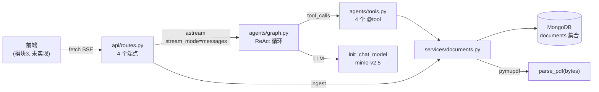

# Repository Guidelines

教学项目：**Agentic Search** —— 一个论文问答助手。原生 HTML/JS 前端 + FastAPI 后端（LangGraph ReAct agent + LangChain tool calling）+ pymupdf PDF 解析 + MongoDB。当前实现到模块 2（agent 后端），模块 3（前端 `frontend/`）与模块 4（TMT 记忆系统 `memory/`）尚未落地。

> 这是个**教学项目**：`任务文档/` 下的中文文档（00→01→02→03→04）是设计意图的源头。改代码前，先确认它和对应模块文档是否一致——文档与代码有意保持同步。

## 架构与数据流



核心是一个 **ReAct 循环**（`agents/graph.py` 的 `build_graph()`）：`StateGraph(MessagesState)` 两个节点——`llm_call`（LLM 绑 4 个工具，外包 `@retry(max_attempts=3)`）与 `tool_node`（`ToolNode`）。条件边 `should_continue` 检查最后一条消息：有 `tool_calls` → 路由到 `tool_node`，否则 → `END`。`tool_node` 总是回到 `llm_call`，形成「调工具→喂回 LLM→再调」的循环，直到 LLM 给出纯文本回答。

数据流：(1) 提问 = `query` 端点 → `graph.astream(...)` → SSE 流式回；(2) 上传 = `ingest` 端点 → `parse_pdf(bytes)` → `store_doc` 入库；(3) agent 自主调工具读论文（`list_papers`/`read_paper`/`search_paper`/`extract_abstract`）。

## 关键目录

```
任务文档/          教学文档（00-04 + 概念速查 + 项目概览），设计意图的源头；不是代码
backend/           uv 项目（src layout），全部后端代码
  src/agentic_search/
    api/           routes.py(4端点) · schemas.py(Pydantic 模型)
    agents/        graph.py(ReAct图) · tools.py(4个@tool)
    services/      documents.py(parse_pdf + Mongo CRUD)
    configs/       config.py(pydantic-settings 单例)
    memory/        空占位包（模块4 TMT 记忆系统，未实现）
  tests/           3 个测试文件（见下）
docs/superpowers/  specs/ + plans/ —— 7 份设计重构记录（pymupdf迁移/ReAct重设计/去预处理/SSE实时流/SSE改ServerSentEvent/bytes流/SwaggerUI步骤）
.superpowers/sdd/  subagent-driven development 产物
frontend/          不存在（模块 3 目标产物 index.html + app.js）
```

## 开发命令

所有命令从 **`backend/` 目录**运行（`uv run` 依赖该目录的 venv 与 `.env`）：

```bash
cd backend
uv sync                              # 安装依赖（首次 / 拉取后）
uv run uvicorn agentic_search.main:app --reload --port 8000   # 启动后端
uv run pytest -v                     # 全部测试
uv run pytest tests/test_api.py -v   # 单文件
uv run ruff check src tests          # lint（默认规则，无 ruff.toml）
uv run ruff format src tests         # 格式化
```

**API 验证方式**：在 PowerShell 里用 curl 有三个叠加的坑（`curl` 是别名、续行符不同、JSON+中文编码冲突）。一律用 `uv run python -c '...'` + httpx：

```bash
# GET
uv run python -c 'import httpx; print(httpx.get("http://localhost:8000/api/documents").json())'

# 流式 SSE（timeout=60，agent 多轮调工具默认 5 秒不够）
uv run python -c '
import httpx
with httpx.stream("POST", "http://localhost:8000/api/query", json={"question":"你好"}, timeout=60) as r:
    for line in r.iter_lines():
        if line: print(line)
'
```

## 代码约定与常见模式

- **包管理 = uv**（不是 pip/poetry）。`uv.lock` 已提交。Python `>=3.12`（`.python-version` 钉 3.12）。
- **src layout**：包根 `backend/src/agentic_search/`，import 写 `from agentic_search.xxx import yyy`。
- **配置单例**：`configs/config.py` 的 `settings = Settings()` 模块级单例，pydantic-settings v2，无 env 前缀（字段 `foo` ↔ env `FOO`）。所有 LLM/Mongo 参数只从这里读。
- **数据契约**：全局用 `doc_id` / `filename`（不是 `id` / `name` / `title`）。
- **Mongo 在 import 时初始化**：`services/documents.py` 模块级 `MongoClient(settings.mongo_url)`，集合 `agentic_search.documents`。文档结构 `{doc_id, filename, text, uploaded_at}`。
- **分层架构**：`services/documents.py`（service 层）= 所有 MongoDB 访问 + 文档操作（`parse_pdf`/`store_doc`/`list_docs`/`_get_doc` 私有/`read_lines`/`search_doc`/`get_abstract`）；`agents/tools.py`（agent 层）= 薄 `@tool` 委托，零 MongoDB 访问、零 `_documents_collection`/`_get_doc` 引用。4 个工具（`list_papers`/`read_paper`/`search_paper`/`extract_abstract`）只调 service 函数。
- **SSE 流式契约**（`api/routes.py` query 端点）：用 `fastapi.sse` 的 `EventSourceResponse` + `ServerSentEvent`（`response_class=EventSourceResponse`，路由本身是异步生成器，`yield ServerSentEvent(...)`）。文字片段 `ServerSentEvent(data=chunk.content)` → wire `data: "\u4f60\u597d"`（`data=` 总做 JSON 序列化，中文 ASCII 转义）；工具调用 `ServerSentEvent(event="tool", data={"name": 工具名})` → wire `event: tool\ndata: {"name": "search_paper"}`（结构化 JSON 对象，对齐 Vercel/OpenAI/LangChain 惯例，**不是**裸字符串）。`except Exception` 是流错误边界（`# noqa: BLE001` 有意宽 catch，防连接静默死）。消费端对任意 `data:` 行 `JSON.parse`（文字得字符串、工具得对象取 `.name`）。
- **PDF 解析**：`parse_pdf(pdf_bytes: bytes) -> str`，`pymupdf.open(stream=, filetype="pdf")`。`str(page.get_text("text"))` 的外层 `str()` 是 Pylance 绕过（pymupdf 无类型 stub，返回是多态联合类型）——不是多余，别删。
- **FastAPI 端点**：`UploadFile` 裸写（不用 `File(...)`，FastAPI 自动检测）；`if not file.filename: raise HTTPException(422)` 防御让 Pylance 把下游 `str|None` 收窄成 `str`。
- **异步**：路由是 `async def`，agent 流用 `graph.astream`（async generator）。测试**全同步**（无 pytest-asyncio）。
- **文档政策**：教学文档里只写「为什么这样」，禁用「不使用 XXX」的否定措辞。

## 重要文件

| 文件 | 作用 |
|------|------|
| `backend/src/agentic_search/main.py` | 入口：FastAPI app + CORSMiddleware(`allow_origins=["*"]`) + `include_router` |
| `backend/src/agentic_search/api/routes.py` | 4 端点：`POST /api/query`(SSE) · `POST /api/ingest` · `GET /api/documents` · `POST /api/consolidate`(占位返回 `pending`) |
| `backend/src/agentic_search/agents/graph.py` | `build_graph()` 构建 ReAct 图 |
| `backend/src/agentic_search/agents/tools.py` | 4 个 `@tool`（薄委托）：`list_papers`·`read_paper(doc_id,start_line=1,end_line=50)`·`search_paper(pattern,doc_id)`·`extract_abstract(doc_id)` |
| `backend/src/agentic_search/services/documents.py` | `parse_pdf`·`store_doc`·`list_docs`·`_get_doc`(私有)·`read_lines`·`search_doc`·`get_abstract` |
| `backend/src/agentic_search/configs/config.py` | `Settings` 单例（7 字段） |
| `backend/.env` / `.env.example` | 环境变量（⚠️ 见下注意） |
| `任务文档/0X-*.md` | 各模块教学文档（设计源头） |

## 运行时与工具链

- **运行时**：Python `>=3.12`，必须从 `backend/` 目录跑 `uv` 命令。
- **包管理器**：uv（`uv_build` 构建后端，非 hatchling/setuptools）。
- **MongoDB**：**本地必须运行 `mongod`**（默认 `localhost:27017`）。仓库无 Docker/compose——不提供容器化数据库。
- **LLM**：小米 MiMo `mimo-v2.5`，经 OpenAI 兼容端点（`https://token-plan-cn.xiaomimimo.com/v1`），需在 `backend/.env` 设 `LLM_API_KEY`。
- **无 Node/Bun**：前端是原生 HTML/JS，零构建。

## ⚠️ 已知陷阱（改代码前必读）

1. **`.env.example` 与 `config.py` 不一致**（待修）：`.env.example` 用 `MONGO_URI`，但 Settings 字段是 **`mongo_url`**（env `MONGO_URL`）——pydantic-settings 按名匹配，`MONGO_URI` **不会**填充该字段（只是默认值恰好也是 localhost:27017 才侥幸能用）。`.env.example` 还有 `INTENT_TIMEOUT`/`ANSWER_TIMEOUT` 两个不存在的字段（已废弃），且缺 `LLM_TIMEOUT`。**字段权威来源是 `config.py`，不是 `.env.example`。**
2. **FastAPI 0.141.1 惰性路由**：`include_router` 不再把端点展开进 `app.routes`（只塞一个 `_IncludedRouter` 包装）。`app.routes` 看不到你的 `/api/*`，但端点运行时正常。**验证路由用 `TestClient` 打实请求，别内省 `app.routes`。**
3. **`.env` 不在 git 跟踪**：已从索引移除（`git rm --cached`），`.gitignore` 已加 `backend/.env`。本地文件保留含 `LLM_API_KEY`，但新 clone 不会有。
4. **`memory/` 是空包**：模块 4 未实现，图当前无持久记忆/checkpointer（只有 LangGraph 临时 `MessagesState`）。
5. **`/api/consolidate` 是占位**：返回 `status="pending"`，模块 4 才补真整合逻辑（届时改为 `status="ok"`）。

## 测试与 QA

- **框架**：pytest（`>=9.1.1`，与 ruff 一起在主依赖里，无 dev 组）。
- **位置**：`backend/tests/`（注意是 `tests/` 不是 `test/`），3 个文件 10 个测试，全同步。
- **隔离性差**（改测试要知道）：`test_api.py` 用 `TestClient` 但连**真 MongoDB**；`test_graph.py` 打**真 LLM**（需 `LLM_API_KEY`）；`test_documents.py` 连真 Mongo + 读一个**硬编码绝对路径**的本地 PDF（`D:\...\任务文档\TiMem...pdf`）。**这些测试不能在干净 CI 跑通**，依赖外部服务与本机文件。
- **无 fixtures、无 conftest.py、无 mock。**
- **无 pytest 配置**（无 `[tool.pytest.ini_options]`），默认自动发现。
- **lint**：仅 ruff（默认规则，无 `ruff.toml`/`[tool.ruff]`）。**无 mypy、无 pyright、无 pre-commit**（`src/` 下有 `py.typed` 但无工具消费）。
- **未覆盖**：`schemas.py`、`tools.py`、`config.py`、`main.py`(CORS/include_router) 无独立测试。

## 关键依赖

`fastapi>=0.141.1` · `uvicorn[standard]>=0.52.0` · `httpx>=0.28.1` · `langchain>=1.3.14` · `langchain-openai>=1.4.1` · `langgraph>=1.2.10` · `pymongo>=4.17.0` · `pymupdf>=1.28.0` · `pydantic-settings>=2.14.2` · `pytest>=9.1.1` · `ruff>=0.16.1`
