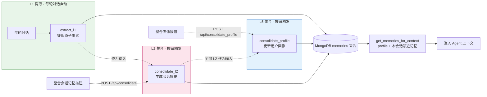

# 模块 4 教学文档重写（TMT 三层记忆）实施计划

> **For agentic workers:** REQUIRED SUB-SKILL: Use superpowers:subagent-driven-development (recommended) or superpowers:executing-plans to implement this plan task-by-task. Steps use checkbox (`- [ ]`) syntax for tracking.

**Goal:** 重写 `任务文档/04-TMT记忆系统.md` 为三层记忆（L1 segment / L2 session / L5 profile）教学文档。

**Architecture:** 以 `任务文档/模块4优化版.md`（草稿，保持不动）为素材，按 spec（`docs/superpowers/specs/2026-08-15-04-tmt-three-layer-memory-design.md`）的大纲重写 04。L1/L2 部分大量沿用草稿，L5 为全新内容，注入策略改为“profile + 本会话 L1/L2”。

**Tech Stack:** Markdown + mermaid + Python 代码块（教学示例，非实现）。TiMeM 源码引用来自本地仓库 `D:\Hermes\Capybara Workspace\Research\Works\Agentic Search计划\TiMEM`。

## Global Constraints

- 只改 `任务文档/04-TMT记忆系统.md` 一个文件；`任务文档/模块4优化版.md` 保持原样。
- 措辞政策：只写“为什么这样、如何用”，全文禁用“不使用 XXX / 不采用 XXX”式否定措辞。
- 数据契约：`doc_id`/`filename`（文档侧）、`session_id`、`level ∈ {"L1","L2","L5"}`；L5 的 `session_id=None`；不加 `user_id` 字段。
- 教学示例代码必须与 spec §2/§3 的签名逐字一致。
- TiMeM 源码引用必须真实可定位（spec“TiMeM 源码事实”表中的文件+行号）。
- 每个 Task 结束 commit，消息前缀 `docs(04):`。

---

### Task 1: 文档骨架——标题、学习目标、模块结构图、核心思路

**Files:**
- Modify: `任务文档/04-TMT记忆系统.md`（整文件重写，从空文件开始）

**Interfaces:**
- Consumes: spec §1（架构与数据流）、§5 大纲第 1-3 节；草稿的“L2 触发机制说明”表。
- Produces: 文档前半部分（到“核心思路”节结束），后续任务在其后追加。

- [ ] **Step 1: 写标题与版本说明**

```markdown
# 模块 4：TMT 三层记忆系统（segment / session / profile）

> 前置模块：[模块 2：LangGraph Agent](./02-LangGraph-Agent.md)、[模块 3：HTML 前端](./03-HTML前端.md)
> 本模块在 TiMem 论文五级 TMT（Segments → Sessions → Daily → Weekly → Profile）中选取
> 三级实现：L1 segment、L2 session、L5 profile。L3/L4 的整合逻辑与 L2 同构
> （下一级摘要 → 更高层摘要），选取首尾三层即可覆盖“细节→会话→画像”的完整链路。
```

- [ ] **Step 2: 写学习目标（6 条）**

```markdown
## 学习目标

1. 理解 TMT（时序记忆树）的核心思想——从对话中提取原子事实，按会话压缩为摘要，再跨会话提炼为用户画像
2. 用 Python + LLM + MongoDB 从零实现 **L1 事实提取**（每轮对话后自动触发）、**L2 会话摘要**与 **L5 用户画像**（均手动触发）
3. 理解整合的**两种触发机制**：TiMem 生产实现的空闲超时扫描与本教学项目的手动按钮触发
4. 在 LangGraph 图中集成 `get_memories` 与 `store_memory` 节点：本会话记忆直接注入，跨会话记忆由 profile 承担
5. 实现 `POST /api/consolidate` 与 `POST /api/consolidate_profile` 端点与前端按钮，手动、即时地触发两级整合并保证幂等
6. 理解“直接注入历史”（方案 A）与“检索注入”（方案 B）的取舍，以及提取时对比历史窗口（recent_l1）从源头减少重复
```

- [ ] **Step 3: 写模块结构 mermaid**

```markdown
## 模块结构


```

- [ ] **Step 4: 写“核心思路”节（五层→三层映射 + 源码证据 + 注入策略 + 触发对比）**

内容四块，逐块写：

(a) **TMT 五层 → 教学三层映射表**：

```markdown
## 核心思路

TiMem 论文（ACL 2026 Findings, arXiv:2601.02845）提出 TMT（Temporal Memory Tree）五级时序分层记忆。本模块实现其中三级：

| 论文层级 | 内容 | 本模块 | 触发 |
|---|---|---|---|
| L1 Segment | 对话片段的原子事实 | ✅ 每轮对话提取 | 每轮自动 |
| L2 Session | 会话主题摘要 | ✅ 会话全部 L1 → 1 条 | 按钮手动 |
| L3 Daily | 每日模式提炼 | 参考概念 | — |
| L4 Weekly | 每周趋势 | 参考概念 | — |
| L5 Profile | 稳定用户画像 | ✅ 全部 L2 + 旧画像 → 1 条 | 按钮手动 |

存储采用 MongoDB（`agentic_search` 数据库的 `memories` 集合），PyMongo 同步驱动。
```

(b) **砍 L3/L4 的源码证据表**（照抄 spec“TiMeM 源码事实”表的 L5 行与结论段，措辞改肯定式）：

```markdown
### 为什么 L2 可以直接喂 L5（源码证据）

TiMem 的 L5 整合只消费下一层的 `content` 字符串与最近 3 条历史 L5，对下层是 Daily 还是 Weekly 并无结构依赖——
`workflows/nodes/unified_processors.py:810` 在缺少 L4 时会回退用 L3 生成 L5，说明“给一批摘要文本 + 历史画像”
就是 L5 的全部输入约定。因此教学版让 L2 直接作为 L5 的输入，机制上与生产实现同构。

代价：TiMem 原本在 L3/L4 prompt 里完成的“画像分类提炼”（L3 四类：关键事件 / 态度与偏好 / 决策过程 / 情绪变化，
见 `config/prompts.yaml:55-60`）失去载体。教学版用两项补偿：L1 提取带 6 类范围指引（见第 2 步），
L5 整合 prompt 带画像维度指引（见 2.3）。

> ⚠️ 阅读 TiMem 源码时注意：生产链路在 `timem/workflows/` 与 `services/session_memory_scanner.py`；
> `timem/memory/l1~l5_*.py` 是早期带 MockLLM 的实验 stub，仅作历史参考。
```

(c) **记忆注入策略**（草稿“记忆注入策略说明”表的改写，方案 A 语义扩为“profile + 本会话最近 N 条”）：

```markdown
### 记忆注入策略（方案 A：直接注入）

| 维度 | 方案 A（本模块采用） | 方案 B（检索注入） |
|------|-------------------|------------------------|
| 原理 | profile（全局 1 条）+ 本会话最近 N 条记忆注入 | 按相关性评分，只注入相关的 |
| 优点 | 简单、零评分噪声、LLM 看到完整背景 | 上下文可控 |
| 缺点 | 记忆多了上下文膨胀 | 评分逻辑有误判风险 |
| 适用 | 记忆量少（教学 Demo） | 记忆量多（长期真实使用） |

**跨会话记忆由 profile 承担**：`get_memories_for_context(session_id)` 只取两类记忆——
全局唯一的 L5 画像 + 该会话的 L1/L2（时间倒序，≤20 条）。开新会话时，Agent 带着画像记忆一切重点，
旧会话的 L1/L2 留在库中作为下次整合画像的素材。将来记忆量级上来（>50 条），
把 `get_memories_for_context` 的函数体换成检索实现即可，图编排不用动——函数名就是为切换预留的接口。
```

(d) **触发机制对比表**（照抄草稿“L2 触发机制说明”表，加一行 L5）：

```markdown
### 整合触发机制

| 维度 | TiMem 生产实现 | 本教学项目 |
|------|---------------|-----------|
| L2 触发器 | `SessionMemoryScanner` 每 10 分钟扫描，会话 idle ≥10 分钟视为结束 | 前端「整合会话记忆」按钮 |
| L5 触发器 | 跨月检测自动回填（`core/catchup_detector.py`） | 前端「整合画像」按钮 |
| 实现位置 | `services/session_memory_scanner.py`、`timem/workflows/` | `api/routes.py` 两个端点 |
| 目的 | 生产自动化 | 教学即时可观察 |

> 💡 **幂等性**：同一会话最多一条 L2（按 `session_id` 定位，有则更新）；全局最多一条 L5（按 `level` 定位，有则更新）。重复点击按钮只会增量更新。
```

- [ ] **Step 5: 验证**

Run: `grep -n "不使用\|不采用\|不用 " "任务文档/04-TMT记忆系统.md"`
Expected: 无输出（否定措辞零命中）。
Run: `grep -c "L5" "任务文档/04-TMT记忆系统.md"`
Expected: ≥6（L5 贯穿标题/目标/图/思路）。

- [ ] **Step 6: Commit**

```bash
git add "任务文档/04-TMT记忆系统.md"
git commit -m "docs(04): 重写骨架——三层学习目标/结构图/核心思路（含砍层源码证据）"
```

---

### Task 2: 第 1 步（TMT 思想）+ 第 2 步前半（Memory dataclass、extract_l1）

**Files:**
- Modify: `任务文档/04-TMT记忆系统.md`（追加）

**Interfaces:**
- Consumes: 草稿 §“第 1 步”与 §2.1/§2.2 全文（L1 部分与三层设计兼容，沿用）。
- Produces: `Memory` 四字段定义与 `extract_l1(dialogue, session_id, recent_l1)` 签名（Task 3/4 的代码引用它）。

- [ ] **Step 1: 追加“第 1 步：理解 TMT 思想”**

照抄草稿 §“第 1 步”（1.1 论文阅读引导三条 📖 引用 + 1.2 核心概念），仅改 1.2 第一条对比为三层表述：

```markdown
- **L1、L2、L5 的区别**：L1 是原子事实（如「用户在研究注意力机制」），L2 是会话级摘要（如「本次会话讨论了 Transformer 架构」），L5 是跨会话的稳定画像（如「用户是关注注意力机制的 NLP 研究者」）。
```

- [ ] **Step 2: 追加 §2 开头与 2.1 Memory dataclass**

```markdown
## 第 2 步：实现 `memory/store.py`

在 `backend/src/agentic_search/memory/` 下创建 `store.py`，通过包化 import 暴露：
`from agentic_search.memory.store import extract_l1, consolidate_l2, consolidate_profile, get_memories_for_context, save_memory, load_memories`。

### 2.1 数据结构：Memory dataclass

```python
# 教学示例：展示核心字段，非完整实现
from dataclasses import dataclass, asdict

@dataclass
class Memory:
    level: str          # "L1"、"L2" 或 "L5"，标识记忆层级
    content: str        # 记忆的实际内容（L1 一条事实，L2 一段摘要，L5 一段画像）
    timestamp: str      # ISO 8601 时间戳，记录记忆生成时刻
    session_id: str     # 所属会话 ID；L5 为 None——画像属于用户而非任何一次会话
```

**字段含义逐项讲解：**
- `level`：决定该条记忆在 TMT 树中的层级。跳号保留 L1/L2/L5：L3/L4 被省略这件事本身就是一个可讨论的设计决策（见“核心思路”的源码证据）。
- `session_id`：L2 幂等的键——整合时按 `session_id + level` 查询是否已存在 L2，有则更新、无则新建。L5 的 `session_id=None` 表达“画像不属于任何会话”，幂等键只用 `level="L5"`。
- `asdict()`：dataclass 自带的字典转换方法，`save_memory` 用它把对象转为 MongoDB document。

**`@dataclass` 也是装饰器**：它和模块 2 的 `@retry` 是同一种机制——接收 `Memory` 类，返回自动生成 `__init__`/`__repr__` 的「增强版」类。

**验证：** 创建 `Memory` 实例（含 `session_id=None` 的 L5），确认字段可赋值、`asdict()` 输出符合预期。
```

- [ ] **Step 3: 追加 2.2 extract_l1（沿用草稿全文 + 三处微调）**

以草稿 §2.2 为底本原样搬入（含 6 类提取范围、prompt、代码、逐段讲解、验证），微调三处：
1. 逐段讲解的“范围扩展（本版新增）”段末尾追加一句：

```markdown
  这一 6 类范围是教学版对 TiMem 的有意偏离：TiMem 的 L1 prompt（`config/prompts.yaml:3-28`）本身无分类体系，分类提炼发生在 L3（四类，`prompts.yaml:55-60`）。省略 L3/L4 后，画像分类的素材需要在 L1 就带方向性，L5 整合才能产出有结构的画像。
```

2. “逐段讲解”的 `recent_l1` 段末尾追加一句：

```markdown
  去重依赖 LLM 遵守“跳过已有记忆”的指令，属于软约束而非硬保证——TiMem 生产实现同样只靠 prompt 指令（“Do not repeat any content from historical memories”，`prompts.yaml:8,14`），零算法去重。

3. “逐段讲解”末尾新增 segment 单位说明段：

```markdown
- **segment 单位**：本模块以一轮对话（user + assistant 各一条）为一个 L1 提取单位；TiMem 生产实现是固定 2 轮对话对（`config/settings.yaml:258` `fragment_size: 2`，`utils/dataset_parser.py:117` 按奇偶索引配对）。每轮提取粒度更细、事实更原子化，代价是 LLM 调用次数翻倍——教学场景优先可读性。
```

- [ ] **Step 4: 验证**

Run: `grep -n "fragment_size\|prompts.yaml:8,14" "任务文档/04-TMT记忆系统.md"`
Expected: 各 1 处命中（偏离说明落位）。

- [ ] **Step 5: Commit**

```bash
git add "任务文档/04-TMT记忆系统.md"
git commit -m "docs(04): 第1步 TMT 思想 + Memory/extract_l1（含有意偏离说明）"
```

---

### Task 3: 第 2 步后半（consolidate_l2 守卫、consolidate_profile、Mongo CRUD、get_memories_for_context）

**Files:**
- Modify: `任务文档/04-TMT记忆系统.md`（追加）

**Interfaces:**
- Consumes: Task 2 的 `Memory` 与 `extract_l1`；草稿 §2.3/§2.4（沿用）。
- Produces: `consolidate_profile(l2_memories, previous_profile)`、`get_memories_for_context(session_id, limit=20)` 最终签名（Task 4/5/6 引用）。

- [ ] **Step 1: 追加 2.3 consolidate_l2**

以草稿 §2.3 为底本，代码替换为带守卫版本：

```python
# 教学示例：展示核心流程，非完整实现
def consolidate_l2(l1_memories: list[Memory]) -> Memory:
    """将同会话的所有 L1 整合为一条 L2 会话摘要。

    空列表守卫：会话尚无 L1 时直接报错，由调用方（端点）转为 422。
    幂等由调用方（端点）保证：传入前先查是否已有 L2。
    """
    if not l1_memories:
        raise ValueError("该会话没有 L1 记忆，先对话几轮再整合")
    facts = "\n".join(f"- {m.content}" for m in l1_memories)
    prompt = f"""你是记忆整合器。将以下原子事实整合为一段会话摘要。
规则：合并重复、提取主题、保留关键细节，输出 100 字以内的摘要文字。
事实列表：
{facts}"""
    summary = call_llm(prompt)           # 返回一段摘要文字
    return Memory(
        level="L2", content=summary,
        timestamp=now_iso(),
        session_id=l1_memories[0].session_id,  # 继承会话 ID
    )
```

逐段讲解沿用草稿，补一条：

```markdown
- **空列表守卫**：`l1_memories[0]` 在空列表上会抛 IndexError——守卫把它变成语义明确的 ValueError，端点捕获后返回 422，前端提示“先对话几轮”。
```

- [ ] **Step 2: 追加 2.4 consolidate_profile（全新小节）**

```markdown
### 2.4 L5 画像整合：`consolidate_profile(l2_memories, previous_profile)`

将跨会话的全部 L2 摘要整合为一条全局唯一的用户画像。与 `consolidate_l2` 同构——都是“下一级记忆 → 一条高层摘要”——区别在输入范围（跨会话）与幂等键（全局一条）。

```python
# 教学示例：展示核心流程，非完整实现
def consolidate_profile(l2_memories: list[Memory], previous_profile: Memory | None = None) -> Memory:
    """将全部 L2 会话摘要整合为一条 L5 用户画像。

    previous_profile: 现有 L5（首次生成时为 None）。传入旧画像让 LLM 做“合并新信息、
    修正过时信息”的增量更新——对应论文 Historical Memories 的思想：高层整合参考同层
    历史保持连续性（TiMem 中 L5 参考最近 3 条历史 L5，`workflows/nodes/unified_processors.py:873`）。
    """
    if not l2_memories:
        raise ValueError("还没有任何 L2 会话摘要，先整合至少一个会话")
    summaries = "\n".join(f"- {m.content}" for m in l2_memories)
    previous_block = previous_profile.content if previous_profile else "（首次生成，尚无画像）"
    prompt = f"""你是画像整合器。基于会话摘要更新用户画像。
画像维度：身份与背景、偏好与倾向、长期关注话题、关键决策、重要事实。
规则：合并新信息、修正已过时的描述、保留仍然成立的内容，输出 150 字以内的画像文字。
历史画像：
{previous_block}

会话摘要：
{summaries}"""
    profile = call_llm(prompt)
    return Memory(level="L5", content=profile, timestamp=now_iso(), session_id=None)
```

**逐段讲解：**
- **画像维度 5 类**：身份与背景、偏好与倾向、长期关注话题、关键决策、重要事实。这是对 L1 提取 6 类的“画像视角”收拢——L1 负责在源头带方向性地记，L5 负责按维度收拢成稳定画像。省略 L3/L4 后，两级 prompt 的维度指引共同承担了原本 L3/L4 的分类提炼职责。
- **`previous_profile` 增量更新**：旧画像全文进 prompt，LLM 在其基础上合并修正，而非每次从零重写——画像稳定性（论文里“从观察到人格”的渐变）靠这一步保持。
- **`session_id=None`**：画像属于用户全局，幂等键就是 `level="L5"`，全库至多一条。

**验证：** 构造 2 条 L2 摘要（不同会话、话题相关），先传 `previous_profile=None` 生成画像 v1；再构造 1 条含新信息的 L2，传 v1 调用，检查输出画像包含新信息且保留 v1 中仍然成立的内容。
```

- [ ] **Step 3: 追加 2.5 Mongo CRUD**

照抄草稿 §2.4（连接初始化 / save_memory / load_memories / update_one 幂等）为 2.5 节，小节号顺延，内容零改动（四字段与三层兼容）。

- [ ] **Step 4: 追加 2.6 get_memories_for_context（改语义版）**

```markdown
### 2.6 记忆注入：`get_memories_for_context(session_id)`

方案 A 的落地：全局画像 + 本会话最近 N 条，两类一起返回。

```python
# 教学示例：展示核心逻辑，非完整实现
def get_memories_for_context(session_id: str, limit: int = 20) -> list[Memory]:
    """取全局画像 + 该会话最近 N 条记忆（L1+L2），按时间倒序，评分留待方案 B。

    profile 在前（全局唯一一条）；本会话记忆按时间倒序取最近 limit 条。
    跨会话记忆由 profile 承担：其他会话的 L1/L2 留在库中，作为下次整合画像的素材。
    """
    memories = load_memories(level="L5")          # 全局至多一条画像
    docs = memories_collection.find(
        {"session_id": session_id}
    ).sort("timestamp", -1).limit(limit)
    for doc in docs:
        doc.pop("_id", None)
        memories.append(Memory(**doc))
    return memories
```

**逐段讲解：**
- **`load_memories(level="L5")` 在最前**：画像是最稳定的背景知识，放列表头部，注入 prompt 时格式化为独立一段（见第 4 步）。
- **`sort("timestamp", -1)` + `.limit(limit)`**：本会话记忆按时间倒序、最多 20 条——上下文保护线，用户偏好变化时 Agent 优先读到当前状态。
- **其他会话的记忆自然被过滤**：查询条件是 `session_id` 等值匹配，跨会话的记忆只有画像这一条通道进入上下文。

**验证：** 会话 A 存 3 条 L1，会话 B 存 2 条 L1，库里存 1 条 L5。调用 `get_memories_for_context("A")`：返回 4 条（L5 在前 + A 的 3 条），B 的记忆不在其中。
```

- [ ] **Step 5: 验证**

Run: `grep -n "def consolidate_profile\|def get_memories_for_context\|session_id=None" "任务文档/04-TMT记忆系统.md"`
Expected: 两个函数各 1 处定义；`session_id=None` ≥2 处（dataclass 注释 + L5 构造）。

- [ ] **Step 6: Commit**

```bash
git add "任务文档/04-TMT记忆系统.md"
git commit -m "docs(04): consolidate_l2 守卫 + consolidate_profile 新小节 + 注入函数改语义"
```

---

### Task 4: 第 3 步（两个整合端点）+ 第 4 步（Agent 图集成）

**Files:**
- Modify: `任务文档/04-TMT记忆系统.md`（追加）

**Interfaces:**
- Consumes: Task 3 的 `consolidate_l2`/`consolidate_profile`/`load_memories`/`memories_collection`；草稿 §“第 3 步”/§“第 4 步”结构。
- Produces: `/api/consolidate` 与 `/api/consolidate_profile` 的请求/响应契约（Task 5 前端引用）；`MemoryState` 扩展（Task 6 测试引用）。

- [ ] **Step 1: 追加“第 3 步：手动整合端点”**

```markdown
## 第 3 步：手动整合端点

### 3.1 L2 端点 `POST /api/consolidate`（api/routes.py）

```python
from agentic_search.memory.store import (
    save_memory, load_memories, consolidate_l2, consolidate_profile, memories_collection,
)

@app.post("/api/consolidate")
def consolidate(request: ConsolidateRequest):
    session_id = request.session_id
    l1_memories = load_memories(session_id=session_id, level="L1")
    if not l1_memories:
        raise HTTPException(422, "该会话没有 L1 记忆，先对话几轮再整合")
    l2 = consolidate_l2(l1_memories)

    existing = memories_collection.find_one({"session_id": session_id, "level": "L2"})
    if existing is None:
        result = memories_collection.insert_one(asdict(l2))
        doc_id = str(result.inserted_id)
    else:
        memories_collection.update_one(
            {"_id": existing["_id"]},
            {"$set": {"content": l2.content, "timestamp": l2.timestamp}},
        )
        doc_id = str(existing["_id"])
    return {"status": "ok", "l2_id": doc_id}
```

**逐段讲解：**
- `load_memories(session_id, level="L1")` 查出本次会话的全部 L1；空列表直接 422，提示先对话。
- **幂等检查**：`find_one({"session_id": ..., "level": "L2"})` 精确定位同会话 L2。无则新建，有则增量更新——每会话最多一条 L2。
- **`l2_id` 返回 MongoDB `_id`**：文档主键全局唯一，比时间戳可靠（同一秒内两次整合会撞车）。

### 3.2 L5 端点 `POST /api/consolidate_profile`

```python
@app.post("/api/consolidate_profile")
def consolidate_profile_endpoint():
    l2_memories = load_memories(level="L2")
    if not l2_memories:
        raise HTTPException(422, "还没有任何会话摘要，先整合至少一个会话")
    previous = load_memories(level="L5")
    profile = consolidate_profile(l2_memories, previous[0] if previous else None)

    existing = memories_collection.find_one({"level": "L5"})
    if existing is None:
        result = memories_collection.insert_one(asdict(profile))
        doc_id = str(result.inserted_id)
    else:
        memories_collection.update_one(
            {"_id": existing["_id"]},
            {"$set": {"content": profile.content, "timestamp": profile.timestamp}},
        )
        doc_id = str(existing["_id"])
    return {"status": "ok", "profile_id": doc_id}
```

**逐段讲解：**
- 输入是**跨会话全部 L2**（`load_memories(level="L2")` 只按层级过滤）+ 现有 L5。
- 幂等键是 `level="L5"` 单条件——画像全局唯一，与具体会话无关。
```

- [ ] **Step 2: 追加“第 4 步：集成到 Agent 图”**

以草稿 §“第 4 步”为底本，替换 `get_memories` 节点代码为两段式注入：

```markdown
## 第 4 步：集成到 Agent 图

```
__start__ → get_memories → [ llm_call ⇄ tool_node ] → store_memory → __end__
```

- **get_memories 节点**（循环开始前）：调用 `get_memories_for_context(state["session_id"])`，
  profile 与本会话记忆分两段格式化为 SystemMessage：

```python
def get_memories(state):
    """注入全局画像 + 本会话历史记忆，相关度检索留待方案 B。"""
    memories = get_memories_for_context(state["session_id"])
    profiles = [m for m in memories if m.level == "L5"]
    session_mems = [m for m in memories if m.level != "L5"]
    if not profiles and not session_mems:
        return {"messages": []}
    sections = []
    if profiles:
        sections.append("用户画像（跨会话长期记忆）：\n" + "\n".join(f"- {m.content}" for m in profiles))
    if session_mems:
        sections.append("本会话历史记忆：\n" + "\n".join(f"- [{m.level}] {m.content}" for m in session_mems))
    memory_msg = SystemMessage(
        content="以下是记忆背景，回答时作为参考：\n\n" + "\n\n".join(sections)
    )
    return {"messages": [memory_msg]}
```

- **store_memory 节点**（循环结束后）：把本轮对话传给 `extract_l1(dialogue, session_id, recent_l1)` 提取原子事实存入 MongoDB。**注意**：`recent_l1` 用 `load_memories(session_id, level="L1")` 取最近几条传入，让历史去重在每轮提取时生效。此节点只产生副作用（写库），返回 `{"messages": []}`。

模块 2 的 `MessagesState` 需扩展：`class MemoryState(MessagesState): session_id: str`。`api/schemas.py` 的 `QueryRequest` 加 `session_id: str = "default"`，`/api/query` 端点把 session_id 传进 graph 的初始 state。

**验证：** 会话 A 连续两轮提问（第二轮应看到第一轮的 L1 注入）；点「新会话」后提问「我是做什么的」——若已点过「整合画像」，Agent 应能基于 profile 回答。
```

- [ ] **Step 3: 验证**

Run: `grep -n "consolidate_profile_endpoint\|MemoryState" "任务文档/04-TMT记忆系统.md"`
Expected: 各 ≥1 处。
Run: `grep -n "l2_id.*timestamp\|l2_id = l2.timestamp" "任务文档/04-TMT记忆系统.md"`
Expected: 无输出（P8 已修）。

- [ ] **Step 4: Commit**

```bash
git add "任务文档/04-TMT记忆系统.md"
git commit -m "docs(04): 两个整合端点（空输入守卫+_id 返回）+ Agent 图两段式注入"
```

---

### Task 5: 第 5 步（前端：session 生命周期 + 三按钮）+ 第 6 步（测试）+ 完成检查 + 常见问题

**Files:**
- Modify: `任务文档/04-TMT记忆系统.md`（追加）

**Interfaces:**
- Consumes: Task 4 端点契约；草稿 §3.2 前端按钮与 §“第 5 步”测试清单。
- Produces: 完整前端行为说明与测试清单（Task 6 验证引用）。

- [ ] **Step 1: 追加“第 5 步：前端（frontend/app.js）”**

```markdown
## 第 5 步：前端

### 5.1 session_id 生命周期

```javascript
// 页面加载：从 localStorage 取，取不到才生成（刷新保持同一会话）
let currentSessionId = localStorage.getItem("session_id") || crypto.randomUUID();
localStorage.setItem("session_id", currentSessionId);

// 「新会话」按钮：显式重置会话边界
function newSession() {
  currentSessionId = crypto.randomUUID();
  localStorage.setItem("session_id", currentSessionId);
  clearChat();   // 清空聊天区
}
```

**设计意图**：会话边界完全由用户显式控制——刷新页面继续同一会话（L1/L2 继续累积到同一 session_id 下），
点「新会话」才切换。切换后注入上下文的记忆只剩全局画像一条，跨会话记忆由 profile 承担。

### 5.2 两个整合按钮

```javascript
async function consolidateMemory() {   // 「整合会话记忆」
  const res = await fetch('http://localhost:8000/api/consolidate', {
    method: 'POST',
    headers: { 'Content-Type': 'application/json' },
    body: JSON.stringify({ session_id: currentSessionId })
  });
  if (res.status === 422) { alert('该会话还没有可整合的记忆，先对话几轮'); return; }
  const { l2_id } = await res.json();
  alert(`L2 整合完成（${l2_id}）`);
}

async function consolidateProfileMemory() {   // 「整合画像」
  const res = await fetch('http://localhost:8000/api/consolidate_profile', { method: 'POST' });
  if (res.status === 422) { alert('还没有会话摘要，先整合至少一个会话'); return; }
  const { profile_id } = await res.json();
  alert(`画像更新完成（${profile_id}）`);
}
```
```

- [ ] **Step 2: 追加“第 6 步：编写 tests/test_memory.py”**

以草稿 §“第 5 步”测试清单为底本，扩为：

```markdown
## 第 6 步：编写 `tests/test_memory.py`

重点测试零 LLM 依赖的部分：

- Memory 数据结构字段完整性（含 L5 的 `session_id=None`）
- MongoDB 存取往返一致性（save_memory → load_memories → 对比）
- `get_memories_for_context`：profile 在前 + 本会话 L1/L2 时间倒序 + limit 生效 + **其他会话记忆被隔离**
- L2 幂等：同一会话二次 consolidate 更新而非新增
- L5 幂等：二次 consolidate_profile 更新而非新增（全库仍只有一条 L5）
- 端点空输入守卫（无 L1 的会话 / 无 L2 的库 → 422）

L1 / L2 / L5 的 LLM 调用涉及真实模型，标记为集成测试（对齐 `test_graph.py` 打真 LLM 的做法）。

**验证：**

```bash
cd backend && uv run pytest tests/test_memory.py -v
```

全部通过。
```

- [ ] **Step 3: 追加“完成检查”与“常见问题”**

```markdown
## 完成检查

- [ ] `memory/store.py` 实现 `Memory`、`extract_l1`（6 类 + recent_l1 去重）、`consolidate_l2`（守卫）、`consolidate_profile`、`save_memory/load_memories`、`get_memories_for_context`
- [ ] Agent 图扩展为含 `get_memories` / `store_memory` 节点，同会话连续对话能引用历史记忆
- [ ] `POST /api/consolidate` 与 `POST /api/consolidate_profile` 实现且幂等，空输入返回 422
- [ ] 前端「新会话」「整合会话记忆」「整合画像」三按钮工作正常
- [ ] `uv run pytest tests/test_memory.py -v` 全部通过
- [ ] 对话几轮 → 点「整合会话记忆」→ Compass 中 `memories` 出现该会话 L2；再点「整合画像」→ 出现全局唯一 L5（`session_id: null`）
- [ ] 点「新会话」后问「我是做什么的」→ Agent 基于 profile 回答（跨会话记忆生效）
- [ ] 同一事实重复表达多轮，L1 中重复明显减少（prompt 级软去重，非硬保证）
- [ ] 二次点「整合画像」→ L5 仍只有一条，content 被更新

## 常见问题

**L1 提取返回空列表？** 对话中可能没有可长期复用的事实；或对话过于寒暄。调整 prompt 的提取规则再试。

**注入的历史记忆太多撑爆上下文？** `get_memories_for_context` 的 `limit`（默认 20）已限制；确需更多可调大，注意上下文窗口。

**多轮对话后 memories 集合文档数越来越多？** `extract_l1` 的 recent_l1 历史窗口让重复事实在提取时即被跳过；已被 L2 覆盖的旧 L1 可定期 `delete_many` 清理。

**连续点击多次整合按钮会生成多条 L2 / L5 吗？** 不会。L2 按 `session_id` 幂等、L5 全局唯一，重复点击只增量更新。

**L5 画像什么时候更新？** 每次点「整合画像」都用当前全部 L2 + 旧 L5 重新合成——新会话的信息在它的 L2 生成后，下次点按钮就会进入画像。

**刷新页面后记忆还在吗？** 在。记忆存 MongoDB；刷新保持同一 session_id（localStorage），本会话 L1/L2 继续累积。

**将来记忆多了怎么办？** 把 `get_memories_for_context` 的函数体从"最近 N 条"换成"按关键词检索"（方案 B），graph 不用改——函数名就是为切换预留的接口。
```

- [ ] **Step 4: 验证**

Run: `grep -c "新会话\|整合画像" "任务文档/04-TMT记忆系统.md"`
Expected: ≥6（三按钮贯穿前端/检查表/FAQ）。

- [ ] **Step 5: Commit**

```bash
git add "任务文档/04-TMT记忆系统.md"
git commit -m "docs(04): 前端 session 生命周期与三按钮 + 测试清单 + 完成检查/FAQ"
```

---

### Task 6: 尾部两节（有意偏离说明、延伸阅读）+ 全文合规验证

**Files:**
- Modify: `任务文档/04-TMT记忆系统.md`（追加尾部）
- Verify only: `任务文档/模块4优化版.md`（必须保持未改动）

**Interfaces:**
- Consumes: spec §5 大纲第 12/13 节、P4/P5/P6、验收标准。
- Produces: 完整文档；本任务即 spec 验收标准的执行。

- [ ] **Step 1: 追加“有意偏离 TiMeM 的说明”**

```markdown
## 教学版与 TiMeM 实现的差异说明

| 差异点 | TiMeM 生产实现 | 本教学版 | 为什么偏离仍然合理 |
|---|---|---|---|
| 层级数量 | L1-L5 五级 | L1/L2/L5 三级 | L3/L4 与 L2 同构；L5 只吃摘要文本（源码证据见“核心思路”），三层已覆盖“细节→会话→画像”全链路 |
| L1 提取范围 | prompt 无分类 | 6 类指引 | 省略 L3/L4 后，画像分类素材需要在源头带方向 |
| L5 画像维度 | 逐级提炼（L3 四类→L4 轨迹） | prompt 5 维度直接合成 | 与上一条同理，两级 prompt 分担提炼职责 |
| segment 单位 | 2 轮对话对（fragment_size=2） | 每轮对话 | 粒度更细、事实更原子；LLM 调用翻倍但教学场景可接受 |
| 整合触发 | 空闲超时扫描 + 跨月回填 | 两个手动按钮 | 即时可观察、可调试；机制对比本身就是学习目标 |
| 存储 | PostgreSQL + Qdrant + 连接池 | MongoDB 单集合 | 教学调试与 Compass 可视化优先 |
| 去重 | prompt 指令级（无算法） | 同样 prompt 指令级 | 与生产一致；教学文档明确这是软约束 |

## 延伸阅读

- **TiMem 论文与源码**：https://github.com/TiMEM-AI/TiMEM （ACL 2026 Findings, arXiv:2601.02845）。读源码认准生产链路：`timem/workflows/` 与 `services/session_memory_scanner.py`；`timem/memory/l1~l5_*.py` 是早期实验 stub，仅作历史参考。
- **LangGraph 官方文档**：https://langgraph.com.cn/
- **Python dataclasses**：https://docs.python.org/zh-cn/3/library/dataclasses.html
- **PyMongo 官方教程**：https://www.mongodb.com/zh-cn/docs/languages/python/pymongo-driver/current/
```

- [ ] **Step 2: 全文合规验证（spec 验收标准三条）**

Run: `grep -n "不使用\|不采用\|不用 " "任务文档/04-TMT记忆系统.md"`
Expected: 无输出（验收标准 2：无否定措辞）。
Run: `grep -n "retrieve\|检索相关记忆" "任务文档/04-TMT记忆系统.md" | head -5`
Expected: 命中处均为“方案 B / 将来换检索”语境，无“本模块用检索”表述（P1-P8 无残留的抽查）。
Run: `git diff --stat "任务文档/模块4优化版.md"`
Expected: 无输出（草稿未被改动）。
人工抽查（验收标准 3）：文档中每处 TiMeM 引用（`settings.yaml:258`、`prompts.yaml:3-28/55-60/8,14`、`unified_processors.py:810/873`、`session_memory_scanner.py`）在 `D:\Hermes\Capybara Workspace\Research\Works\Agentic Search计划\TiMEM` 下打开核对一次。

- [ ] **Step 3: Commit**

```bash
git add "任务文档/04-TMT记忆系统.md"
git commit -m "docs(04): 差异说明表 + 延伸阅读，全文合规验证通过"
```
