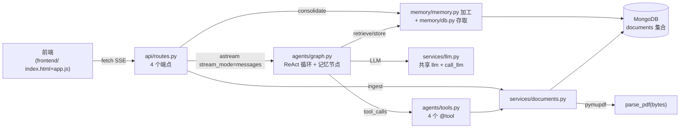

# ruff 全绿 + 文档对齐 + 04 波及总览 实施计划

> **For agentic workers:** REQUIRED SUB-SKILL: Use superpowers:subagent-driven-development (recommended) or superpowers:executing-plans to implement this plan task-by-task. Steps use checkbox (`- [ ]`) syntax for tracking.

**Goal:** 消除全部 10 条 ruff 违规（零配置全绿），同步 01/04 文档与代码写法，刷新 AGENTS.md 至模块 4 落地态，并在 04 插入对前面模块的波及总览表。

**Architecture:** 三段独立改动：①backend 代码机械+语义修复（UP017/B006/pyyaml）②教学文档逐行对齐（01×3 行、04×11 处）③AGENTS.md 全面刷新 + 04 新表。代码侧改动**留在工作区**（用户的模块 4 实现未提交，任何 backend 文件提交都会连带），文档侧改动每任务一提交。

**Tech Stack:** uv + ruff（默认规则，无配置文件）、FastAPI/LangGraph/MongoDB 现有栈、httpx 验证。

**Spec:** `docs/superpowers/specs/2026-08-21-ruff-alignment-04-ripple-design.md`

## Global Constraints

- uv 命令一律从 `backend/` 目录运行（`uv run ruff ...`、`uv add ...`）
- ruff 保持零配置：禁新增 `[tool.ruff]`/ruff.toml/`noqa`/`--ignore`——修代码而非压制
- 教学文档措辞：只写「为什么这样」；禁「不使用 XXX」否定措辞；中文弯引号「」
- `任务文档/02` 冻结、`任务文档/03` 零改动
- **代码侧改动不 git commit**（用户统一打包模块 4 + 前端 + ruff 修复）；文档/spec 改动每任务一提交
- `main.py` 的 `load_dotenv()` 桥接保留（02 L876-880 钦定：LangSmith 只读真正的 `os.environ`），I001 修复仅由 `--fix` 自动补空行
- 时间戳统一写法：`from datetime import UTC, datetime` + `datetime.now(UTC)`（Python ≥3.12）
- 验证用 `uv run python -c` + httpx，禁用 PowerShell curl
- 用户的 uvicorn `--reload` 在 8000 端口运行中，改码自动热载；烟测前先 `GET /api/documents` 探活

---

### Task 1: backend 代码 ruff 全绿 + pyyaml 转正

**Files:**
- Modify: `backend/src/agentic_search/memory/memory.py`（B006 手改 + UP017 自动）
- Modify: `backend/src/agentic_search/services/documents.py`（UP017 自动）
- Modify: `backend/src/agentic_search/main.py`（I001 自动）
- Modify: `backend/tests/test_api.py`、`test_graph.py`、`test_documents.py`（I001/F401 自动）
- Modify: `backend/pyproject.toml` + `backend/uv.lock`（uv add pyyaml）

**Interfaces:**
- Produces: `extract_l1(history: dict, session_id: str, recent_l1: list[Memory] | None = None) -> list[Memory]`——签名变更，`None` 哨兵语义；现有调用点（graph.py `store_memory` 显式传参）不受影响
- Produces: pyproject dependencies 含 `pyyaml`（04:273 契约兑现）

- [ ] **Step 1: pyyaml 转正**

```bash
cd backend && uv add pyyaml
```

Expected: pyproject `[project.dependencies]` 出现 `pyyaml`，uv.lock 更新。

- [ ] **Step 2: 自动修复 9 条（I001×4、F401×1、UP017×4）**

```bash
uv run ruff check src tests --fix
```

Expected: 剩余 1 条 `B006 memory.py:10`。UP017 会把 `documents.py:2` 与 `memory.py:2` 的 import 改为 `from datetime import UTC, datetime`（或保留 timezone 由 Step 4 的 format 清理），4 个调用点改 `datetime.now(UTC)`；`main.py` 的 `load_dotenv()` 调用与 import 块间补空行（调用时序不变）。

- [ ] **Step 3: 手改 B006（None 哨兵）**

`memory.py` 的 `extract_l1`，改为：

```python
def extract_l1(
    history: dict, session_id: str, recent_l1: list[Memory] | None = None
) -> list[Memory]:
    if recent_l1 is None:
        recent_l1 = []

    recent_block = "\n".join([f"- {m.content}" for m in recent_l1]) or "（无）"
```

（函数体其余不动。）

- [ ] **Step 4: format 并全绿验证**

```bash
uv run ruff format src tests
uv run ruff check src tests
grep -rn "timezone" src/
```

Expected: ruff check 退出码 0 零输出；grep 无残留 `timezone`。

- [ ] **Step 5: 运行时烟测（--reload 已热载）**

```bash
uv run python -c "import httpx; print(httpx.get('http://localhost:8000/api/documents').status_code)"
uv run python -c "
import httpx, json
with httpx.stream('POST', 'http://localhost:8000/api/query', json={'question': '你好，简单介绍一下你能做什么', 'session_id': 'ruff-smoke'}, timeout=90) as r:
    err = False; txt = []
    for line in r.iter_lines():
        if line.startswith('data:'):
            p = json.loads(line[5:].strip())
            if isinstance(p, str):
                if p.startswith('[错误'): err = True; print('ERROR:', p)
                else: txt.append(p)
    print('answer len:', len(''.join(txt)), '| error:', err)
"
uv run python -c "
from agentic_search.memory.db import load_memories
print('L1 count:', len(load_memories('ruff-smoke', level='L1')))
"
```

Expected: 探活 200；无错误事件、回答非空；L1 count ≥ 1（时间戳 UTC 写法落库正常）。

- [ ] **Step 6: 不提交**

代码改动全部留在工作区（Global Constraints）。烟测数据 `ruff-smoke` 会话提醒用户事后在 Compass 清理。

---

### Task 2: 01 + 04 文档对齐（UP017 ×10 行、B006 ×2 处、省略号换真实实现）

**Files:**
- Modify: `任务文档/01-Python文档工具.md`（L454、L473、L482）
- Modify: `任务文档/04-TMT记忆系统.md`（L154、L159、L167、L315 区、L322 区、L330、L336 区、L364、L396、L463、L636）

**Interfaces:**
- Consumes: Task 1 修复后的真实代码写法（文档示例与其逐字对齐）
- Produces: 文档零 `timezone.utc` 残留；04 store_memory 示例 = graph.py 真实实现

- [ ] **Step 1: 01 三处**

| 行 | 改前 | 改后 |
|---|---|---|
| L454 | `from datetime import datetime, timezone` | `from datetime import UTC, datetime` |
| L473 | `"uploaded_at": datetime.now(timezone.utc),  # 上传时间` | `"uploaded_at": datetime.now(UTC),  # 上传时间` |
| L482 | `` `datetime.now(timezone.utc)` 用带时区的 UTC 时间`` | `` `datetime.now(UTC)` 用带时区的 UTC 时间`` |

- [ ] **Step 2: 04 时间戳六处**

| 行 | 改法 |
|---|---|
| L154 散文 | `datetime.now(timezone.utc)` → `datetime.now(UTC)` |
| L159 import | `from datetime import datetime, timezone` → `from datetime import UTC, datetime` |
| L167 散文 | `datetime.now(timezone.utc).isoformat()` → `datetime.now(UTC).isoformat()` |
| L330 | `timestamp=datetime.now(timezone.utc).isoformat()` → `timestamp=datetime.now(UTC).isoformat()` |
| L364 / L396 / L463 | 同上逐处替换 |

- [ ] **Step 3: 04 §2.2 B006 同步**

签名行（L315）改为：

```python
def extract_l1(history: dict, session_id: str, recent_l1: list[Memory] | None = None) -> list[Memory]:
```

docstring 的 `recent_l1:` 行尾补「；缺省 `None` 表示无历史记忆」。「# 历史窗口」注释行之后、「recent_block」行之前插入：

```python
    if recent_l1 is None:      # 可变默认值陷阱：默认 [] 在所有调用间共享同一个列表对象
        recent_l1 = []
```

- [ ] **Step 4: 04 §2.2 逐段讲解新增一条**（「recent_l1 历史窗口」条目之后）

```markdown
- **默认值是 `None` 而非 `[]`**：Python 的默认参数在函数定义时求值一次，所有调用共享同一个列表对象——本例只读不写暂无实害，但只要哪天在函数体内 `append`，污染就会跨调用累积。惯用法是 `None` 哨兵加函数体内初始化，ruff 的 B006 规则拦的正是这个陷阱。
```

- [ ] **Step 5: 04 L636 教学省略号换真实实现**

改前：`    history = {"user": ..., "agent": ...}                          # 取最后一对 user/agent 消息`

改后（与 graph.py 现行代码一致）：

```python
    history = {  # 取最后一对 user/agent 消息（人设与记忆 SystemMessage 不参与提取）
        "user": next(m.content for m in reversed(state["messages"]) if m.type == "human"),
        "agent": next(m.content for m in reversed(state["messages"]) if m.type == "ai"),
    }
```

- [ ] **Step 6: 验证**

```bash
grep -c "timezone.utc" 任务文档/01-Python文档工具.md 任务文档/04-TMT记忆系统.md   # 两文件均 0
grep -n "= \.\.\." 任务文档/04-TMT记忆系统.md                                    # 无 history 省略号行
awk '/^```/{c++} END{print c%2}' 任务文档/01-Python文档工具.md 任务文档/04-TMT记忆系统.md   # 均 0
```

逐文件 `git diff` 审读一遍（只应有上述改动）。

- [ ] **Step 7: 提交**

```bash
git add 任务文档/01-Python文档工具.md 任务文档/04-TMT记忆系统.md
git commit -m "docs(01,04): 时间戳统一 datetime.UTC、extract_l1 None 哨兵、store_memory 示例换真实实现（文档-代码对齐）"
```

---

### Task 3: .env.example 字段名 + AGENTS.md 刷新至模块 4 落地态

**Files:**
- Modify: `backend/.env.example:7`
- Modify: `AGENTS.md`（七处段落/表格替换）

**Interfaces:**
- Consumes: 模块 4 已落地的事实状态（端点 4 个全转正、memory/ 双文件、frontend/ 存在、pyyaml 直接依赖）

- [ ] **Step 1: .env.example**

L7 `MONGO_URI = mongodb://localhost:27017` → `MONGO_URL = mongodb://localhost:27017`（Settings 字段 `mongo_url` 按名匹配）。

- [ ] **Step 2: AGENTS.md 头部段替换**

改前首段含「**代码当前实现到模块 2**（agent 后端）；模块 3（前端 `frontend/`）与模块 4（TMT 记忆 `memory/db.py`）代码尚未落地，但**模块 3/4 的教学文档已定稿**——改代码前以文档为准。」——整段替换为：

```markdown
> 这是个**教学项目**：`任务文档/` 下的中文文档（00→01→02→03→04）是设计意图的源头。改代码前，先确认它和对应模块文档是否一致——文档与代码有意保持同步。**四个模块（文档工具 / LangGraph Agent / HTML 前端 / TMT 记忆）代码均已落地**（`tests/test_memory.py` 属 04 第 6 步待写）。模块 4 定义**三层 TMT 记忆**（L1 事实 / L2 会话摘要 / L5 用户画像，L3/L4 因与 L2 同构被省略）：注入策略是配额制（L5 全局一条 + 本会话 L1/L2 ≤20 条），叙事以 oh-my-pi（omp）为标杆、TiMeM 论文为参考，**零向量依赖**（无 embedding/向量库）。
```

- [ ] **Step 3: AGENTS.md 架构 mermaid 替换**

原 mermaid 整块替换为：

````markdown

````

- [ ] **Step 4: AGENTS.md 关键目录块替换**

目录树中三行区域替换（其余行不动）：

```
  src/agentic_search/
    api/           routes.py(4端点全转正) · schemas.py(Pydantic 模型)
    agents/        graph.py(ReAct图+记忆节点) · tools.py(4个@tool)
    services/      documents.py(parse_pdf + Mongo CRUD) · llm.py(共享 LLM 单例)
    configs/       config.py(pydantic-settings 单例) · prompts.py+prompts.yaml(PROMPTS 单例)
    memory/        db.py(Memory+存取+阈值) · memory.py(三加工函数，纯进出)
  tests/           4 个测试文件（test_memory.py 待写，04 第 6 步）
docs/superpowers/  specs/ + plans/ —— 设计重构记录
.superpowers/sdd/  subagent-driven development 产物
frontend/          index.html + app.js（原生 HTML/JS，零构建）
```

- [ ] **Step 5: AGENTS.md 四条「文档定稿，代码待实现」措辞转正**

代码约定区四条 bullet 标题（记忆层双文件 / 记忆端点契约 / LLM 客户端共享 / prompt 集中管理）：「（模块 4 文档定稿，代码待实现）」→「（模块 4 已实现）」，正文不动。

- [ ] **Step 6: AGENTS.md 重要文件表更新**

- routes.py 行：`POST /api/consolidate(占位返回 pending)` → `POST /api/consolidate(level 分流 L2/L5，幂等 upsert)`
- 新增四行：

```markdown
|`backend/src/agentic_search/memory/db.py`|Memory dataclass + `_memories_collection` + save/load_memories + upsert_l2/upsert_profile + get_memories_for_context + L2_TRIGGER_THRESHOLD=10|
|`backend/src/agentic_search/memory/memory.py`|extract_l1/consolidate_l2/consolidate_profile（纯进出零 Mongo，只 import Memory）|
|`backend/src/agentic_search/services/llm.py`|共享 LLM 单例：`llm`（供 bind_tools）+ `call_llm`（裸调用，供记忆层）|
|`backend/src/agentic_search/configs/prompts.py`+`prompts.yaml`|PROMPTS 单例，四键 persona/l1_extract/l2_consolidate/l5_profile|
|`frontend/app.js`+`index.html`|原生前端：SSE 流式渲染 + 会话管理 + 三按钮（新会话/整合 L2/整合 L5）|
```

- [ ] **Step 7: AGENTS.md 陷阱 4/5 替换**

陷阱 4（「memory/ 是空包」整条）替换为：

```markdown
4. **SSE 流内错误 + HTTP 200**：`/api/query` 的响应头发出后，图执行中的异常被 `except Exception` 错误边界转成 `ServerSentEvent(data=f"[错误：{e}]")` 事件——后端日志 200、前端收到 `[错误：'xxx']`。诊断看错误事件文本（`str(KeyError('x'))` 显示为 `'x'`），查图节点读的 state 键是否在 astream 入参里。
```

陷阱 5（「/api/consolidate 是占位」整条）替换为：

```markdown
5. **条件边路由表与 session_id 三处契约**：①LangGraph `add_conditional_edges` 的路由表必须含 `should_continue` 全部返回值（无工具调用返回 `"store_memory"`，返回 END 而路由表无 `__end__` → `KeyError('__end__'）`）；②session_id 三处契约缺一即断：`QueryRequest` 字段（缺省 `"default"`）、astream 入参带键、`MemoryState` 通道声明。
```

- [ ] **Step 8: AGENTS.md 依赖行与未覆盖行**

- 关键依赖行追加 `pyyaml`（约束从 pyproject 实际值复制）。
- 测试未覆盖行改为：「**未覆盖**：`schemas.py`、`tools.py`、`config.py`、`main.py`(CORS/include_router) 及模块 4 记忆层（`test_memory.py` 属 04 第 6 步待写）。」

- [ ] **Step 9: 验证**

```bash
git grep -n "空占位\|占位返回\|尚未落地\|未落地" AGENTS.md          # 空
git grep -n "MONGO_URI" backend/.env.example                       # 空
awk '/^```/{c++} END{print c%2}' AGENTS.md                         # 0
```

逐段 `git diff AGENTS.md` 审读。

- [ ] **Step 10: 提交**

```bash
git add backend/.env.example AGENTS.md
git commit -m "docs: .env.example 字段名对齐 MONGO_URL；AGENTS.md 刷新至模块 4 落地态（架构图/目录/端点/陷阱/依赖）"
```

---

### Task 4: 04 新增「对前面模块的波及总览」

**Files:**
- Modify: `任务文档/04-TMT记忆系统.md`（`## 第 1 步：理解 TMT 思想` 标题前插入新节）

**Interfaces:**
- Produces: 索引表——每行「详见」指向 04 既有步骤标题，单源不复制内容

- [ ] **Step 1: 插入新节**（锚点：`## 第 1 步：理解 TMT 思想` 之前、整合触发表之后）

```markdown
## 对前面模块的波及总览

模块 4 不止新增 `memory/`——它还反向改动模块 2、3 的既有文件。动手前先看爆炸半径：

| 前面模块的文件 | 波及改动 | 详见 |
|---|---|---|
| `services/llm.py`（新增） | LLM 客户端从 `build_graph` 提出共享单例（`llm` + `call_llm`） | 第 2 步前置 |
| `configs/prompts.yaml` + `prompts.py`（新增） | prompt 集中管理；`pyyaml` 转直接依赖 | 第 2 步前置 |
| `api/schemas.py` | `QueryRequest` 加 `session_id`；新增 `ConsolidateRequest/Response` | 第 3 步 / 第 4 步 |
| `api/routes.py` | `/api/consolidate` 占位转正（level 分流）；`/api/query` 传 session_id | 第 3 步 / 第 4 步 |
| `agents/graph.py` | `MemoryState` + `retrieve_memory`/`store_memory` 节点 + persona 前置 | 第 4 步 |
| `frontend/app.js` + `index.html` | 真会话 ID（localStorage）、请求体带 session_id、新增两按钮及绑定 | 第 5 步 |

模块 1（`services/documents.py`）零波及。

```

- [ ] **Step 2: 验证**

```bash
grep -n "^## 对前面模块的波及总览\|^## 第 1 步" 任务文档/04-TMT记忆系统.md   # 新节在第 1 步之前
grep -n "^## 第 2 步\|^## 第 3 步\|^## 第 4 步\|^## 第 5 步" 任务文档/04-TMT记忆系统.md   # 四个指向目标存在
awk '/^```/{c++} END{print c%2}' 任务文档/04-TMT记忆系统.md                    # 0
```

- [ ] **Step 3: 提交**

```bash
git add 任务文档/04-TMT记忆系统.md
git commit -m "docs(04): 新增对前面模块的波及总览表（模块 2/3 反向改动集中索引，动手前看爆炸半径）"
```

---

### Task 5: 终验收 + 打包报告

**Files:** 无新改动（只验证与汇报）

- [ ] **Step 1: 跑 spec 验收清单 1-10**

```bash
cd backend && uv run ruff check src tests && uv run ruff format --check src tests
cd .. && git grep -n "timezone.utc" -- 任务文档 backend/src || echo CLEAN
git grep -n "MONGO_URI" backend/.env.example || echo CLEAN
git grep -n "空占位\|占位返回\|未落地" AGENTS.md || echo CLEAN
grep -n "= \.\.\." 任务文档/04-TMT记忆系统.md || echo CLEAN
```

逐项核对 spec《验收清单》1-10（含 04 表指向、围栏配对、四文档 diff 审读）。

- [ ] **Step 2: 打包报告**

向用户呈报工作区未提交清单（backend 代码 ruff 修复 + 模块 4 实现 + frontend + pyproject/uv.lock），给出建议的打包提交切分（如：①模块 4 后端全套 ②前端 ③ruff 规范化），由用户决定提交时机与粒度。

## Self-Review 记录

- Spec 覆盖：改动一（Task 1）、改动二 2a-2e（Task 2/3）、改动三（Task 4）、验收清单（Task 5）——全覆盖。
- 类型一致：`extract_l1` 新签名在 Task 1 代码与 Task 2 文档示例逐字一致（`list[Memory] | None = None`）。
- 计数修正：01 实为 3 行（spec 写 ×2 处，指 grep 命中数；L454 import 行必须同改），04 实为 11 处（6 时间戳 + 2 B006 + 1 教学条目 + 1 省略号 + 1 docstring 尾注）。
