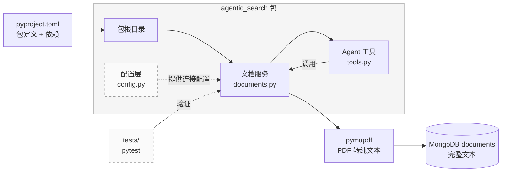

# 模块 1：Python 文档工具
> 技术栈：Python 3.11+ / uv / pymupdf / pydantic-settings / pymongo / MongoDB / pytest
> 所属项目：Agentic Search with Memory（后端 Python 包地基）

---

## 学习目标

完成本模块后，你将能够：

1. 理解 **Python 包化布局（src layout）**，说明 `backend/src/agentic_search/` 这种结构与单文件 `.py` 的区别，以及工业项目采用它的原因
2. 使用 **uv** 创建包化项目，通过 `pyproject.toml` 声明包名与依赖，并用 `uv sync` / `pip install -e .` 完成可编辑安装
3. 使用 **pydantic-settings** 编写配置层 `configs/config.py`，从 `.env` 读取 LLM 模型名、MongoDB 连接配置、超时，避免在代码中硬编码
4. 使用 **pymupdf + PyMongo** 在 `services/documents.py` 中实现 `parse_pdf`（PDF 转纯文本）、`store_document`、`list_documents` 三个文档工具函数，把完整文本存入 MongoDB
5. 使用 **pytest** 为文档工具编写并运行单元测试
6. 使用 **LangChain `@tool` 装饰器** 在 `agents/tools.py` 中实现四个论文导航工具（`list_papers`/`read_paper`/`search_papers`/`extract_abstract`），理解装饰器如何从类型注解 + docstring 自动生成工具 schema

本模块的产出是后端包的「地基」部分：包化骨架（`pyproject.toml` + `src/agentic_search/`）、配置层（`configs/config.py`）与文档服务（`services/documents.py`）、Agent 导航工具（`agents/tools.py`），以及对应的测试文件 `tests/test_documents.py`。这些函数将在[模块 2：LangGraph Agent](./02-LangGraph-Agent.md) 中被 Agent 的论文导航工具（`read_paper`/`search_papers` 等）调用——Agent 按行号按需读取本模块产出的完整文本片段，自主决定读哪篇、读哪段，而不是一次性把全文塞进上下文。

---

## 技术概念

> 更多技术概念见[概念速查](./概念速查.md)。

### Python 包化布局（src layout）

**Python 包（package）** 是一组按目录组织的模块（`.py` 文件），可以被 `import` 语句引用。本项目采用 **src layout**：把源代码放在 `src/` 之下的一个命名包里（`src/agentic_search/`），而不是把 `.py` 文件直接散落在项目根目录。

对比两种写法：

```
扁平结构（不推荐）        src layout（本项目采用）
tools.py                 src/
parse_pdf()              └── agentic_search/
                             ├── __init__.py
                             ├── configs/config.py
                             └── services/documents.py
```

采用 src layout 的原因有三点：

1. **import 路径清晰**。安装后，整个项目以一个统一的根包名 `agentic_search` 暴露。无论项目被复制到哪台机器、哪个目录，外部代码都以 `from agentic_search.services.documents import parse_pdf` 的形式引用——路径与文件在磁盘上的位置无关，只取决于包名。
2. **可测试**。src layout 强制开发者必须先「安装」包才能 import。这避免了「在项目根目录下随手能 import、换个目录就找不到」的假象，测试环境与真实使用环境一致。
3. **可分发**。包化的项目可以发布到 PyPI，或通过 `pip install` 安装到其他项目。扁平结构的脚本无法这样分发。

包名的规则值得注意：`pyproject.toml` 中的分发名通常写为 `agentic-search`（连字符），而 Python 的 `import` 名必须是合法标识符，因此连字符转为下划线 `agentic_search`。两者指同一个包。

**可编辑安装（editable install）** 是包化工作流的关键。执行 `pip install -e .`（或 `uv sync`，uv 会自动完成可编辑安装）后，Python 解释器会把包注册到当前虚拟环境，import 时直接指向 `src/` 下的源码。这样你每次修改 `services/documents.py` 保存后，无需重新安装，import 立即生效——这是开发期高效迭代的基础。

### pymupdf

**pymupdf** 是基于 MuPDF 内核的轻量 PDF 处理库。它通过 `page.get_text("text")` 从 PDF 文本层提取纯文本——单一 wheel、无模型下载、无 GPU 依赖、即装即用。

**`get_text("text")` 返回什么？** 每一页的纯文本字符串，按 PDF 的排版顺序拼接。项目只需把所有页的文本拼成一个完整字符串，存入 MongoDB。不做任何切分——切分是 agent 的职责，它用正则搜索定位行号、按行号读取片段，完全自主。

**为什么不做结构化切分？** 这对齐 omp 的文件读取模型：文件以原始形态存在，agent 用 `grep`（正则搜索行号）+ `read :50-100`（按行号取片段）自主探索，不在入库时做任何预处理。预切分会破坏跨段上下文、切分位置可能出错，反而降低 agent 的探索效果。

### MongoDB 与 PyMongo

本项目用 `agentic_search` 数据库下的 `documents` 集合存放论文（每篇存为完整纯文本），`memories` 集合存放 L1/L2 记忆。

用 MongoDB 集中存储有三点优势：第一，**原子性与一致性**——数据库的写入是原子的，不会出现「写了一半」的损坏文件；第二，**按条件查询**——可以用 `doc_id`、`filename` 等字段精确检索；第三，**可视化**——用 MongoDB Compass 可以直观地浏览、搜索数据，便于教学调试。

**PyMongo** 是 MongoDB 的官方 Python 驱动（同步）。它把数据库操作映射为 Python 对象方法：`MongoClient(uri)` 建立连接、`db["collection"]` 取集合、`collection.insert_one(doc)` 插入一条记录、`collection.find_one(query)` 查单条、`collection.find(query)` 查多条。这些方法都是同步阻塞的——对于本项目这种教学量级完全够用。

> MongoDB 官方文档：https://www.mongodb.com/zh-cn/docs/manual/ ；PyMongo 官方文档：https://www.mongodb.com/zh-cn/docs/languages/python/pymongo-driver/current/ 。

### 配置层与 pydantic-settings

**配置层**负责管理「会随环境变化、但不属于业务逻辑」的值：LLM 模型名、请求超时、数据文件路径等。把这些值放进 `.env` 文件与配置对象，而不是写死在代码里，是工业项目的基本规范。好处是：换环境（本地开发 / 服务器部署）只改 `.env`、不改代码；敏感值（如 API Key）不进入版本库。

**pydantic-settings** 是 Pydantic 家族的配置库，专门用于把 `.env` 文件、环境变量映射为带类型校验的 Python 对象。它的优势是：类型错误（例如把超时写成字符串 `"abc"`）在启动时就会被发现，而不是运行到一半才报错。

### pytest

**pytest** 是 Python 的测试框架。核心规则有三条：测试文件以 `test_` 开头（如 `test_documents.py`）、测试函数以 `test_` 开头（如 `test_parse_pdf`）、用 Python 原生的 `assert` 语句做断言。运行：`uv run pytest tests/ -v`。

### 装饰器（decorator）与 LangChain `@tool`

**装饰器** 是 Python 的语法机制：用 `@` 给函数「套一层额外逻辑」而不改写其本体。`@装饰器名` 写在 `def` 上方，等价于 `函数 = 装饰器名(函数)`——装饰器接收原函数、返回一个包装后的新函数。

LangChain 的 `@tool` 是本项目遇到的第一个装饰器。它读取函数的**类型注解**和 **docstring**，自动生成一份工具 schema（名字、参数描述、用途），让 LLM 能「看到」这个工具。函数体一行没改，但装饰后它不再是普通函数，而是一个带 `.name`、`.description`、`.args_schema` 属性的工具对象：

```python
from langchain.tools import tool


@tool
def multiply(a: int, b: int) -> int:
    """将两个整数相乘并返回结果。"""
    return a * b

print(multiply.name)          # multiply（取自函数名）
print(multiply.description)   # 将两个整数相乘并返回结果。（取自 docstring）
print(multiply.args_schema.model_json_schema())
# {'properties': {'a': {'type': 'integer'}, 'b': {'type': 'integer'}}, ...}（取自类型注解）
```

这三项信息——名字、描述、参数 schema——就是 LLM 决定「要不要调这个工具、传什么参数」的全部依据。本模块用 `@tool` 把四个普通函数（`list_papers`/`read_paper`/`search_papers`/`extract_abstract`）注册成 agent 工具。

> 装饰器的**主体讲解**在[模块 2](./02-LangGraph-Agent.md)：那里会手写一个自定义装饰器 `@retry`（从零理解 `@` 背后的高阶函数机制）。此外，模块 2 的 `@router.post`（FastAPI 路由注册）和模块 4 的标准库 `@dataclass` 也都是装饰器——同一个机制，不同的库。本模块先用起来，模块 2 再深入原理。

---

## 前置要求

- 已阅读[开始之前](./00-开始指南.md)
- 已安装 **uv**（`uv --version` 能输出版本号）
- 已安装 **VS Code**（或其他代码编辑器）
- 已安装并启动 **MongoDB Community Server**（`localhost:27017` 可连接），并安装 **MongoDB Compass**（可视化查看数据库）。安装步骤见[开始之前](./00-开始指南.md)
- 具备基本的 Python 语法知识（函数、列表、字典、文件读写、类型注解）
- 具备命令行操作基础（`cd`、`ls`）

---

## 模块结构

本模块在后端包中建立四个部分：包化骨架、配置层、文档服务、Agent 导航工具。它们的依赖关系如下：



读图要点：`pyproject.toml` 是包的「身份证」，定义包名与依赖；`config.py` 与 `documents.py` 同属 `agentic_search` 包，且文档服务依赖配置层提供的 MongoDB 连接配置；测试文件通过包化 import 直接验证文档服务。

---

## 项目结构

本模块在 `backend/` 目录下工作。完成本模块后，目录结构如下（标注了各部分属于哪个模块，本模块负责的部分已注明）：

```
agentic-search/
└── backend/
    ├── pyproject.toml              # 本模块创建：包配置 + 依赖声明
    ├── .env.example                # 本模块创建：配置模板
    ├── .python-version             # uv 自动生成
    ├── src/
    │   └── agentic_search/         # 包根目录
    │       ├── __init__.py         # 本模块创建：标记为 Python 包
    │       ├── configs/
    │       │   ├── __init__.py
    │       │   └── config.py       # 本模块创建：配置层
    │       ├── services/
    │       │   ├── __init__.py
    │       │   └── documents.py    # 本模块创建：文档工具
    │       ├── agents/
    │       │   ├── __init__.py
    │       │   └── tools.py        # 本模块创建：Agent 论文导航工具（list_papers/read_paper/search_papers/extract_abstract）
    └── tests/
        └── test_documents.py       # 本模块创建：pytest 测试
```

> PDF 经 pymupdf 提取的完整文本，以及 L1/L2 记忆，全部存入 MongoDB（`agentic_search` 数据库，`localhost:27017`）。学生可用 **MongoDB Compass** 可视化查看数据库状态。安装 MongoDB Community Server 与 Compass 的步骤见[开始之前](./00-开始指南.md)。

其余文件（`main.py`、`api/routes.py`、`agents/graph.py`、`memory/store.py`）分别由[模块 2](./02-LangGraph-Agent.md) 与[模块 4](./04-TMT记忆系统.md) 创建。本模块只搭建地基。

---

## 步骤 1：创建 Python 包化项目 + 安装依赖

### 1.1 初始化包项目

打开命令行，进入项目根目录，用 `uv init --lib <包名>` 初始化库项目（直接把包名传给 `uv init`，从源头让生成物命名正确）：

```bash
uv init --lib agentic-search
```

`uv init --lib agentic-search` 会创建一个名为 `agentic-search/` 的目录，其内部已经生成 `pyproject.toml`（含 `[build-system]` 字段）和 `src/agentic_search/`（连字符自动转下划线，命名已正确）。

随后**手动把目录调整到本项目的 `backend/` 位置**——把生成的 `agentic-search/` 改名为 `backend/`（或将其内容移入已有的 `backend/`）：

```bash
mv agentic-search backend
cd backend
```

`uv init --lib` 创建的是**库项目**：生成 `pyproject.toml`（含构建后端声明）和 `src/` 目录结构。这与 `uv init`（默认的应用项目）的区别在于，库项目会带上 `[build-system]` 字段，使其可被 `pip install`。

### 1.2 指定 Python 版本

确保项目使用 Python 3.11+：

```bash
uv python pin 3.11
```

这会创建 `.python-version` 文件，锁定解释器版本。

**验证**：执行 `cat .python-version`，输出应为 `3.11`（或更高版本）。

### 1.3 配置 `pyproject.toml`

由于初始化时已传入包名 `agentic-search`，生成的 `pyproject.toml` 已有正确的 `name` 字段，无需再改包名，只补充依赖即可。以下是**教学示例，展示关键字段，非完整文件**：

```toml
[project]
name = "agentic-search"            # 分发名：pip 安装时用这个名字
version = "0.1.0"
requires-python = ">=3.11"          # 本项目要求 Python 3.11 及以上
dependencies = [
    "pymupdf",                      # PDF → 纯文本提取（get_text("text")）
    "pydantic-settings",            # 配置层：从 .env 读取并做类型校验
    "pymongo",                     # MongoDB Python 驱动（同步）：存取文档文本与记忆
    "langchain",                    # LangChain：@tool 装饰器（把函数注册成 agent 工具）
]

[dependency-groups]
dev = ["pytest"]                    # 开发依赖，仅开发/测试时需要

[build-system]
requires = ["hatchling"]
build-backend = "hatchling.build"

[tool.hatch.build.targets.wheel]
packages = ["src/agentic_search"]   # 告诉构建工具：包源码在 src/agentic_search
```

逐段讲解：

- `name = "agentic-search"` 是包的**分发名**。`pip install agentic-search` 或 `pip install -e .` 时以此识别。注意它用的是连字符；对应的 Python import 名为 `agentic_search`（下划线），两者是同一个包。
- `dependencies` 列出运行时依赖。本模块需 `pymupdf`、`pydantic-settings`、`pymongo`；`pytest` 放在 `dev` 分组，不污染生产环境。
- `[build-system]` 与 `[tool.hatch.build.targets.wheel]` 告诉构建工具：用 hatchling 打包，源码包位于 `src/agentic_search`。这一段是「可被 pip 安装」的前提，缺少它则 `pip install -e .` 无法定位源码。

> 因为初始化命令已指定包名 `agentic-search`，`src/` 下的目录名自动为 `agentic_search`（下划线），无需手动改名。

### 1.4 安装依赖与可编辑安装

执行：

```bash
uv sync
```

`uv sync` 做三件事：读取 `pyproject.toml` 生成/更新 `uv.lock` 锁文件、创建虚拟环境（`.venv/`）、安装所有依赖，**并自动把本项目以可编辑模式安装**（因为项目声明了 `[build-system]`）。可编辑模式意味着你对 `src/agentic_search/` 下任何文件的修改，都立即对已安装的 import 生效，无需重新安装。


可编辑安装的等价手动命令是 `pip install -e .`（在虚拟环境内执行）。理解这一条有助于明白 `uv sync` 背后发生了什么，但日常开发直接用 `uv sync` 即可。

**验证**（在 `backend/` 目录下执行）：

```bash
uv run python -c "import agentic_search; print(agentic_search.__file__)"
```

预期输出指向 `backend/src/agentic_search/__init__.py`。这说明包已被正确注册为可编辑安装，import 时指向源码目录。若报 `ModuleNotFoundError`，请回到步骤 1.3 检查包名与 `src/` 目录名是否一致。

### 1.5 创建目录结构

```bash
mkdir -p src/agentic_search/configs src/agentic_search/services src/agentic_search/agents
mkdir -p tests
# 为每个子包创建空的 __init__.py（标记为 Python 包，原理见下）
touch src/agentic_search/configs/__init__.py src/agentic_search/services/__init__.py src/agentic_search/agents/__init__.py
```

每个 Python 子包（`configs/`、`services/`、`agents/`）都需要一个空的 `__init__.py` 文件来标记其为 Python 包。`agentic_search/__init__.py` 由 `uv init --lib` 自动生成。

**验证依赖安装**：

```bash
uv run python -c "import pymupdf; from pydantic_settings import BaseSettings; import pymongo; print('依赖安装成功')"
```

若无报错，说明运行时依赖安装正确。

---

## 步骤 2：`configs/config.py` — 配置层

### 为什么需要配置层

在代码里写死 LLM 模型名（`"deepseek-v4-flash"`）或 MongoDB 连接地址（`"mongodb://localhost:27017"`）是常见的坏习惯。一旦这些值需要变动——比如换用另一个模型、把数据库迁移到远程服务器——就得翻遍代码逐处修改，极易遗漏。配置层的职责是把这些「会变、但不属于业务逻辑」的值集中到一处（`.env` 文件 + 配置对象），业务代码只引用配置对象、不接触具体值。

本项目的配置项包括：LLM 模型名、MongoDB 连接地址与数据库名。其中 LLM 相关项在本模块先定义、由[模块 2](./02-LangGraph-Agent.md) 的 Agent 实际使用；MongoDB 配置则被本模块的文档服务（存取论文纯文本）与[模块 4](./04-TMT记忆系统.md) 的记忆系统（存取 L1/L2 记忆）共同消费。

### 2.1 创建 `.env.example` 配置模板

`.env.example` 是**模板**，提交到版本库，供他人复制为 `.env` 后填写实际值。真正的 `.env` 含敏感信息，不提交。以下是**教学示例**：

```env
# LLM 配置（模块 2 的 Agent 使用）
LLM_MODEL=deepseek-v4-flash

# MongoDB 配置（数据存储地址，参见开始指南中的安装步骤）
MONGO_URI=mongodb://localhost:27017
MONGO_DB=agentic_search
```

逐项讲解：

- `LLM_MODEL`：LLM 模型名，Agent 用它决定调用哪个模型。换模型只改这里。
- `MONGO_URI` / `MONGO_DB`：MongoDB 连接地址与数据库名。本模块文档服务把 pymupdf 提取的完整文本存入该库的 `documents` 集合，[模块 4](./04-TMT记忆系统.md) 的记忆系统则使用 `memories` 集合。集中配置便于将来把数据库迁移到远程服务器——只需改这一处。

> 在实际开发中，请将 `.env.example` 复制为 `.env`：`cp .env.example .env`。并将 `.env` 加入 `.gitignore`。

### 2.2 编写 `configs/config.py`

用 pydantic-settings 把上面的 `.env` 映射为类型安全的 Python 对象。以下是**教学示例，展示核心逻辑，非完整实现**：

```python
from pydantic_settings import BaseSettings, SettingsConfigDict


class Settings(BaseSettings):
    """从 .env 文件读取的配置。"""

    model_config = SettingsConfigDict(
        env_file=".env",        # 配置来源文件
        env_file_encoding="utf-8",
        extra="ignore",         # .env 中多余的字段不报错
    )

    # LLM 配置（模块 2 使用）
    llm_model: str = "deepseek-v4-flash"

    # MongoDB 配置（本模块文档服务 + 模块 4 记忆系统使用）
    mongo_url: str = "mongodb://localhost:27017"
    mongo_db: str = "agentic_search"


# 模块级单例：其他模块 import 这个 settings 即可拿到配置
settings = Settings()
```

逐段讲解：

- 继承 `BaseSettings` 的类会自动从 `.env` 文件与环境变量读取值。字段名 `llm_model` 对应 `.env` 中的 `LLM_MODEL`（大小写与下划线/连字符的对应关系由 pydantic-settings 自动处理）。
- 每个字段的类型注解（`str`、`int`）同时是**默认值**和**类型校验规则**。`.env` 未提供时用默认值；提供了但类型不符（如超时写成 `"abc"`）会在启动时抛出校验错误。
- 末尾 `settings = Settings()` 创建一个模块级单例。整个项目通过 `from agentic_search.configs.config import settings` 引用同一个配置对象，避免反复读取文件。

**验证**（在 `backend/` 目录下执行）：

```bash
uv run python -c "from agentic_search.configs.config import settings; print(settings.mongo_url, settings.mongo_db, settings.llm_model)"
```

预期输出：`mongodb://localhost:27017 agentic_search deepseek-v4-flash`（或 `.env` 中填写的值）。若你修改了 `.env`，输出会随之变化——这正是配置层的目的。

---

## 步骤 3：`services/documents.py` — 文档工具

本模块的核心是文档服务，提供以下函数：

| 函数 | 职责 |
|------|------|
| `parse_pdf(pdf_path)` | 用 pymupdf 把 PDF 转为完整纯文本 |
| `store_document(doc_id, filename, text)` | 把完整文本写入 MongoDB `documents` 集合 |
| `list_documents()` | 从 MongoDB 查询所有文档，返回 doc_id 与文件名 |

它们都位于 `agentic_search.services.documents`，调用方式统一为包化 import：

```python
from agentic_search.services.documents import parse_pdf, store_document, list_documents
```

注意：包化布局让 import 路径只依赖包名，与文件在磁盘上的相对位置无关——这是「可测试、可分发」的关键。

### 3.1 `parse_pdf(pdf_path)`

**功能定义**：

```python
def parse_pdf(pdf_path: str | Path) -> str:
    """读取 PDF，用 pymupdf 提取完整纯文本。不做任何切分。"""
```

输入：PDF 文件路径（如 `"paper.pdf"`，可放在 `backend/` 下任意位置）。输出：完整纯文本字符串——所有页面的文字按排版顺序拼接。

**pymupdf 基础用法**（官方文档：https://pymupdf.readthedocs.io/）。核心是「打开文档 → 逐页取纯文本 → 拼接 → 关闭」：

```python
import pymupdf

doc = pymupdf.open("example.pdf")          # 打开文档
for page in doc:                            # 逐页迭代
    text = page.get_text("text")            # 该页的纯文本
    print(text)
doc.close()
```

关键概念：`pymupdf.open(path)` 打开 PDF（返回 Document 对象）；`for page in doc` 遍历每一页；`page.get_text("text")` 返回该页的纯文本字符串，按 PDF 排版顺序排列；`doc.close()` 释放资源。

> 现代导入写 `import pymupdf`（pymupdf ≥1.23.8 的官方推荐别名）。

**为什么只提取纯文本、不做切分？** 切分是 agent 的职责。agent 用 `search_papers(pattern, doc_id)` 正则搜索行号定位关键词，再用 `read_paper(doc_id, start_line, end_line)` 按行号取上下文——完全自主地决定读哪段。上传时预切分会把全文打散成固定片段，agent 被迫在预切的边界里搜索，失去了自主定位的灵活性。这与 omp 用 `grep` + `read` 探索代码库完全一致：文件以原始形态存在，agent 按需读取。

**你需要实现的逻辑**：检查文件是否存在 → 打开 PDF → 逐页取 `get_text("text")` 拼接 → 关闭文档 → 返回完整字符串。以下是**教学示例，展示核心逻辑，非完整实现**：

```python
from pathlib import Path
import pymupdf


def parse_pdf(pdf_path: str | Path) -> str:
    """读取 PDF，用 pymupdf 提取完整纯文本。不做任何切分。"""
    p = Path(pdf_path)
    if not p.exists():
        raise FileNotFoundError(f"文件不存在：{pdf_path}")
    doc = pymupdf.open(p)
    pages = [page.get_text("text") for page in doc]
    doc.close()
    return "\n".join(pages)
```

讲解要点：

- **无需缓存**：pymupdf 的 `open()` 是轻量操作，每次调用即可，无需缓存层。
- **错误处理**：路径不存在时抛出 `FileNotFoundError` 并附上具体路径，便于排查。
- **完整文本**：所有页的纯文本用 `"\n"` 拼接成一个字符串。这是 agent 工具（`read_paper`/`search_papers`/`extract_abstract`）按行号操作的基础。

**测试你的函数**：准备任意一个 PDF 文件，放在 `backend/` 下：

```bash
uv run python -c "
from agentic_search.services.documents import parse_pdf
text = parse_pdf('你的文件.pdf')
print(f'文本长度: {len(text)}')
print(f'前 200 字符: {text[:200]}')
"
```

**验证**：输出文本长度（非零）和前 200 字符（含 PDF 原文内容），而非报错。

### 3.2 `store_document(doc_id, filename, text)`

`parse_pdf` 只负责把 PDF 转为纯文本；持久化由 `store_document` 完成。它把完整文本连同文档标识、文件名、上传时间写入 MongoDB 的 `documents` 集合。集合中每条记录的固定结构为 `{_id, doc_id, filename, text, uploaded_at}`，其中 `text` 是完整纯文本。

> 在 MongoDB 术语中，一个 database（本项目为 `agentic_search`）下有若干 collection（集合，本项目为 `documents` 与 `memories`），每个集合里存放若干 document（文档，即一条记录）。注意区分「集合 collection」与「文档 document」：前者是表，后者是行。

MongoDB 的连接通过 PyMongo 的 `MongoClient` 建立。以下是**教学示例，展示核心逻辑，非完整实现**：

```python
from datetime import datetime, timezone
from pymongo import MongoClient

from agentic_search.configs.config import settings


# 模块级连接：MongoDB 连接建立后可复用，不必每次操作都新建客户端
_client = MongoClient(settings.mongo_url)
_db = _client[settings.mongo_db]
_documents_collection = _db["documents"]


def store_document(doc_id: str, filename: str, text: str) -> None:
    """把一篇论文的完整纯文本存入 documents 集合。"""
    _documents_collection.insert_one(
        {
            "doc_id": doc_id,                       # 文档唯一标识（上传时生成）
            "filename": filename,                   # 原始 PDF 文件名
            "text": text,                           # 完整纯文本
            "uploaded_at": datetime.now(timezone.utc),  # 上传时间
        }
    )
```

讲解要点：

- **模块级连接**：`MongoClient(settings.mongo_url)` 在模块被 import 时建立一次连接。PyMongo 的客户端内置连接池，多个 `insert_one` / `find_one` 复用同一连接，无需手动管理。
- **`insert_one`**：向集合插入一条记录。若 `documents` 集合尚不存在，MongoDB 会在首次写入时自动创建——无需提前建表。
- **`uploaded_at`**：记录上传时间。`datetime.now(timezone.utc)` 用带时区的 UTC 时间，避免不同服务器时区不一致导致的排序错误。
- **schema：`{doc_id, filename, text, uploaded_at}`**：扁平文档，`text` 是完整纯文本。agent 经 `read_paper(doc_id, start_line, end_line)` 按行号取片段，或经 `search_papers(pattern, doc_id)` 正则定位。

**验证**：先用 `parse_pdf` 提取一个 PDF 的文本，再调用 `store_document` 存入，然后打开 **MongoDB Compass** 查看 `agentic_search` 的 `documents` 集合——应能看到一条新记录，其 `text` 字段是完整纯文本。

### 3.3 `list_documents()`

这个函数负责从 MongoDB 列出所有文档，供 Agent 自主决定「语料库里有哪些论文」。

- `list_documents() -> list[dict]`：查询 `documents` 集合中的全部记录，只取 `doc_id` 与 `filename` 两个字段（不取 `text` 正文），返回 `[{doc_id, filename}, ...]`。

以下是**教学示例，展示核心逻辑，非完整实现**：

```python
def list_documents() -> list[dict]:
    """列出所有文档的 doc_id 与文件名。"""
    cursor = _documents_collection.find({}, {"doc_id": 1, "filename": 1, "_id": 0})
    return [
        {"doc_id": doc["doc_id"], "filename": doc["filename"]}
        for doc in cursor
    ]
```

讲解要点：

- **`find({}, {投影})`**：第一个参数 `{}` 是查询条件（空字典表示「全部」）；第二个参数是**投影**——`{"doc_id": 1, "filename": 1}` 表示只返回这两个字段，`"_id": 0` 表示排除默认会返回的 `_id`。投影让列表接口只传输文件名而非整篇论文全文，大幅减少数据量。

> **Agent 怎么读单篇论文？** agent 工具层的 `read_paper(doc_id, start_line, end_line)`、`search_papers(pattern, doc_id)`、`extract_abstract(doc_id)` 各自用 PyMongo 的 `find_one({"doc_id": ...})` 按 ID 精确查找并按需取片段——这些在[模块 2](./02-LangGraph-Agent.md) 的 `agents/tools.py` 中实现。services 层只需提供 `list_documents` 让 agent 先发现有哪些论文，具体读取由 agent 工具按行号自主完成。

**验证**（假设已通过 `store_document` 存入至少一篇文档）：

```bash
uv run python -c "
from agentic_search.services.documents import list_documents
docs = list_documents()
print('文档列表:', docs)
"
```

---

## 步骤 4：`agents/tools.py` — 论文导航工具集

Agent 的「手和眼」——四个工具，对标 omp 探索代码库的 `glob`/`read`/`grep`/`summarize`。用 LangChain 的 `@tool` 装饰器声明（装饰器原理见上方[技术概念](#装饰器decorator与-langchain-tool)）：`@tool` 从函数的类型注解和 docstring 自动生成工具 schema，函数体一行没改，就变成了 LLM 可调用的工具。

新建 `agents/tools.py`：

```python
# agents/tools.py —— 教学示例：四个论文导航工具
import re
from langchain.tools import tool
from agentic_search.services.documents import (
    list_documents, _documents_collection,
)


def _get_doc_text(doc_id: str) -> str:
    """按 doc_id 取出整篇文档的完整文本。找不到抛 KeyError。"""
    doc = _documents_collection.find_one({"doc_id": doc_id})
    if doc is None:
        raise KeyError(f"文档不存在: {doc_id}")
    return doc["text"]


@tool
def list_papers() -> list[dict]:
    """列出语料库中所有可用论文。返回 [{doc_id, filename}]，不含正文。
    先用本工具了解语料库里有哪些论文，再用 read_paper 或 search_papers 深入某一篇。
    """
    return list_documents()


@tool
def read_paper(doc_id: str, start_line: int = 1, end_line: int = 50) -> str:
    """读取指定论文从 start_line 到 end_line 的原始文本（行号从 1 开始，含两端）。
    默认返回前 50 行。搜索或摘要给出某个行号后，用本工具读取该位置附近的完整上下文。
    """
    text = _get_doc_text(doc_id)
    lines = text.split("\n")
    # 行号是 1-indexed，列表是 0-indexed
    return "\n".join(lines[start_line - 1 : end_line])


@tool
def search_papers(pattern: str, doc_id: str) -> list[dict]:
    """用正则表达式搜索指定论文内容，返回每个命中行 [{doc_id, line_number, line}]。
    pattern 是 Python 正则（如 'transformer|attention'），不是自然语言问题。
    doc_id 必填——先用 list_papers 查看可用论文，拿到 doc_id 后再调本工具。
    拿到命中行号后，用 read_paper 读取该位置附近的上下文。
    """
    if not doc_id:
        raise ValueError("doc_id 不能为空。请先调用 list_papers 获取可用的 doc_id。")
    regex = re.compile(pattern)
    doc = _documents_collection.find_one({"doc_id": doc_id})
    if doc is None:
        raise KeyError(f"文档不存在: {doc_id}")
    hits = []
    for i, line in enumerate(doc["text"].split("\n"), 1):
        if regex.search(line):
            hits.append({"doc_id": doc_id, "line_number": i, "line": line})
    return hits


@tool
def extract_abstract(doc_id: str) -> str:
    """提取论文的 Abstract 段落，用于快速判断论文是否与问题相关。
    找不到独立 Abstract 段落时返回提示信息。
    """
    text = _get_doc_text(doc_id)
    lines = text.split("\n")
    for i, line in enumerate(lines):
        if line.strip().lower() == "abstract":          # "abstract" 独立成段才算数
            # 收集其下方第一个非空自然段
            for j in range(i + 1, len(lines)):
                para = lines[j].strip()
                if para:                                  # 找到非空行，收集到空行为止
                    end = j + 1
                    while end < len(lines) and lines[end].strip():
                        end += 1
                    return "\n".join(lines[j:end])
            return "Abstract 标题下方无内容"
    return "未找到独立 Abstract 段落"
```

四工具与 omp 的对应关系：

| 工具 | 签名 | 返回 | 对应 omp |
|------|------|------|----------|
| `list_papers` | `() -> list[dict]` | 语料库所有论文：`doc_id` + `filename`（**不带正文**） | `glob` |
| `read_paper` | `(doc_id, start_line?, end_line?) -> str` | 指定行号范围的原始文本 | `read :50-100` |
| `search_papers` | `(pattern, doc_id) -> list[dict]` | 正则命中的 `doc_id`+`line_number`+`line`（`doc_id` 必填） | `grep` |
| `extract_abstract` | `(doc_id) -> str` | Abstract 段落（或未找到提示） | `summarizeCode()` |

**为什么 `search_papers` 用正则、不用 embedding？** 这是对齐 omp `grep` 的核心决策。embedding/向量库会引入额外依赖、上传时做向量入库、让搜索结果不可解释。正则命中是人能读懂的精确匹配，智能来自 LLM 自主迭代构造正则——**正则匹配、零额外依赖、结果可解释**。

**为什么 `extract_abstract` 是工具、不是上传预处理？** 对齐 omp 的 `summarizeCode()`：它是**读取时的可选便利**，agent 按需调用，不是入库步骤。上传时只做格式转换（PDF → 纯文本），不做任何内容分析。

**验证**：

```bash
cd backend
uv run python -c "from agentic_search.agents.tools import list_papers, read_paper, search_papers, extract_abstract; print([t.name for t in [list_papers, read_paper, search_papers, extract_abstract]])"
```

看到四个工具名即正确。

---

## 步骤 5：编写测试 — `test_documents.py`

### 为什么写测试

测试是确保代码正确性的关键手段。后续模块（LangGraph Agent）会调用这些文档函数；若函数行为不符合预期，调试链路会很长。编写测试能在早期发现问题。此外，包化布局要求测试通过 `from agentic_search...` 这种「已安装包」的方式 import——这同时验证了可编辑安装是否成功。

### pytest 基础

官方文档：https://pytest.cn/en/stable/getting-started.html。核心规则：测试文件以 `test_` 开头、测试函数以 `test_` 开头、用 `assert` 断言。

```python
# 一个最简单的 pytest 测试
def test_addition():
    assert 1 + 1 == 2
```

常用断言模式：

```python
assert result == expected          # 判断相等
assert isinstance(result, str)     # 判断类型
assert len(result) > 0             # 判断长度

# 判断抛出指定异常
import pytest
with pytest.raises(FileNotFoundError):
    parse_pdf("不存在的文件.pdf")
```

### 你需要编写的测试

创建 `tests/test_documents.py`。注意：所有 import 都用包化路径，这与扁平结构下手动改 `sys.path` 的做法不同——包化布局天然让测试能 import 到源码。

#### 5.1 测试 `parse_pdf`

`parse_pdf` 是纯提取函数（输入文件路径、输出纯文本字符串），不依赖 MongoDB，测试最直接：

```python
from agentic_search.services.documents import parse_pdf
import pytest


def test_parse_pdf_returns_text():
    """parse_pdf 应返回非空字符串。"""
    result = parse_pdf("test_sample.pdf")
    assert isinstance(result, str)
    assert len(result) > 0


def test_parse_pdf_file_not_found():
    """传入不存在的路径应抛出 FileNotFoundError。"""
    with pytest.raises(FileNotFoundError):
        parse_pdf("nonexistent_file.pdf")
```

> 你需要准备一个测试用 PDF（放在 `backend/` 目录下，命名为 `test_sample.pdf`）。可创建一个简单文本文档导出为 PDF，或使用任何已有论文 PDF。`parse_pdf` 不依赖 MongoDB，故可独立测试。

#### 5.2 测试 `store_document`、`list_documents`

这些函数操作 MongoDB，测试前需确保 MongoDB 服务已启动（见[开始之前](./00-开始指南.md)）。测试思路：先用 `store_document` 写入一条记录，再用 `list_documents` 验证它出现在列表中。以下是**教学示例**：

```python
from agentic_search.services.documents import store_document, list_documents


def test_store_document():
    """存入后应能在文档列表中看到。"""
    doc_id = "test-doc-001"
    store_document(doc_id, "测试论文.pdf", "正文内容")
    docs = list_documents()
    doc_ids = [d["doc_id"] for d in docs]
    assert doc_id in doc_ids


def test_list_documents_returns_list():
    """list_documents 应返回列表。"""
    result = list_documents()
    assert isinstance(result, list)


def test_list_documents_result_format():
    """每个结果应包含 doc_id 与 filename 字段。"""
    result = list_documents()
    if result:  # 有记录时才校验字段
        assert "doc_id" in result[0]
        assert "filename" in result[0]
```

讲解要点：

- `test_store_document` 用硬编码字符串 `"正文内容"` 而非 `parse_pdf` 的真实输出，目的是**隔离被测逻辑**：这个测试只验证「写入 → 列表能看到」这条链路，不引入 `parse_pdf` 的不确定性。`parse_pdf` 有自己的独立测试（5.1 节）；各函数各测各的，互不耦合。
- `list_documents` 用投影只取 `doc_id` 与 `filename`，故断言这两个字段存在即可（`text` 正文不会出现在列表结果中）。
- MongoDB 测试会在数据库中留下测试记录。教学阶段可用 MongoDB Compass 手动清理，或为每个测试生成随机 `doc_id` 避免相互干扰。


### 运行测试

```bash
uv run pytest tests/test_documents.py -v
```

`-v` 参数显示每个测试的详细结果。

**验证**：所有测试显示 `PASSED`（绿色），没有 `FAILED` 或 `ERROR`。

---

## 步骤 6：集成验证

所有函数实现完毕后，执行一次完整的端到端流程验证（在 `backend/` 目录下）：

```bash
uv run python -c "
from agentic_search.services.documents import parse_pdf, store_document, list_documents

# 1. 将一个 PDF 转为纯文本
text = parse_pdf('你的文件.pdf')
print(f'提取完成，文本长度: {len(text)}')

# 2. 存入 MongoDB documents 集合
doc_id = 'demo-paper'
store_document(doc_id, '你的文件.pdf', text)
print('已存入 MongoDB documents 集合')

# 3. 列出所有文档
print()
print('=== 文档列表 ===')
docs = list_documents()
for d in docs:
    print(f'  {d}')
"
```

**验证**：命令正常执行，输出文档列表（含刚存入的 `demo-paper`），无报错。随后打开 **MongoDB Compass**，连接 `mongodb://localhost:27017`，在 `agentic_search` 数据库的 `documents` 集合中应能看到刚才存入的记录，其 `text` 字段是完整纯文本。

---

## 完成检查

以下条件全部满足，本模块才算完成：

- [ ] `backend/pyproject.toml` 存在，包名为 `agentic-search`，包含 `pymupdf`、`pydantic-settings`、`pymongo`、`langchain`、`pytest`（dev）
- [ ] `backend/src/agentic_search/configs/config.py` 存在，`settings` 含 `mongo_url`、`mongo_db`，可从 `.env` 读取配置
- [ ] `backend/src/agentic_search/services/documents.py` 包含 `parse_pdf`、`store_document`、`list_documents`
- [ ] `backend/src/agentic_search/agents/tools.py` 包含四个 `@tool` 工具（`list_papers`/`read_paper`/`search_papers`/`extract_abstract`）
- [ ] MongoDB 服务已启动（`localhost:27017`），MongoDB Compass 可连接查看 `agentic_search`
- [ ] 可编辑安装成功：

```bash
cd backend
uv sync
uv run python -c "from agentic_search.services.documents import parse_pdf; from agentic_search.configs.config import settings; print(settings.mongo_url); print('包化 import 成功')"
```

- [ ] 所有测试通过（全绿）：

```bash
cd backend
uv run pytest tests/test_documents.py -v
```

预期输出示例：

tests/test_documents.py::test_parse_pdf_returns_text PASSED
tests/test_documents.py::test_parse_pdf_file_not_found PASSED
tests/test_documents.py::test_store_document PASSED
tests/test_documents.py::test_list_documents_returns_list PASSED
tests/test_documents.py::test_list_documents_result_format PASSED
======================== 5 passed in 1.2s ========================
```

- [ ] 额外验证：以下命令返回非零数字（PDF 解析成功）：

```bash
cd backend
uv run python -c "from agentic_search.services.documents import parse_pdf, store_document, list_documents; text = parse_pdf('你的文件.pdf'); store_document('verify', '你的文件.pdf', text); docs = [d['doc_id'] for d in list_documents()]; print('verify' in docs)"
```

---

## 常见问题

### Q：`uv run python -c "import agentic_search"` 报 `ModuleNotFoundError`

**A**：确认以下三点。第一，你是在 `backend/` 目录下执行的命令——`uv run` 使用当前项目的虚拟环境，在项目根目录执行则找不到正确环境，需 `cd backend` 后重试。第二，`pyproject.toml` 的 `name` 字段是 `agentic-search`，且 `src/` 下的目录名是 `agentic_search`（下划线）。第三，已执行过 `uv sync`（它会完成可编辑安装）。

### Q：pytest 找不到测试文件

**A**：确认文件名以 `test_` 开头（如 `test_documents.py`），函数名也以 `test_` 开头。pytest 默认只收集符合命名规则的测试。若测试放在其他目录，需在 `pyproject.toml` 的 `[tool.pytest.ini_options]` 中指定 `testpaths`。

### Q：pytest 报 `ImportError: cannot import 'parse_pdf'`

**A**：这是包化布局的安装问题。包化布局下，测试应通过 `from agentic_search.services.documents import parse_pdf` 引用，而**不应**手动改 `sys.path`。若此 import 失败，说明可编辑安装未生效——回到步骤 1.4 执行 `uv sync`，并确认 `pyproject.toml` 含 `[build-system]` 与 `packages = ["src/agentic_search"]`。

### Q：Windows 上路径斜杠问题

**A**：统一用 `pathlib.Path` 处理路径，不要手动拼接字符串。`Path` 会自动处理操作系统的路径分隔符差异：

```python
from pathlib import Path
file_path = Path("论文.pdf")               # parse_pdf 接收文件路径，统一用 Path
# 不要写 file_path = "data\\raw\\paper.pdf"  # 手动拼斜杠在 Windows 上易出错
```

### Q：连接 MongoDB 报错 `ServerSelectionTimeoutError`

**A**：这是 PyMongo 连不上数据库。确认三点：第一，MongoDB 服务已启动——在命令行执行 `mongod --version` 能输出版本，且系统服务列表中有 MongoDB；第二，`.env` 中 `MONGO_URI=mongodb://localhost:27017` 与实际监听地址一致；第三，防火墙未拦截 27017 端口。可用 MongoDB Compass 尝试连接 `mongodb://localhost:27017`，若 Compass 也连不上，说明是 MongoDB 服务本身未运行，回到[开始之前](./00-开始指南.md)按步骤启动。

---

## 延伸阅读

- Python 打包用户指南（src layout 与 pyproject.toml，英文）：https://packaging.python.org/en/latest/discussions/src-layout-vs-flat-layout/
- pydantic-settings 官方文档：https://pydantic.com.cn/concepts/pydantic_settings/
- pymupdf 官方文档：https://pymupdf.readthedocs.io/
- MongoDB 官方文档（数据库与集合概念）：https://www.mongodb.com/zh-cn/docs/manual/core/databases-and-collections/
- PyMongo 官方教程（CRUD 基础）：https://www.mongodb.com/zh-cn/docs/languages/python/pymongo-driver/current/get-started/
- MongoDB Compass 下载与使用：https://www.mongodb.com/products/tools/compass
- pytest 官方文档：https://pytest.cn/en/stable/
- uv 官方文档：https://uv.oaix.tech/

---

## 下一步

本模块完成了后端包的全部底层能力：包化布局、配置层、文档服务、Agent 导航工具。在[模块 2：LangGraph Agent](./02-LangGraph-Agent.md) 中，Agent 将用 `build_graph()` 把本模块产出的四个工具组装成一个 ReAct 循环，并通过 FastAPI 把它暴露为 HTTP API。

按照学习路径（模块 1 → 模块 2 → 模块 3 → 模块 4），接下来进入[模块 2：LangGraph Agent](./02-LangGraph-Agent.md)，在文档能力之上构建「LLM 自主调用论文导航工具、迭代搜索与回答」的 Agent 工作流。
