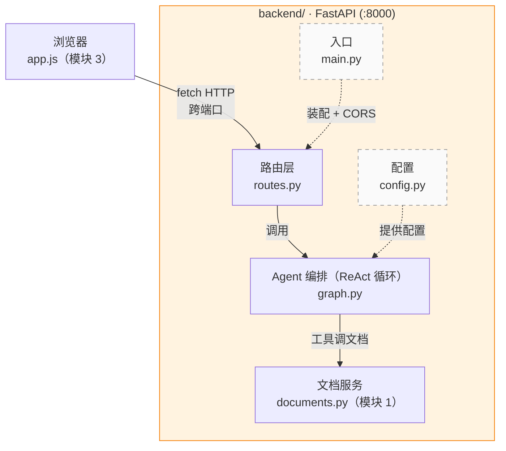
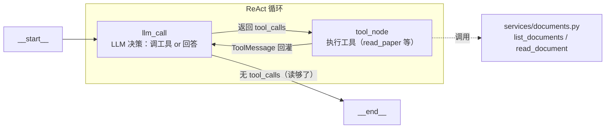

# 模块 2：LangGraph Agent 工作流 + FastAPI 分层 API

## 学习目标

完成本模块后，你将能够：

1. 理解 **LangGraph agent** 的四个核心概念：StateGraph（有向图容器）、Node（节点函数）、Edge（边），以及 agent 区别于固定流程的关键——**条件边**（`add_conditional_edges`）；认识到「没有条件边、没有循环的线性图」只是 agent 图的退化特例
2. 用 `bind_tools` + `ToolNode` 构建 **ReAct 循环**：LLM 自主决定调用哪个工具、调用几次、何时认为「读够了」直接作答——而不是写死「先分析意图、再读全文」
3. 用 `build_graph()` 把[模块 1](./01-Python文档工具.md) 的四个论文导航工具组装成一个 **ReAct 循环**——理解 agent 如何像 omp/hermes 用 `glob`/`read`/`grep` 自主探索代码库那样，探索论文语料库
4. 理解 Python **装饰器（decorator）**：从手写自定义 `@retry`，到 LangChain `@tool`、FastAPI `@router`、标准库 `@dataclass`——认识 `@` 语法背后的高阶函数本质
5. 用 **LangChain** 的 `init_chat_model` 调用 DeepSeek（替代旧版裸 `httpx`），理解**工具调用协议（tool calling）**为何让 agent 层必须引入框架
6. 用 `uv run uvicorn` 启动 API 服务，并通过 `uv run python -c` 验证 SSE 流式 agent 问答

---

## 技术概念

**LangGraph** 是一个用有向图构建 Agent 工作流的框架。核心概念有四：StateGraph（有向图容器）、Node（处理步骤，本质是一个函数）、Edge（步骤间的连接），以及 **条件边**（`add_conditional_edges`）——根据状态动态选择下一个节点。数据（State）从起点 `START` 出发，经节点逐步处理，到达终点 `END`；每个节点接收当前状态、返回要更新的字段，LangGraph 自动合并。本模块的关键认知：**没有条件边、没有循环的线性图，只是 agent 图的退化特例**；真正的 agent 靠条件边实现「LLM 决策 → 执行工具 → 回到 LLM 再决策」的循环。

**ReAct agent**（Reasoning + Acting）是 LLM + 工具的循环：LLM 先「思考」该做什么，再「行动」调用一个工具，拿到结果后继续思考，直到认为信息足够、直接给出答案。它对标 omp/hermes 用 `read`/`grep`/`glob` 自主探索本地代码库——本项目的 agent 把这套能力换到了论文上，用 `list_papers`/`read_paper`/`search_papers`/`extract_abstract` 自主探索论文语料库。路径完全由 LLM 在运行时决定：简单问题两步收工，跨论文对比可能走八九步。

**工具调用协议（tool calling）** 是 ReAct 循环的运转机制。开启工具调用后，LLM 不再只返回文本，而是在响应里返回结构化的 `tool_calls`（函数名 + 参数 JSON）；LangGraph 的 `ToolNode` 解析这些调用、执行对应工具，把结果包装成 `ToolMessage` 回灌给 LLM；LLM 看到工具结果后再次决策——调下一个工具，还是直接回答。`bind_tools`/`ToolNode`/条件边封装了这整套胶水。

> **先观察：开启工具调用后，LLM 的响应长什么样？**
>
> 当 LLM 决定调工具时，OpenAI 兼容接口的响应里 `finish_reason` 是 `"tool_calls"`，`message.content` 为空，真正的指令藏在 `tool_calls` 数组里：
>
> ```json
> {"choices": [{"index": 0, "finish_reason": "tool_calls",
>   "message": {"role": "assistant", "content": null,
>     "tool_calls": [{"id": "call_1", "type": "function",
>       "function": {"name": "search_papers",
>         "arguments": "{\"pattern\": \"dataset|corpus\", \"doc_id\": \"paper_001\"}"}}]}}]}
> ```
>
> 注意 `arguments` 还是一段 **JSON 字符串**（不是字典），需要二次解析；`finish_reason` 决定了响应该怎么处理（`"tool_calls"` 走工具执行，`"stop"` 才是最终答案）。旧版本教过「`content` 是字符串、要 `json.loads` 二次解析」——同样的结构，观感重点从「解析 content」转到了「路由 tool_calls」。LangChain 的 `.invoke()` 会把上面这段解析成结构化的 `AIMessage(tool_calls=[...])`，你不必手写解析——这正是用框架而非裸 HTTP 的核心理由。

> **为什么用 LangChain 而非裸 httpx？** 旧版本用裸 httpx 直接打 DeepSeek 的 `/chat/completions`，图「少一层抽象，能看见完整请求与响应」。但工具调用协议很复杂：要在请求里声明工具 schema、解析响应里的 `tool_calls`、校验参数、路由到对应工具、收集结果、再作为 `ToolMessage` 回灌——这套 ReAct 胶水自己用裸 httpx 写是几百行噪声。LangChain 的 `init_chat_model(...).bind_tools(...)` + LangGraph 的 `ToolNode` 把它们全封装了。所以 agent 层切到 LangChain；httpx 的「客户端 vs 服务端」概念下面单独讲。

**httpx** 是 Python 的 HTTP 客户端库，它**主动**向外部服务发起请求并接收响应。要分清它与 FastAPI 的关系：FastAPI 是**服务端**框架，在本进程监听端口、接收并处理**别人发来的**请求；httpx 是**客户端**库，从本进程**主动发出**请求——方向相反、职责互补。后端进程同时承担两种角色：作为服务端用 FastAPI 接收前端的 `/api/*`；作为客户端向 DeepSeek 发请求——只是这一步现在由 LangChain 代劳（LangChain 底层仍走 HTTP，但 agent 代码不再直接 import httpx、不再手写 HTTP 请求）。

**FastAPI** 是 Python 的现代 Web 框架，把 Python 函数暴露为 HTTP API。本模块采用**分层（layered）布局**：「创建应用」「定义路由」「定义数据模型」拆到不同文件，每层职责单一。

**uvicorn** 是基于 ASGI 的 Web 服务器。FastAPI 只定义路由，无法独立接收网络请求；uvicorn 启动进程、监听端口、接收请求并转交给 FastAPI。本模块用 `uv run uvicorn agentic_search.main:app --reload --port 8000` 启动，`--reload` 开启文件改动后自动重启。

**分层架构（Layered Architecture）** 的核心是「关注点分离」：HTTP 层只管收发请求，不写业务逻辑；agent 层只管 ReAct 编排，不关心 HTTP 细节；工具层只管读写 MongoDB，不知道谁在调用它。

**CORS（跨源资源共享）** 是浏览器的安全机制。浏览器有**同源策略**：只允许网页向「同协议 + 同域名 + 同端口」的地址发请求——三者完全一致才算「同源」。本项目前端（`localhost:3000`）与后端（`localhost:8000`）端口不同，属于**跨源**，浏览器默认拦截。CORS 的解法是后端在响应头加入 `Access-Control-Allow-Origin`，显式告诉浏览器「允许这个外部源访问」。第 9 步用 FastAPI 的 `CORSMiddleware` 完成这一配置。

**装饰器（decorator）** 是 Python 的语法机制：用 `@` 给函数或类「套一层额外逻辑」而不改写其本体，本质是接收函数、返回函数的高阶函数，`@` 只是语法糖。本模块在第 5 步手写一个**自定义装饰器** `@retry`（LLM 调用失败自动重试），第 8 步发现 FastAPI 的 `@router.post` 是库提供的装饰器；[模块 1](./01-Python文档工具.md) 的 LangChain `@tool` 与模块 4 的标准库 `@dataclass` 也是装饰器——同一个机制，既能挂路由、注册工具，也能加重试。

**流式输出（Streaming）** 是服务器「边生成边发送」、客户端「边接收边显示」的数据传输方式，与「生成完毕再一次性返回」相对。LLM 生成回答需要数秒到数十秒——如果等整句话生成完再返回，用户面对一片空白等待很久；流式则让每个字在生成的瞬间就到达浏览器，用户看到文字逐字出现。本项目用 LangGraph 的 `graph.astream(stream_mode="messages")`：DeepSeek 每生成一个 token（文字的最小单位），LangGraph 就通过回调把它推出来，后端立即 yield 给浏览器——不等整句、不等整段、不等整个 ReAct 循环跑完。

**SSE（Server-Sent Events）** 是一种服务器向浏览器单向推送数据的 HTTP 协议格式。每条事件由若干行组成：`event:` 行声明事件类型（可省略，省略时为默认事件），`data:` 行携带数据，事件之间以空行 `\n\n` 分隔。浏览器原生的 `EventSource` API 能自动解析 SSE 帧，但它只支持 GET 请求；本项目的提问接口是 POST（需要在请求体中发送问题），因此前端用 `fetch` + `ReadableStream.getReader()` 手动读取并解析 SSE 帧——这正是 ChatGPT、Claude.ai 等现代 AI 产品的做法。第 8 步的 `/api/query` 端点用 FastAPI 的 `StreamingResponse` 返回 `text/event-stream` 格式的 SSE 流。

> 更多技术概念见 [概念速查](./概念速查.md)。

---

## 模块结构

### 分层架构总览



读图要点：`main.py` 是瘦入口，只负责装配；请求处理在 `api/routes.py`；ReAct 编排由 `agents/graph.py` 的 `llm_call ↔ tool_node` 循环完成；工具读写复用模块 1 的 `services/documents.py`；配置集中在 `configs/config.py`。

### LangGraph 图结构



本模块的图是一个 **ReAct 循环**：`llm_call` 与 `tool_node` 之间靠条件边反复跳转，何时结束由 LLM 决定（不再返回 `tool_calls` 即终止）。模块 4 会在此循环外层加上 `retrieve_memory`（进入前）与 `store_memory`（结束后）两个记忆节点。

---

## 前置条件

- 已完成 [模块 1：Python 文档工具](./01-Python文档工具.md)——`services/documents.py` 中的 `parse_pdf`（返回完整纯文本）、`store_document`、`list_documents`、`read_document` 已实现且测试通过
- `agents/tools.py` 中四个 `@tool` 工具（`list_papers`/`read_paper`/`search_papers`/`extract_abstract`）已实现
- 后端已执行第 1 步的 `uv add`，`langgraph` / `langchain` / `langchain-openai` 等依赖安装完毕
- 有可用的 DeepSeek API Key，写入 `backend/.env` 文件

---

## 核心设计

本模块的 Agent 不写死「先读全文再回答」，而是一个 **ReAct 循环**：LLM 拿到问题后，自主决定调用哪个论文导航工具、调用几次、何时认为证据足够、直接作答。它对标 omp/hermes 探索本地代码库的能力——`list_papers` 相当于 `glob`（看有哪些论文），`read_paper` 相当于 `read :50-100`（按行号取片段），`search_papers` 相当于 `grep`（正则定位行号），`extract_abstract` 相当于 `summarizeCode()`（读取时的概览便利），对象从代码换成了论文。

三个逼出 agentic 行为的设计约束：

1. **没有「读整篇论文」的工具**。agent 必须先 `search_papers` 定位行号、再 `read_paper` 按行号取片段——这是「按需取片段」的强约束，既逼出真正的多轮探索，也是多论文场景下不撑爆上下文窗口的根本保障。
2. `**search_papers` 用正则、不用 embedding**。对齐 omp `grep`：参数是正则 `pattern`（不是语义 query），返回命中行+行号。智能来自 LLM 自主迭代构造正则。**不用向量库、不做 embedding。**
3. `**extract_abstract` 是读取时工具，不是上传预处理**。对齐 omp 的 `summarizeCode()`：agent 按需调用，从完整文本里正则提取 abstract 段落。不在上传时预计算。

---

## 第 1 步：包化布局回顾与依赖安装

### 1.1 目录结构回顾

本模块在模块 1 已建好的包化布局上继续开发。回顾 `backend/src/agentic_search/` 的结构：

```
backend/src/agentic_search/
├── __init__.py
├── main.py              # 本模块新建：瘦入口（创建 app + CORS + 挂路由）
├── configs/
│   ├── __init__.py
│   └── config.py        # 模块 1 已建基础（本模块追加 Agent 专用字段，见第 3 步）
├── api/
│   ├── __init__.py
│   ├── routes.py        # 本模块新建：HTTP 端点
│   └── schemas.py       # 本模块新建：Pydantic 请求/响应模型
├── agents/
│   ├── __init__.py
│   ├── tools.py         # 模块 1 已实现：list_papers / read_paper / search_papers / extract_abstract
│   └── graph.py         # 本模块创建：ReAct agent 图
├── memory/
│   ├── __init__.py
│   └── store.py         # 模块 4 实现：L1/L2 记忆
└── services/
    ├── __init__.py
    └── documents.py     # 模块 1 已实现：parse_pdf / list_documents / read_document
```

**设计说明——为什么要"包化"？**

包化（package layout）把代码组织成 `agentic_search/` 这样的命名空间包，通过 `pyproject.toml` 的可编辑安装注册到 Python 环境。注册后无论从哪个目录运行，都能用绝对导入 `from agentic_search.agents.graph import build_graph`——不折腾 `PYTHONPATH`、不用 `sys.path` 黑魔法。这是工业化项目与「脚本堆砌」的根本区别。

### 1.2 安装依赖

```bash
cd backend
uv add langgraph langchain langchain-openai fastapi 'uvicorn[standard]' pydantic-settings
```

各项依赖的职责：


| 依赖                  | 职责                                                       | 用在哪                       |
| ------------------- | -------------------------------------------------------- | ------------------------- |
| `langgraph`         | Agent 图工作流：StateGraph、条件边、`ToolNode`、`MessagesState`     | `agents/graph.py`         |
| `langchain`         | LLM 抽象 + 工具调用协议（`@tool` / `bind_tools`）                  | `agents/graph.py`         |
| `langchain-openai`  | OpenAI 兼容 provider（接 DeepSeek 的 `/chat/completions`）     | `agents/graph.py`         |
| `fastapi`           | Web 框架                                                   | `main.py`、`api/routes.py` |
| `uvicorn[standard]` | ASGI 服务器（`[standard]` 额外装入 uvloop 与 httptools，官方推荐的完整安装） | 启动命令                      |
| `pydantic-settings` | 从 `.env` 读配置                                             | `configs/config.py`       |


> **httpx 去哪了？** 旧版本单独安装 httpx 并在 agent 代码里直接发 HTTP 请求。现在 agent 层改用 LangChain，HTTP 调用由 LangChain 内部处理（底层仍是 httpx/openai 客户端），所以 agent 代码不再直接 import httpx，也不必单独安装。

---

## 第 2 步：Hello World —— 最小 Agent 图（验证 ReAct 结构）

在写正式工具前，先用一个最小例子确认 ReAct 循环的图结构能跑通。这是排查环境问题的标准做法。本例**用桩函数代替真实 LLM**——目的是验证 `langgraph` 已装好、条件边 + 工具节点的模式能编译运行，不需要 API Key。

新建临时文件 `hello_agent.py`（教学示例，验证完即可删除）：

```python
# 教学示例：最小 ReAct agent 图（桩 LLM，验证循环结构）
from langchain_core.messages import AIMessage, HumanMessage, ToolMessage
from langgraph.graph import StateGraph, START, END, MessagesState   # ← 直接用预置基类


# ① 状态：MessagesState 自带 messages 字段（带 add_messages reducer），无需自己写 TypedDict
#    （第 4 步会讲 MessagesState 内部长什么样；这里先用起来，体会它开箱即用）

# ② 一个 dummy 工具节点（真实版用 ToolNode 自动调度多个工具，见第 6 步）
def get_time(state: MessagesState):
    return {"messages": [ToolMessage(content="现在是 14:00", tool_call_id="call_1")]}


# ③ llm_call：桩函数，模拟「第一轮调工具、第二轮直接答」的决策
_step = 0
def llm_call(state: MessagesState):
    global _step
    _step += 1
    if _step == 1:   # 第一轮：决定调工具
        return {"messages": [AIMessage(
            content="", tool_calls=[{"name": "get_time", "args": {}, "id": "call_1"}])]}
    # 第二轮：看到工具结果，直接回答
    return {"messages": [AIMessage(content="现在 14:00。")]}


# ④ 条件边：看最后一条消息有没有 tool_calls，决定去 tools 还是 END
def should_continue(state: MessagesState) -> str:
    last = state["messages"][-1]
    return "tools" if getattr(last, "tool_calls", None) else END


# ⑤ 组装图：注册节点 → 入口边 → 条件边 → 工具回流
builder = StateGraph(MessagesState)
builder.add_node("llm_call", llm_call)
builder.add_node("tools", get_time)
builder.add_edge(START, "llm_call")
builder.add_conditional_edges("llm_call", should_continue, ["tools", END])
builder.add_edge("tools", "llm_call")     # 工具执行完，回到 llm_call 再决策
graph = builder.compile()


if __name__ == "__main__":
    result = graph.invoke({"messages": [HumanMessage(content="几点了？")]})
    print(result["messages"][-1].content)   # 输出：现在 14:00。
```

运行：

```bash
cd backend
uv run python hello_agent.py
```

**验证**：终端输出 `现在 14:00。`。这就跑通了一个完整的 ReAct 循环——`llm_call → tools → llm_call → END`。逐段说明新概念：

- `**add_messages` reducer**：`messages` 字段标注 `Annotated[list, add_messages]`，表示节点返回的 messages 会**追加**到历史，而不是覆盖（普通字段才是覆盖）。这是循环的关键——工具产生的 `ToolMessage` 要追加进历史，下一轮 `llm_call` 才能看到「上一步调了什么、拿到了什么」。
- **条件边（`add_conditional_edges`）**：第一个参数是源节点，第二个是路由函数（返回 `"tools"` 或 `END`），第三个是可选的「可能去向」列表（给图的可视化与校验用）。路由函数检查最后一条消息——有 `tool_calls` 就去执行工具，没有就结束。
- **工具回流边**：`add_edge("tools", "llm_call")` 让工具执行完回到 LLM，形成循环。正式代码用 `ToolNode([...])` 替代手写的 `get_time`，它能根据 `tool_calls` 自动路由到正确的工具（工具来自[模块 1](./01-Python文档工具.md)，组装见第 6 步）。

> 📖 官方文档：[LangGraph 条件边](https://langgraph.com.cn/how-tos/branching/)

---

## 第 3 步：补充 Agent 配置

`configs/config.py` 的基础已在[模块 1](./01-Python文档工具.md) 创建（`llm_model`、`mongo_url`、`mongo_db`）。配置层只此一份、所有模块共享。Agent 调用 DeepSeek 还需要 API Key、接口地址与超时——这些是 Agent 专用字段，在此**追加到同一个 `Settings` 类**，不重写已有定义。

```python
# configs/config.py —— 在模块 1 的 Settings 类中追加以下字段
# （llm_model / mongo_url / mongo_db 已在模块 1 定义，不重复）

    # Agent 调用 LLM 专用
    llm_model_provider: str = "openai"                # init_chat_model 的 provider 参数，决定用哪个集成包
    llm_api_key: str = ""                              # API 密钥，写入 .env，勿提交到 Git
    llm_base_url: str = "https://api.deepseek.com"     # OpenAI 兼容接口地址
    llm_timeout: int = 60                              # 单次 LLM 调用超时（秒）

> `llm_model`（默认 `deepseek-v4-flash`）已在模块 1 定义，Agent 直接复用，不在此重复。

**为什么只设一个 `llm_timeout`？** 旧版本把超时拆成「意图分析」和「问答」两项，因为那是两种不同量级的调用。新版本的 agent 是同质的 ReAct 循环——每一轮 `llm_call` 都是「决定调哪个工具 or 回答」，耗时在同一量级，不再需要分项超时。

**追加到 `.env`**（基础项已在模块 1 配置，放在 `backend/` 下，**不要提交到 Git**）：

```text
# backend/.env —— 追加 Agent 专用项（填入你自己的密钥）
LLM_MODEL_PROVIDER=openai
LLM_API_KEY=your-api-key-here
LLM_BASE_URL=https://api.deepseek.com
LLM_TIMEOUT=60
```

> 字段名与 `.env` 变量名由 pydantic-settings 自动对应（大小写不敏感、按下划线匹配）：`llm_api_key` ↔ `LLM_API_KEY`、`llm_timeout` ↔ `LLM_TIMEOUT`。

**验证**：

```bash
cd backend
uv run python -c "from agentic_search.configs.config import settings; print(settings.llm_model, settings.llm_model_provider, settings.llm_base_url, settings.llm_timeout)"
```

输出 `deepseek-v4-flash openai https://api.deepseek.com 60`（或你在 `.env` 中设置的值）即正确。

---

## 第 4 步：直接用 `MessagesState` 标准基类

创建 `agents/graph.py`。ReAct agent 的状态就是**对话历史**（`messages` 列表）——LangGraph 提供了预置基类 `MessagesState`，无需自己写 TypedDict：

```python
# agents/graph.py 顶部 —— 直接用标准基类
from langgraph.graph import MessagesState   # 预置状态：messages 字段已带 add_messages reducer
```

`**MessagesState` 是什么？** 它是 LangGraph 预置的状态基类，内部就一行定义：

```python
# LangGraph 源码 langgraph/graph/message.py 里的 MessagesState（无需自己写，直接用）
class MessagesState(TypedDict):
    messages: Annotated[list[AnyMessage], add_messages]
```

`messages` 字段标注 `Annotated[list[AnyMessage], add_messages]`，表示节点返回的 messages 会**追加**到历史而不是覆盖——这正是 ReAct 循环的关键：`tool_node` 产出的 `ToolMessage` 必须接在之前的对话之后，下一轮 `llm_call` 才能看到完整脉络。LangGraph 把这行封装成 `MessagesState`，让你直接拿来用。

**为什么不再自定义 `question` 字段？** 用户提问就是 `messages` 列表的第一条 `HumanMessage`（`messages[0].content` 就是问题），最终答案就是最后一条 AI 消息（`messages[-1].content` 就是答案）。单独留 `question` 字段会重复存储同一信息——标准做法是只靠 `messages`，API 层直接从 `messages[0]` / `messages[-1]` 取。

**验证**：

```bash
cd backend
uv run python -c "from langgraph.graph import MessagesState; print(MessagesState.__annotations__)"
```

看到 `messages` 字段（带 `add_messages` reducer）即正确。

---

## 第 5 步：插曲——什么是装饰器？与自定义 `@retry`

ReAct 循环里，`llm_call` 节点会反复调用 DeepSeek。网络偶发超时、断连是真实风险，重试是真实需求。在写节点之前，先引入一个贯穿本模块的工具——**装饰器（decorator）**，并手写一个自定义的 `@retry`。它将包在 agent 的 LLM 调用上（具体怎么包到 `.invoke()` 上，在第 6 步图组装里展开；本步先看装饰器机制本身）。

#### 什么是装饰器？

装饰器是「在不改写函数体的前提下，给函数套一层额外逻辑」的语法。本质上它是一个接收函数、返回函数的高阶函数，`@` 只是语法糖。你已经在概念速查里见过它——`@router.get("/api/hello")` 就是 FastAPI 提供的装饰器：它接收下面的 `hello` 函数，把它注册成 HTTP 接口，而 `hello` 函数体一行没改。

「重试」这种与业务无关的横切逻辑，正是装饰器的经典舞台——业务函数专注业务，重试逻辑由装饰器包在外面。

```python
# agents/graph.py（续）—— 教学示例
import functools
import httpx   # LangChain 底层走 httpx；这里仍以 httpx 的网络异常作为重试触发条件


def retry(max_attempts: int = 3):
    """自定义装饰器：被包裹的函数失败（超时/连接错误）时自动重试。

    这是「带参数的装饰器」——写 @retry(max_attempts=3) 时，Python 先以 3 为参数
    调用 retry()，拿到返回的 decorator，再用它去装饰下面的函数（多了一层嵌套）。
    """
    def decorator(func):
        @functools.wraps(func)   # 保留原函数的 __name__、__doc__，被装饰后仍可识别
        def wrapper(*args, **kwargs):
            last_exc: Exception | None = None
            for attempt in range(1, max_attempts + 1):
                try:
                    return func(*args, **kwargs)
                except (httpx.TimeoutException, httpx.ConnectError) as e:
                    print(f"  [retry] {func.__name__} 第 {attempt}/{max_attempts} 次失败：{e}")
                    last_exc = e
            assert last_exc is not None  # 循环至少执行一次，且未 return 意味着每次都抛了异常
            raise last_exc   # 重试耗尽，抛出最后一次异常
        return wrapper
    return decorator

逐层拆解：

- **`@functools.wraps(func)`**：被装饰后的函数仍保留原函数的名字（`__name__`）和文档（`__doc__`）。没有它，`wrapper.__name__` 会变成 `"wrapper"`，调试和日志会迷失。这是写装饰器的标准配件。
- **带参数的装饰器**：`@retry(max_attempts=3)` 比 `@retry` 多一层嵌套——Python 先用 `3` 调用 `retry()` 拿到 `decorator`，再用 `decorator` 装饰下面的函数。之所以要这层嵌套，是为了让装饰器能「先吃参数，再吃函数」。
- **捕获哪些异常**：只捕 `httpx.TimeoutException`（超时）与 `httpx.ConnectError`（连接失败）——这两类是网络层瞬时故障，重试有意义；业务异常（如 `KeyError`）不该被吞掉。

`@retry` 用在 agent 的 `llm_call` 上长这样（示意，真实写法见第 6 步）：

```python
@retry(max_attempts=3)
def _call_llm(messages):
    """示意：agent 的 llm_call 节点内部调用 LLM（第 6 步用 llm_with_tools.invoke 展开）。"""
    # return llm_with_tools.invoke(messages)
    ...
```

> 装饰器在[模块 1](./01-Python文档工具.md) 已通过 LangChain `@tool`（把函数注册成 agent 工具）首次介绍。本步手写自定义 `@retry`，是装饰器的第二次「点亮」。后续还有第 8 步的 FastAPI `@router.post`（把函数注册成 HTTP 路由），以及模块 4 的标准库 `@dataclass`——都是装饰器，只是来自不同的库。

---

## 第 6 步：组装 ReAct agent 图 —— `build_graph()`

第 2 步用桩函数验证过 ReAct 的图结构（条件边 + 工具回流）。现在把它「落到真 LLM + 真工具」上——四件套（`init_chat_model` + `bind_tools` + `ToolNode` + `add_conditional_edges`）拼出完整的 agent：

```python
# agents/graph.py（续）—— 组装 ReAct agent 图
from langchain.chat_models import init_chat_model
from langgraph.prebuilt import ToolNode
from langgraph.graph import StateGraph, START, END
from agentic_search.configs.config import settings
from agentic_search.agents.tools import list_papers, read_paper, search_papers, extract_abstract


def build_graph():
    """组装 ReAct agent 图：llm_call ⇄ tool_node 循环，条件边控制终止。"""
    # ① 工具集（模块 1 定义）
    tools = [list_papers, read_paper, search_papers, extract_abstract]

    # ② LLM：init_chat_model 接 DeepSeek（OpenAI 兼容接口），bind_tools 开启工具调用
    #    model / model_provider / base_url / api_key / timeout 全部从 config.py 读取，不硬编码
    llm = init_chat_model(
        model = settings.llm_model,
        model_provider = settings.llm_model_provider,
        base_url = settings.llm_base_url,
        api_key = settings.llm_api_key,
        timeout = settings.llm_timeout
    )
    llm_with_tools = llm.bind_tools(tools)

    # ③ llm_call：LLM 决策节点。第 5 步的 @retry 包在这里——
    #    重试整个含 bind_tools 的 .invoke()，而非包在 init_chat_model 工厂上（工厂只建一次，无需重试）
    @retry(max_attempts=3)
    def llm_call(state: MessagesState):
        response = llm_with_tools.invoke(state["messages"])
        return {"messages": [response]}

    # ④ 条件边：看最后一条消息有没有 tool_calls——
    #    有就执行工具，没有（LLM 认为「读够了」）就结束
    def should_continue(state: MessagesState):
        last = state["messages"][-1]
        return "tool_node" if getattr(last, "tool_calls", None) else END

    # ⑤ 组装：注册节点 → 入口边 → 条件边 → 工具回流
    builder = StateGraph(MessagesState)
    builder.add_node("llm_call", llm_call)
    builder.add_node("tool_node", ToolNode(tools))
    builder.add_edge(START, "llm_call")
    builder.add_conditional_edges("llm_call", should_continue, ["tool_node", END])
    builder.add_edge("tool_node", "llm_call")
    return builder.compile()
```

逐点拆解四件套如何把第 2 步的桩函数换成真 agent：

- `**init_chat_model(...)` + `bind_tools(tools)`**：把模块 1 四个 `@tool` 函数的 schema 注入 LLM。开启后，LLM 的响应里就可能带 `tool_calls`（见技术概念的「先观察」），而不再只是纯文本。
- `**ToolNode(tools)**`：替代第 2 步手写的 `get_time` 桩。它自动读上一条消息的 `tool_calls`，分发到对应工具、执行、把结果包成 `ToolMessage` 回灌——这就是「工具调用协议」的胶水，由 LangGraph 封装好。
- `**add_conditional_edges("llm_call", should_continue, ...)**`：这是 agent 的**心脏**。`should_continue` 只看一眼最后一条消息——有 `tool_calls` 就跳到 `tool_node`，没有就到 `END`。对标 omp 探索代码库时的「搜索 → 读 → 再搜索」循环：何时停止完全由 LLM 在运行时决定，而非写死流程。
- `**add_edge("tool_node", "llm_call")**`：工具执行完回到 LLM 再决策，形成 `llm_call ⇄ tool_node` 的循环。

**为什么 `@retry` 包在 `llm_call` 而非 `init_chat_model` 上？** `init_chat_model(...)` 是工厂——只建一次客户端对象，建失败多半是配置错（重试也没用）；而 `llm_with_tools.invoke(...)` 是真正的网络调用，每轮都可能超时/断连，这才是该重试的对象。装饰器刚好套在「这一行调用」上——这正是第 5 步埋下的 `@retry` 与第 6 步图组装的衔接点。

```
__start__ → llm_call ⇄ tool_node → __end__   （条件边 should_continue 控制循环与终止）
```

> 📖 官方文档：[LangGraph ToolNode](https://langchain-ai.github.io/langgraph/how-tos/tool-calling/) · [LangChain init_chat_model](https://python.langchain.com/docs/how_to/chat_models_load/)

---

## 第 7 步：Pydantic 数据模型 —— `api/schemas.py`

现在进入 FastAPI 分层架构的 HTTP 层。首先定义请求与响应的数据模型。`schemas.py` 是 HTTP 层与外部世界的"契约"——它规定了每个接口接收什么、返回什么。

```python
# api/schemas.py —— 教学示例：请求/响应数据模型
from pydantic import BaseModel


class QueryRequest(BaseModel):
    """POST /api/query 的请求体。"""
    question: str           # 用户提问；读哪篇论文由 agent 自主决定


class ConsolidateRequest(BaseModel):
    """POST /api/consolidate 的请求体（模块 4 启用）。"""
    session_id: str         # 会话 ID


class IngestResponse(BaseModel):
    """POST /api/ingest 的响应。"""
    doc_id: str             # 分配的文档 ID
    filename: str           # 原始文件名


class DocumentResponse(BaseModel):
    """GET /api/documents 返回的单个文档。"""
    doc_id: str             # 文档 ID
    filename: str           # 文档名


class ConsolidateResponse(BaseModel):
    """POST /api/consolidate 的响应（模块 4 启用）。"""
    status: str             # 状态
    l2_id: str              # 生成的 L2 记忆 ID
```

**设计说明——为什么把模型单独放一个文件？**

- **复用**：`QueryRequest` 既被路由层引用，也可能被测试代码引用。
- **职责分离**：路由文件只写"如何处理请求"，不写"请求长什么样"。
- **可文档化**：FastAPI 会自动根据这些模型生成 OpenAPI 文档（访问 `/docs`），集中定义使文档更清晰。

Pydantic 在这里的作用是**数据校验**：当请求体的 `question` 字段缺失或类型错误时，FastAPI 会自动返回 422 错误并指出问题，路由函数无需手动校验。

---

## 第 8 步：HTTP 路由 —— `api/routes.py`（4 个端点）

`routes.py` 是 HTTP 层的核心。它定义 4 个端点，把 HTTP 请求转发给业务层（图、文档工具、记忆）。

```python
# api/routes.py —— 教学示例：4 个 HTTP 端点
import json
from pathlib import Path

from fastapi import APIRouter, HTTPException, UploadFile
from fastapi.responses import StreamingResponse
from langchain_core.messages import HumanMessage, AIMessageChunk

from agentic_search.agents.graph import build_graph
from agentic_search.services.documents import parse_pdf, list_documents, store_document
from agentic_search.api.schemas import (
    QueryRequest, IngestResponse, DocumentResponse,
    ConsolidateRequest, ConsolidateResponse,
)

# 创建路由器，统一加 /api 前缀
router = APIRouter(prefix="/api")

# 构建一次图实例，供所有请求复用
graph = build_graph()
```

**设计说明——为什么用 `APIRouter`？**

`APIRouter` 是 FastAPI 的路由分组机制。把所有端点注册到一个 router 上，再由 `main.py` 用 `app.include_router(router)` 挂载。这样 `main.py` 保持"瘦"，路由文件独立可测试，且 `prefix="/api"` 让所有端点自动带上 `/api` 前缀。

顺带呼应：每个端点上的 `@router.post("/query")`、`@router.get("/documents")` 正是第 5 步学过的**装饰器**——FastAPI 提供的版本。它接收下面的异步函数，把它注册成对应路径的 HTTP 接口。同一个 `@` 机制，既能挂路由（库提供），也能加重试（我们手写）。

### 8.1 POST /api/query（SSE 流式输出）

这是核心接口。前端通过 SSE（Server-Sent Events）接收逐步推送的回答。

```python
@router.post("/query")
async def query(req: QueryRequest):
    """向 Agent 提问，以 SSE 流式返回回答。读哪篇论文由 agent 自主决定。"""
    async def event_stream():
        try:
            async for chunk, metadata in graph.astream(
                {"messages": [HumanMessage(content=req.question)]},
                stream_mode="messages"
            ):
                if not isinstance(chunk, AIMessageChunk):
                    continue                    # 跳过 ToolMessage 等非 LLM chunk
                if chunk.content:               # 文字 token
                    yield f"data: {json.dumps(chunk.content, ensure_ascii=False)}\n\n"
                elif chunk.tool_call_chunks:     # LLM 决定调工具
                    for tc in chunk.tool_call_chunks:
                        if tc.get("name"):
                            yield f"event: tool\ndata: {tc['name']}\n\n"
        except Exception as e:
            yield f"data: {json.dumps(f'[错误：{e}]', ensure_ascii=False)}\n\n"

    return StreamingResponse(event_stream(), media_type="text/event-stream")
```

上面的代码用 SSE 格式推送数据。SSE 协议与流式输出的概念已在开头的[技术概念](#技术概念)段介绍——这里只看这个端点具体怎么用。

本项目用两种事件：文字 token 是默认事件（`data: "你"\n\n`），数据是 JSON 字符串值——`json.dumps` 转义了文字中的换行，防止 SSE 帧被撕裂；工具调用用命名事件（`event: tool\ndata: search_papers\n\n`），工具名是简单标识符，无需 JSON 包裹。流结束时后端关闭连接，前端 `reader.read()` 收到 `done: true` 即知结束——不需要单独的结束事件。

### 8.2 POST /api/ingest（上传 PDF）

这个端点接收用户上传的 PDF，把里面的文字"抠"出来，存进 MongoDB。看起来简单，但藏着一个值得深究的设计问题——我们先看最直觉的写法，再看它为什么啰嗦、以及怎么把它塌缩掉。

#### 笨办法：临时文件（先理解，不必写进项目）

上传的文件经 `await file.read()` 读进内存，得到一串字节流（`bytes`）。而模块 1 的 `parse_pdf` 收的是**文件路径**，不是字节流——

```python
def parse_pdf(path: str | Path) -> str:   # ← 模块 1 的契约：收路径
    with pymupdf.open(path) as doc:
        ...
```

手里是字节，要的是路径——错位出现了。最直觉的解法：把字节先写成一个临时文件，拿到路径喂给 `parse_pdf`，用完再删：

```python
@router.post("/ingest", response_model=IngestResponse)
async def ingest(file: UploadFile = File(...)):
    pdf_bytes = await file.read()                         # ① 读字节到内存

    # ② 把字节写成临时文件，纯粹是为了给 parse_pdf 一个"路径"
    with tempfile.NamedTemporaryFile(suffix=".pdf", delete=False) as tmp:
        tmp.write(pdf_bytes)
        tmp_path = tmp.name                               # 拿到临时文件路径
    try:
        text = parse_pdf(tmp_path)                        # ③ 喂路径给 parse_pdf
    finally:
        os.unlink(tmp_path)                               # ④ 用完即删

    doc_id = Path(file.filename).stem
    store_document(doc_id, file.filename, text)
    return IngestResponse(doc_id=doc_id, filename=file.filename)
```

逐行看为什么每步都"必要"：

- `tempfile.NamedTemporaryFile(...)`：操作系统在临时目录建一个唯一名字的文件，返回路径。`suffix=".pdf"` 让扩展名是 `.pdf`（有些库靠扩展名判格式）。
- `delete=False`：默认 `delete=True` 会在 `with` 块结束时自动删文件——但我们要在 `with` 块**外面**用它，所以必须关掉自动删除。
- `try / finally`：`finally` 块**无论成功还是抛异常都一定执行**，保证临时文件绝不会泄漏。即使 `parse_pdf` 崩溃，`os.unlink` 也会删掉临时文件。
- `os.unlink(tmp_path)`：手动删除临时文件（因为关掉了自动删除）。

四步、12 行，只为完成"字节 → 文本"。功能正确，但啰嗦——而且它把一个错误的前提当成了理所当然。

#### 点破根因：问题不在 pymupdf

上面这套临时文件的绕路，建立在一个注释上：

```python
# ② pymupdf 的 open() 需要文件路径：写入临时文件   ← 这句话是错的
```

**pymupdf 的 `open()` 从来就不"需要"文件路径。** 它的签名是：

```python
pymupdf.open(filename=None, stream=None, filetype=None, ...)
```

`stream=` 参数**直接吃字节流**——传 `pymupdf.open(stream=pdf_bytes, filetype="pdf")` 就能解析内存里的字节，不需要任何文件路径。`stream=` 一直都在。

那临时文件那 12 行是为啥？**根因是 `parse_pdf` 的契约收路径**。手里是字节，`parse_pdf` 要路径，错位逼出了临时文件。改契约，错位消失，12 行全消失。

#### 优化：parse_pdf 改收字节

回到 `services/documents.py`，把模块 1 的 `parse_pdf` 从"收路径"改为"收字节"：

```python
def parse_pdf(pdf_bytes: bytes) -> str:
    """从 PDF 字节流提取纯文本（不读文件、不落盘）。"""
    with pymupdf.open(stream=pdf_bytes, filetype="pdf") as doc:
        return "\n".join(str(page.get_text("text")) for page in doc)
```

变化只有两处：入参 `path` → `pdf_bytes`；内部 `pymupdf.open(p)` → `pymupdf.open(stream=pdf_bytes, filetype="pdf")`。原来那三行 `Path` / `exists` / `FileNotFoundError` 全删——文件不存在的语义交给调用方的 `read_bytes()` 自然抛 `FileNotFoundError`。

> **关于错误处理**：`parse_pdf` 不再手动检查"文件存在"，但 pymupdf 自己会拒绝非法输入——空字节抛 `pymupdf.EmptyFileError`，损坏字节抛 `pymupdf.FileDataError`。不需要我们再加一层校验，简单优先。
>
> **同步更新模块 1 的测试**：`parse_pdf` 改了契约，`test_documents.py` 里两条测试要跟着改——`test_parse_pdf_return_string` 调用改为传 `Path(path).read_bytes()`；`test_parse_pdf_file_not_found` 换成 `test_parse_pdf_empty_bytes_raises`，断言 `pymupdf.EmptyFileError`。

#### 优化后的 ingest

契约改完，ingest 端点塌缩成：

```python
@router.post("/ingest", response_model=IngestResponse)
async def ingest(file: UploadFile):
    """上传 PDF，提取纯文本并存入 MongoDB（零文件系统依赖）。"""
    if not file.filename:                                 # 外部输入，先校验
        raise HTTPException(422, "缺少文件名（filename）")
    pdf_bytes = await file.read()                         # ① 读字节
    text = parse_pdf(pdf_bytes)                           # ② 直接喂字节，无临时文件
    doc_id = Path(file.filename).stem                     # ③ 派生 doc_id
    store_document(doc_id, file.filename, text)           # ④ 存 MongoDB
    return IngestResponse(doc_id=doc_id, filename=file.filename)
```

`tempfile` / `try/finally` / `os.unlink` 全部消失——没有临时文件要写，自然没有要删。这才是"零文件系统依赖"真正兑现的样子。

**设计说明——为什么 PDF 不落盘，且转换与存储分两个函数？**

- **零文件系统依赖**：PDF 字节流直接交给 `parse_pdf`（内部 `pymupdf.open(stream=...)`），全程不碰磁盘。没有 `data/raw/` 目录，没有临时文件，所有持久化数据集中在 MongoDB。
- **职责分离**：`parse_pdf` 只做「PDF → 纯文本」提取（纯函数，便于单元测试）；`store_document` 只做「写入 MongoDB documents 集合」。两者解耦后，换存储后端只需改 `store_document`，`parse_pdf` 不动。
- **doc_id 由文件名派生**：`Path(file.filename).stem` 取主文件名作为文档唯一标识，与模块 1 的 `read_document(doc_id)`、`list_documents()` 保持一致。

### 8.3 GET /api/documents（列出文档）

```python
@router.get("/documents", response_model=list[DocumentResponse])
async def documents():
    """列出已上传的文档。"""
    return list_documents()
```

### 8.4 POST /api/consolidate（触发 L2 记忆整合）

```python
@router.post("/consolidate", response_model=ConsolidateResponse)
async def consolidate(req: ConsolidateRequest):
    """手动触发 L2 会话记忆整合。

    注意：L2 整合逻辑在模块 4 的 memory/store.py 中实现。
    本路由负责把 HTTP 请求转发到记忆层；此处为占位，
    模块 4 将补全真正的整合调用。
    """
    # 模块 4 将在此处调用 memory.store 的整合函数
    # from agentic_search.memory.store import consolidate_session
    # return ConsolidateResponse(status="ok", l2_id=consolidate_session(req.session_id))
    return ConsolidateResponse(status="pending", l2_id="")
```

**设计说明——为什么模块 2 就声明 `/api/consolidate` 路由？**

这是分层架构的体现：HTTP 层在模块 2 就规划好**全部 4 个端点的契约**（路径、请求体、响应体），即使某个端点的业务逻辑要到后续模块才实现。这样前端（模块 3）可以提前对接所有接口，不必等记忆模块完成。占位返回明确状态，模块 4 接入真实逻辑时只需替换函数体。

> 📖 FastAPI StreamingResponse 文档：[https://fastapi.tiangolo.com/zh/advanced/custom-response/](https://fastapi.tiangolo.com/zh/advanced/custom-response/)

---

## 第 9 步：瘦入口 —— `main.py` + CORS

`main.py` 是整个后端的入口，但它是"瘦"的——只做三件事：创建应用、配置 CORS、挂载路由。不含任何业务逻辑。

```python
# main.py —— 教学示例：瘦入口
from fastapi import FastAPI
from fastapi.middleware.cors import CORSMiddleware

from agentic_search.api.routes import router

app = FastAPI(title="Agentic Search with Memory")

# 配置 CORS：允许前端（不同端口）跨域访问
# 前端运行在 localhost:3000，后端在 localhost:8000，浏览器默认拦截跨端口请求
app.add_middleware(
    CORSMiddleware,
    allow_origins=["*"],       # 教学示例：允许所有源；生产环境应限定具体域名
    allow_methods=["*"],
    allow_headers=["*"],
)

# 挂载路由：把 routes.py 的全部端点注册到 app
app.include_router(router)
```

**为什么需要 CORS？**

本项目前端与后端是两个独立服务（端口不同）。浏览器的同源策略默认禁止网页向不同端口发请求。`CORSMiddleware` 在响应头中加入 `Access-Control-Allow-Origin`，告诉浏览器「这个后端允许被前端访问」。没有它，前端的 `fetch` 会被浏览器拦截并报 CORS 错误。

对于 `POST` 等非简单请求，浏览器会先发一个 **预检请求（preflight）**：用 `OPTIONS` 方法询问后端「你允许哪些源、哪些方法、哪些请求头？」。`CORSMiddleware` 会自动应答这个 `OPTIONS` 请求——这就是代码里 `allow_origins`/`allow_methods`/`allow_headers` 三个参数的用途。浏览器收到预检通过后，才真正发出业务请求。

**设计说明——为什么 `main.py` 这么短？**

这正是分层架构的目的。如果入口文件塞满业务逻辑，会变成难以维护的"上帝对象"。把职责分散到各层后，入口只需"装配"，改业务时不动入口，改入口（如换端口、加中间件）时不碰业务。

> 📖 FastAPI CORS 文档：[https://fastapi.tiangolo.com/zh/tutorial/cors/](https://fastapi.tiangolo.com/zh/tutorial/cors/)

---

## 第 10 步：启动服务

```bash
cd backend
uv sync                                  # 确保依赖安装
uv run uvicorn agentic_search.main:app --reload --port 8000
```

逐段说明启动命令：

- `uv run`：在项目的虚拟环境中运行命令。
- `uvicorn agentic_search.main:app`：用 uvicorn 启动 ASGI 应用，定位到 `agentic_search.main` 模块的 `app` 变量。这正是包化布局的好处——用绝对路径定位应用对象。
- `--reload`：代码改动后自动重启，开发时常用。
- `--port 8000`：监听 8000 端口。

**验证——启动后用 Python 测试**：

> **为什么不用 curl？** 在 PowerShell 里用 curl 有三个叠加的坑（`curl` 是别名、续行符不同、JSON body + 中文编码冲突）。用 `uv run python -c '...'` 直接走 httpx——同一个终端、同一个虚拟环境，引号和编码交给 Python 处理，干净利落。

```bash
# ① 列出文档（启动后应能访问，即使列表为空）
uv run python -c '
import httpx
r= httpx.get("http://localhost:8000/api/documents")
print(r.json())
'

# ② 上传一篇 PDF（把路径替换为你本地的 PDF）
uv run python -c '
import httpx
files = {"file": ("要存到库中的文件名.pdf", open(r"论文本体.pdf", "rb"), "application/pdf")}
r=httpx.post("http://localhost:8000/api/ingest", files=files)
print(r.json())
'

# ③ 提问（SSE 流式）——逐行读取，看到 data: 行就是文字 token、event: tool 行是工具调用
#    timeout=60 因为 agent 要多轮调用工具才回答，默认 5 秒不够
uv run python -c '
import httpx
with httpx.stream("POST", "http://localhost:8000/api/query", json={"question": "TiMem的核心方法是什么？"}, timeout=60) as r:
    for line in r.iter_lines():
        if line:
            print(line)
'

# ④ 跨论文提问——观察 agent 自主调 list_papers → search_papers → read_paper
#    换个问题：改 json 里的文字，重发即可
uv run python -c '
import httpx
with httpx.stream("POST", "http://localhost:8000/api/query", json={"question": "对比语料库里两篇论文分别是什么研究方向？"}, timeout=60) as r:
    for line in r.iter_lines():
        if line:
            print(line)
'
```

> 命令 ③④ 会持续打印 SSE 事件直到 agent 回答完毕（连接关闭即结束）。想中途打断按 `Ctrl+C`。

**验证标准**：

- `/api/documents` 返回文档列表（JSON 数组）。
- `/api/ingest` 返回 `{"doc_id": "...", "filename": "..."}`。
- `/api/query` 返回 SSE 流：文字 token 逐个到达（`data: "..."` 行），`event: tool` 行标记工具调用；服务端终端可看到 `[retry]` 重试日志与 agent 多轮工具调用的轨迹。
- 访问 `http://localhost:8000/docs` 可看到 FastAPI 自动生成的交互式 API 文档。

---

## 第 11 步：编写测试（pytest）

### 11.1 测试图逻辑

新建 `tests/test_graph.py`：

```python
# tests/test_graph.py —— 教学示例
from langchain_core.messages import HumanMessage
from agentic_search.agents.graph import build_graph


def test_graph_returns_answer():
    """agent 跑完 ReAct 循环后，最后一条消息应是含答案的 AIMessage。"""
    graph = build_graph()
    result = graph.invoke({
        "messages": [HumanMessage(content="TiMem的核心方法是什么？")],
    })

    # agent 的多轮探索（list_papers → read_paper → ...）都累加进 messages，
    # 最后一条是它认为「读够了」后给出的最终 AIMessage
    final = result["messages"][-1]
    assert final.content   # 非空回答
```

**观察 agent 的探索轨迹**：把 `result["messages"]` 逐条打印（或在服务端终端看日志），能看到 agent 的多轮决策——比如先 `list_papers` 看有哪些论文、再 `search_papers("dataset|corpus", doc_id="paper_001")` 定位、最后 `read_paper` 取证。故意问一个**跨论文**问题（如「对比语料库里两篇论文的数据集差异」），观察 agent 在多篇论文间反复跳转的探索路径——这正是 agentic search 区别于「读一篇全文」的核心。

### 11.2 测试 API 接口

新建 `tests/test_api.py`，用 FastAPI 的 `TestClient`（无需真正启动服务器即可测试路由）：

```python
# tests/test_api.py —— 教学示例
from fastapi.testclient import TestClient
from agentic_search.main import app

client = TestClient(app)


def test_documents_endpoint():
    """/api/documents 应返回 200 与列表。"""
    resp = client.get("/api/documents")
    assert resp.status_code == 200
    assert isinstance(resp.json(), list)


def test_query_validation():
    """缺少 question 字段时应返回 422（Pydantic 校验失败）。"""
    resp = client.post("/api/query", json={})   # 不带 question，应 422
    assert resp.status_code == 422
```

运行测试：

```bash
cd backend
uv run pytest tests/ -v
```

**验证标准**：所有测试显示 `PASSED`。

> 📖 pytest 文档：[https://pytest.cn/](https://pytest.cn/)

---

## 完成检查

完成以下全部项，才算通过本模块：

- [ ] `uv run python -c "from agentic_search.agents.graph import build_graph"` 无报错
- [ ] `uv run uvicorn agentic_search.main:app --reload --port 8000` 成功启动
- [ ] `uv run python -c '...'`（httpx.get）访问 `/api/documents` 返回 JSON 列表
- [ ] `uv run python -c '...'`（httpx.post files=）调用 `/api/ingest` 返回 `doc_id` 与 `filename`
- [ ] `uv run python -c '...'`（httpx.stream）调用 `/api/query` 返回 SSE 流，文字 token 逐个到达（`data: "..."` 行），`event: tool` 行标记工具调用
- [ ] 访问 `http://localhost:8000/docs` 能看到 4 个端点的交互式文档
- [ ] `uv run pytest tests/ -v` 全部绿色

---

## 常见问题

### Q：agent 一直调工具、停不下来（不直接回答）

说明 LLM 总觉得「还没读够」。常见原因：① `tool_node` 没把工具结果正确回灌（检查 `add_edge("tool_node", "llm_call")` 是否在）；② 语料库里确实没有相关信息，LLM 反复搜索同一批词。教学示例省略了兜底——正式实现可在 `should_continue` 里加一个最大轮数上限（如超过 10 轮强制 `END`）。

### Q：启动报 `ModuleNotFoundError: No module named 'agentic_search'`

未执行可编辑安装。在 `backend/` 目录下运行 `uv sync`（会根据 `pyproject.toml` 以可编辑模式安装本包），确保 `from agentic_search...` 这类绝对导入可用。

### Q：浏览器调用接口报 CORS 错误

确认 `main.py` 中已添加 `CORSMiddleware`，且 `allow_origins` 包含前端所在源。教学示例中用 `"*"` 放开全部源。

### Q：`from agentic_search.services.documents import read_document` 报 ImportError

确认模块 1 已完成——`services/documents.py` 中 `read_document` 函数已实现且包已安装。

---

## 下一步

进入 [模块 3：HTML 前端](./03-HTML前端.md)。本模块已暴露 4 个 HTTP 端点，模块 3 将用原生 HTML + fetch 对接它们，实现上传 PDF、流式提问、触发 L2 整合的完整界面。

---

## 延伸阅读

- **LangGraph 官方文档（核心概念）**：[https://langgraph.com.cn/concepts/low_level/](https://langgraph.com.cn/concepts/low_level/)
- **LangGraph ToolNode / 工具调用**：[https://langchain-ai.github.io/langgraph/how-tos/tool-calling/](https://langchain-ai.github.io/langgraph/how-tos/tool-calling/)
- **LangChain init_chat_model / bind_tools**：[https://python.langchain.com/docs/how_to/chat_models_load/](https://python.langchain.com/docs/how_to/chat_models_load/)
- **LangChain 构建 ReAct agent**：[https://langchain-ai.github.io/langgraph/tutorials/introduction/](https://langchain-ai.github.io/langgraph/tutorials/introduction/)
- **FastAPI 官方教程**：[https://fastapi.tiangolo.com/zh/tutorial/](https://fastapi.tiangolo.com/zh/tutorial/)
- **FastAPI CORS 中间件**：[https://fastapi.tiangolo.com/zh/tutorial/cors/](https://fastapi.tiangolo.com/zh/tutorial/cors/)
- **Pydantic 官方文档**：[https://pydantic.com.cn/](https://pydantic.com.cn/)
- **pydantic-settings（环境配置）**：[https://pydantic.com.cn/concepts/pydantic_settings/](https://pydantic.com.cn/concepts/pydantic_settings/)

