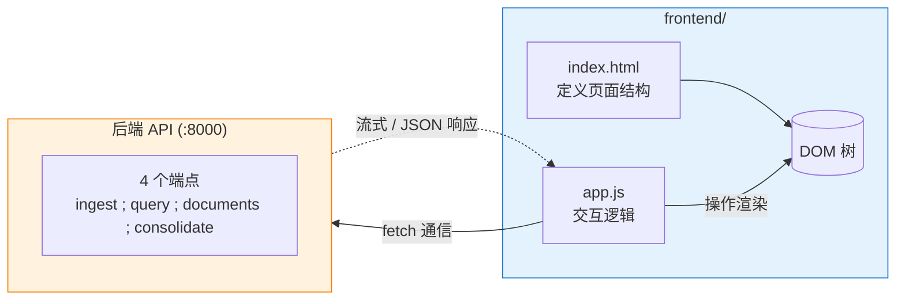

# 模块 3：HTML 前端
> 技术栈：原生 HTML / JavaScript (fetch) / ReadableStream / FormData

---

## 学习目标

完成本模块后，你将能够：

1. 用原生 **HTML** 标签搭建「垂直布局的聊天页面结构」（控件区 → 消息区 → 输入区）
2. 理解 **DOM**（文档对象模型），用 JavaScript 获取元素、修改内容、追加节点
3. 用浏览器原生的 **fetch API** 发起 AJAX 请求，掌握 Promise 与 async/await
4. 用 **ReadableStream** 逐块读取流式响应，实现「逐字出现」的 AI 回答效果
5. 用 **FormData** 实现文件（PDF）上传

本模块的产出是 `frontend/` 目录下的两个文件：`index.html`（页面结构）与 `app.js`（逻辑）。它们调用 [模块 2](./02-LangGraph-Agent.md) 提供的后端 API（上传、流式提问、整合记忆），并在 [模块 4](./04-TMT记忆系统.md) 中接入记忆展示。

---

## 技术概念

**HTML**（HyperText Markup Language）是网页的结构描述语言。用标签（如 `<div>`、`<button>`、`<input>`）定义页面元素的类型与嵌套关系。浏览器读取 HTML 并将其解析为一棵 **DOM 树**，再渲染为可视页面。本项目只用 HTML 描述结构，不写 CSS（采用浏览器默认样式）。

**DOM**（Document Object Model）是浏览器在内存中为 HTML 建立的对象树。JavaScript 通过 DOM API（如 `document.getElementById`、`element.appendChild`）读取或修改页面内容。原生 JavaScript 是**命令式**的：你直接告诉浏览器「在这个节点后面追加一段文字」，逐条操作节点。

**AJAX**（Asynchronous JavaScript and XML）是浏览器在**不刷新整个页面**的前提下，异步向服务器请求或发送数据的技术模式。AJAX 不是某个具体工具，而是「异步获取数据」这一模式的统称。本项目用浏览器原生的 **`fetch`** API 实现 AJAX——它是现代标准，无需第三方库。

**Promise / async-await** 是 JavaScript 处理异步操作的语法。`fetch()` 返回一个 Promise（代表「未来某个时刻会得到的响应」），用 `await` 可以像写同步代码一样等待它完成。本模块会大量使用 `async function` + `await`。

> 更多技术概念见 [概念速查](./概念速查.md)。

---

## 前置知识

本节是前端零基础的「补课」内容：从浏览器渲染机制讲起，到 HTML 结构、JavaScript 语法、DOM 操作、异步编程。读完之后，你应能理解 `index.html` 与 `app.js` 中每一行代码「为什么这样写」，而不只是照抄。

### HTML

**1. 浏览器如何渲染画面**

打开一个 HTML 文件，浏览器并非直接「显示」文本，而是经过一条固定的处理流水线，把文本转换成屏幕像素。这条流水线称为**关键渲染路径（Critical Rendering Path）**，分为五个阶段：

1. **解析（Parse）**。浏览器按字符编码（如 UTF-8）把 HTML 字节流解码成字符，再把字符切分成一个个有意义的单元（标签、属性、文本），称为**词法单元（token）**。每解析出一个 token，就按它的嵌套关系构造一个内存中的节点对象，最终组装成一棵树——这棵树就是 **DOM 树**。CSS 也经历同样过程，解析成 **CSSOM 树**。
2. **样式计算（Style）**。浏览器把 CSS 规则匹配到对应的 DOM 节点，算出每个节点最终生效的样式值。本项目不写 CSS，这一步只应用浏览器默认样式。
3. **布局（Layout / Reflow）**。根据样式（尺寸、边距、定位）计算每个节点在屏幕上的精确位置和大小。
4. **绘制（Paint）**。把文字、颜色、边框、图片填充成像素，画到各个图层上。
5. **合成（Composite）**。把多个图层按顺序叠加，输出最终的屏幕画面。

这条流水线有一个细节直接决定本项目代码的写法：**`<script>` 标签会阻塞解析**。HTML 解析器遇到 `<script>` 时，会停下解析、先下载并执行脚本，执行完才继续解析后面的 HTML（原因是脚本可能修改 DOM，浏览器必须保证执行时 DOM 状态确定）。后果是：若 `<script>` 写在 `<head>` 里，此时 `<body>` 内的元素尚未解析成 DOM 节点，脚本调用 `document.getElementById("upload-btn")` 会得到 `null`。所以本项目把 `<script src="app.js">` 放在 `<body>` 最末尾——确保所有元素先入 DOM 树，脚本执行时才能取到它们。

> 补充 `defer` / `async`：两者只对外部 `<script src>` 生效，都能避免阻塞解析。`defer` 让脚本在文档解析完成后、`DOMContentLoaded` 事件前执行，并保持脚本顺序；`async` 让脚本一下载完就立即执行，不保证顺序。本项目把脚本放在 body 末尾，已天然规避了阻塞问题，无需这两个属性。

**2. HTML 介绍**

HTML（HyperText Markup Language）是一种**标记语言**：用一对对标签标注文本的语义与结构，本身是纯文本文件（扩展名 `.html`）。浏览器读取这些标签，解析成 DOM 树，再渲染成页面。

一个 HTML 文档由四部分组成：**标签（tag）**、**元素（element）**、**属性（attribute）**、**文本内容（text）**。完整的文档骨架如下：

```html
<!DOCTYPE html>          <!-- 文档类型声明，告诉浏览器用 HTML5 标准解析 -->
<html lang="zh">         <!-- 根元素，lang 声明语言 -->
  <head>                 <!-- 头部：存放元信息，不显示在页面上 -->
    <meta charset="UTF-8">   <!-- 字符编码，防止中文乱码 -->
    <title>页面标题</title>   <!-- 浏览器标签页上显示的标题 -->
  </head>
  <body>                 <!-- 主体：所有可见内容都在这里 -->
    <!-- 页面内容 -->
  </body>
</html>
```

要点：

- `<!DOCTYPE html>` 必须是文档第一行，固定写法。缺省会让浏览器退回「怪异模式（quirks mode）」，盒模型等布局行为会偏离标准。
- `<head>` 存放不直接显示的元信息（编码、标题、引入外部 CSS/JS）。
- `<body>` 存放所有可见内容。本项目的控件区、消息区、输入区都写在 `<body>` 内。

**3. HTML 元素**

HTML 元素的语法是「开始标签 + 内容 + 结束标签」：

```html
<p class="note">这是一段文字</p>
 │   └─ 属性                └─ 结束标签
 └─ 开始标签
```

**并非所有元素都有结束标签**。一类称为**空元素（void element / 自闭合元素）**的标签不包裹任何内容，因此没有结束标签：

| 空元素 | 作用 |
|--------|------|
| `` | 插入图片 |
| `<input>` | 表单输入控件 |
| `<br>` | 换行 |
| `<hr>` | 水平分隔线 |
| `<meta>` | 文档元信息 |
| `<link>` | 引入外部资源（如 CSS） |

它们可写成 ``，也可写成自闭合形式 ``，两者等价（HTML5 中斜杠可省）。

**HTML 元素与 DOM 节点的关系**：浏览器解析 HTML 时，每个元素都生成一个对应的 **DOM 节点（node）**，节点之间按嵌套关系构成树。DOM 节点有几个核心属性：

- `nodeType`：节点种类。`1` 是元素节点，`3` 是文本节点，`9` 是 `document` 节点。
- `nodeName`（元素节点等同于 `tagName`）：标签名，如 `"DIV"`（始终大写）。
- `childNodes` / `parentNode`：子节点列表 / 父节点，构成树的连接。
- `attributes`：该元素的所有属性。

JavaScript 拿到的「元素对象」本质就是这些 DOM 节点——对它们读写属性、增删子节点，浏览器会同步重绘页面。

**常用 HTML 元素速查**：

| 元素 | 作用 | 示例 |
|------|------|------|
| `<div>` | 通用块级容器（独占一行） | `<div id="controls"></div>` |
| `<span>` | 通用行内容器（不换行） | `<span class="badge">新</span>` |
| `<p>` | 段落 | `<p>一段文字</p>` |
| `<h1>`~`<h6>` | 标题（数字越大字号越小） | `<h1>主标题</h1>` |
| `<button>` | 按钮 | `<button id="upload-btn">上传</button>` |
| `<input>` | 输入控件（空元素） | `<input type="text" id="q">` |
| `<textarea>` | 多行文本输入 | `<textarea rows="3"></textarea>` |
| `<form>` | 表单容器 | `<form id="query-form">…</form>` |
| `<label>` | 输入框说明文字 | `<label for="q">问题</label>` |
| `<ul>` / `<li>` | 无序列表 / 列表项 | `<ul><li>a</li></ul>` |
| `<a>` | 超链接 | `<a href="...">链接</a>` |
| `` | 图片（空元素） | `` |
| `<script>` | 引入或内联脚本 | `<script src="app.js"></script>` |

本项目实际只用到 `<div>` / `<button>` / `<input>` / `<form>` / `<hr>` / `<script>` 这几种。

**4. HTML 属性（attribute）**

属性写在开始标签里，格式为 `名字="值"`，给元素附加额外信息。属性分两类。

**全局属性（global attribute）**——几乎所有元素都能用：

| 属性 | 作用 | 本项目用法 |
|------|------|-----------|
| `id` | 元素唯一标识，全文档不可重复 | `document.getElementById("upload-btn")` 靠它取元素 |
| `class` | 元素分类标记，可重复、可多个（空格分隔） | 给消息气泡区分 `user` / `assistant` |
| `style` | 行内 CSS 样式 | 本项目不用 |
| `title` | 鼠标悬停时的提示文字 | — |
| `data-*` | 自定义数据属性，存任意业务数据 | — |
| `hidden` | 布尔属性，隐藏元素 | — |

**元素特有属性**——只有特定元素才识别：

| 属性 | 适用的元素 | 示例 |
|------|-----------|------|
| `type` | `<input>` / `<button>` | `<input type="file" accept=".pdf">` |
| `value` | `<input>` | 当前输入值 |
| `placeholder` | `<input>` / `<textarea>` | 占位提示文字 |
| `src` | `` / `<script>` | 资源地址 |
| `href` | `<a>` | 链接地址 |
| `action` / `method` | `<form>` | 提交地址 / 方法 |
| `accept` | `<input type="file">` | 限定文件类型 |

**布尔属性（boolean attribute）**：只有「有 / 无」两种状态，写了即生效、无需赋值，例如 `<input disabled>`（禁用）、`<option selected>`（默认选中）。

工程实践：属性值一律加双引号 `"..."`，即使 HTML5 允许省略——避免值含空格时产生歧义。

### JavaScript

**1. 什么是 JavaScript**

JavaScript（JS）是一种高级、动态类型、由引擎即时编译（JIT）执行的脚本语言。在浏览器中，它负责网页的交互逻辑：响应用户操作、修改页面内容、发起网络请求。

JS 的语言规范叫 **ECMAScript（ES）**。常说的「ES6」指 2015 年发布的 ES2015，是 JS 的重大升级，引入了 `let`/`const`、箭头函数、类、模块、Promise、模板字符串等现代语法。今天的 JS 几乎都是 ES6 及以后版本，浏览器原生支持、无需编译。本项目的 `app.js` 大量使用这些 ES6+ 语法。

**2. JavaScript 基本语法**

**变量声明**：`let`（可重新赋值）与 `const`（绑定不可变，但对象内容仍可改）。两者都是块级作用域（`{}` 内有效）。已淘汰的 `var` 是函数作用域且存在变量提升，现代代码不再使用。

```javascript
let count = 1;                       // 可变
const url = "http://localhost:8000"; // 不可重新赋值
count = count + 1;                   // ✓
// url = "...";                      // ✗ 报错
```

**数据类型**：基本类型（`number` `string` `boolean` `null` `undefined` `symbol` `bigint`）按值传递；对象类型（`object`，含数组、函数）按引用传递。

```javascript
typeof 42;          // "number"
typeof "hi";        // "string"
typeof undefined;   // "undefined"
typeof null;        // "object"（历史遗留，null 实际不是对象）
typeof {};          // "object"
```

**函数**：三种写法。

```javascript
// ① 函数声明（有提升，可在声明前调用）
function add(a, b) { return a + b; }

// ② 函数表达式（赋值给变量）
const add = function (a, b) { return a + b; };

// ③ 箭头函数（ES6，更简洁）
const add = (a, b) => a + b;
const greet = name => `Hello ${name}`;  // 单参数可省括号；单表达式可省 return 和 {}
```

箭头函数与普通函数的关键差异是 `this`：普通函数的 `this` 由调用方式决定，箭头函数没有自己的 `this`，继承外层作用域。本项目回调里主要用箭头函数。

**对象**：花括号定义键值对，用点或方括号访问属性。

```javascript
const user = { name: "Alice", age: 20 };
user.name;            // "Alice"
user["age"];          // 20
user.email = "a@b.com";   // 动态新增属性
const { name } = user;    // 解构赋值，取出 name
```

**数组**：有序集合，常用方法。

```javascript
const arr = [1, 2, 3];
arr.push(4);             // 末尾添加 → [1,2,3,4]
arr.map(x => x * 2);     // 映射 → [2,4,6,8]
arr.filter(x => x > 1);  // 过滤 → [2,3,4]
arr.forEach(x => console.log(x));   // 遍历，无返回值
arr.find(x => x === 2);  // 查找首个匹配 → 2
```

**模板字符串**：反引号包裹，用 `${}` 嵌入变量与表达式。

```javascript
const name = "world";
`Hello, ${name}! 1+1=${1 + 1}`;   // "Hello, world! 1+1=2"
```

**控制流**：`if` / `else if` / `else`、`for`、`for...of`、`while`、`switch`，语法与 C/Java 类似。

```javascript
for (const item of list) { console.log(item); }   // 遍历可迭代对象
```

**3. 常用内置对象**

下列对象是 ECMAScript 语言内置的（不属于浏览器），Node.js 与浏览器里都能用，且与本项目紧密相关。

**`JSON`**——本项目与后端通信的数据格式，最常用。

```javascript
JSON.stringify({ question: "你好" });   // 对象 → JSON 字符串：'{"question":"你好"}'
JSON.parse('{"doc_id":"abc"}');         // JSON 字符串 → 对象：{ doc_id: "abc" }
```

**`Math`**——数学运算。

```javascript
Math.max(1, 5, 3);    // 5
Math.floor(3.9);      // 3
Math.random();        // 0~1 随机数
```

**`Date`**——时间。

```javascript
new Date();               // 当前时间
new Date().toISOString(); // "2025-01-01T00:00:00.000Z"
```

**`String` 方法**——字符串处理。

```javascript
"a,b,c".split(",");        // ["a","b","c"]   按分隔符切数组
"hello".includes("ell");   // true            是否包含
"hello".slice(1, 3);       // "el"            截取 [start, end)
"hello".replace("l", "L"); // "heLlo"         替换首个匹配
```

**`Object` 方法**——遍历对象的键值。

```javascript
Object.keys({ a: 1, b: 2 });    // ["a","b"]
Object.values({ a: 1, b: 2 });  // [1, 2]
Object.entries({ a: 1, b: 2 }); // [["a",1],["b",2]]
```

**`Error` 与 `try/catch`**——异常处理。

```javascript
try {
  JSON.parse("{非法}");    // 抛出 SyntaxError
} catch (e) {
  console.error(e.message);
}
```

**4. 浏览器中的 JavaScript**

浏览器内置一个 JS 引擎（Chrome 用 V8，Firefox 用 SpiderMonkey）执行脚本。在浏览器环境里，JS 还能访问一组**宿主对象（host object）**——由浏览器提供、与页面及浏览器交互的接口。这些对象分两大类。

**BOM（Browser Object Model，浏览器对象模型）**：以 `window` 为根，提供对浏览器窗口与环境信息的访问。`window` 同时是浏览器的**全局对象**：所有全局变量和全局函数都成为 `window` 的属性，`window.xxx` 的 `window.` 常可省略。

| BOM 对象 / 方法 | 作用 |
|----------------|------|
| `window` | 全局对象，代表当前浏览器窗口/标签页 |
| `window.location` | 当前 URL 信息，读写可实现跳转 |
| `window.navigator` | 浏览器与系统信息（如 `navigator.userAgent`） |
| `window.history` | 浏览历史，`history.back()` 后退 |
| `window.localStorage` | 本地持久存储（键值对） |
| `window.fetch` | 发起 HTTP 请求（本项目核心） |
| `window.alert` / `window.console` | 弹窗 / 控制台输出（调试用） |

**DOM（Document Object Model，文档对象模型）**：以 `document` 为根，`document` 即 `window.document`，代表整个 HTML 页面对应的 DOM 树，是 JS 操作页面内容的唯一入口。

| `document` 方法 | 作用 |
|----------------|------|
| `document.getElementById(id)` | 按 id 取单个元素 |
| `document.querySelector(sel)` | 按 CSS 选择器取首个匹配 |
| `document.querySelectorAll(sel)` | 取全部匹配（返回类数组 NodeList） |
| `document.createElement(tag)` | 创建新元素节点 |
| `document.createTextNode(text)` | 创建文本节点 |

**BOM 与 DOM 的关系**：`document` 是 `window` 的属性（`window.document === document`）。BOM 管「浏览器窗口与环境」，DOM 管「页面内容」，二者都挂在 `window` 这棵全局对象树上。

**5. DOM 操作**

DOM 操作分四类：**查询**、**读写**、**增删**、**事件**。本项目 `app.js` 的核心就是这四类操作的组合。

**① 查询元素**

```javascript
document.getElementById("upload-btn");      // 按 id，最快、最精确
document.querySelector("#upload-btn");      // CSS 选择器，等价于上面
document.querySelectorAll("div.message");   // 取全部，返回 NodeList
```

`querySelector` 接收 CSS 选择器字符串：`#id`、`.class`、`tag`、`.a.b`（同时含两个 class）、`div > p`（直接子级）等，比 `getElementById` 灵活。

**② 读写内容与属性**

```javascript
const el = document.getElementById("messages");
el.textContent;                 // 读取纯文本
el.textContent = "新内容";       // 设置文本（会转义 HTML，安全）
el.innerHTML;                   // 读取 HTML（设置时会被解析为标签，有 XSS 风险）
el.className;                   // 读取 class 字符串
el.className = "message user";  // 设置 class
el.classList.add("active");     // 增删 class 的推荐方式
el.classList.remove("active");
el.classList.toggle("active");
el.getAttribute("href");        // 读写任意属性
el.setAttribute("href", "...");
```

**安全提示**：用户输入或网络数据若直接写进 `innerHTML`，可能被解析成 `<script>` 等标签执行（XSS 攻击）。渲染纯文本一律用 `textContent`。

**③ 创建与增删节点**

增删操作的「目标」必须是元素引用：要么是用第 ① 节查询方法（`getElementById` / `querySelector`）拿到的**已存在节点**，要么是 `createElement` **新建的节点**。下面的 `messagesEl`、`parentEl` 就是查询来的容器；`div` 是新建的节点。

```javascript
// 先用第 ① 节的查询方法拿到已存在的元素引用
const messagesEl = document.getElementById("messages");
const parentEl = document.getElementById("controls");

const div = document.createElement("div");   // 新建（此时不在页面上）
div.className = "message";
div.textContent = "你好";
messagesEl.appendChild(div);            // 追加为子节点 → 此刻才出现在页面上
parentEl.insertBefore(div, parentEl.firstChild);  // 插到指定子节点前面
div.remove();                            // 从 DOM 删除自身
```

**④ 事件监听**

用户交互（点击、输入、提交）会触发**事件**。用 `addEventListener` 把回调函数绑定到元素的事件上：

```javascript
button.addEventListener("click", () => {
  console.log("被点击了");
});
form.addEventListener("submit", (e) => {
  e.preventDefault();   // 阻止表单默认提交行为（页面跳转）
  console.log("表单提交");
});
```

`e.preventDefault()` 在本项目很关键：`<form>` 默认提交会刷新整页，而前端要自己用 `fetch` 处理，因此必须阻止默认行为。`addEventListener` 第二个参数是函数引用（不带括号），事件发生时浏览器才调用它。

**⑤ 本项目的标准套路**：查询 → 创建 → 填充 → 挂载。

```javascript
function appendMessage(role, text) {
  const messagesEl = document.getElementById("messages");  // 查询容器
  const div = document.createElement("div");               // 创建节点
  div.className = "message " + role;                       // 设 class
  div.textContent = text;                                  // 设文本
  messagesEl.appendChild(div);                             // 挂到树上
}
```

流式回答时，先创建一个空节点拿到引用，再用 `div.textContent += chunk` 把分块到达的文字累加进去——不必每次创建新节点。

**6. 异步函数**

JavaScript 是**单线程**的：同一时刻只执行一段代码。如果某个操作要等待（网络请求、定时器、读文件），绝不能让主线程卡住，否则页面会冻结。JS 用**事件循环（Event Loop）**解决：把「需要等待的任务」交给浏览器后台，主线程继续往下跑；等后台任务完成，把对应的回调排进**任务队列**，主线程空闲时再取出来执行。

最原始的异步写法是**回调函数**，但层层嵌套可读性差（俗称「回调地狱」）。现代 JS 用 **Promise** 与 **async/await**。

**Promise**：代表一个「尚未完成、将来会有结果」的值，有三种状态——`pending`（进行中）、`fulfilled`（成功）、`rejected`（失败）。状态一旦敲定（后两者统称 settled）不可逆。

```javascript
fetch("http://localhost:8000/api/documents")   // 返回 Promise（pending）
  .then(res => res.json())        // 成功：拿到 Response，再解析成 JSON
  .then(data => console.log(data)) // 链式：上一步的返回值传给下一步
  .catch(err => console.error(err)); // 失败：捕获错误
```

**async / await**：用同步的写法写异步代码。`async` 声明的函数自动把返回值包成 Promise；`await` 暂停当前 async 函数的执行，等 Promise 落定后再取结果（暂停期间不阻塞主线程，事件循环照常运转）。

```javascript
async function uploadFile() {
  try {
    const res = await fetch(".../api/ingest", { method: "POST", body: form });
    const data = await res.json();   // res.json() 也返回 Promise，也要 await
    console.log(data.doc_id);
  } catch (e) {
    console.error("上传失败", e);     // await 抛出的错误用 try/catch 捕获
  }
}
```

要点：

- `await` 只能在 `async` 函数内（或 ES 模块的顶层）使用。
- `await` 后面通常跟一个 Promise；若不是 Promise，`await` 直接返回该值。
- 多个**互不依赖**的异步操作不要串行 `await`，应并行：`await Promise.all([a(), b()])`。

本项目的每一次网络请求（`fetch`）都是异步的，全部用 `async/await` 处理；流式回答则配合 `ReadableStream` 逐块读取。这两者的完整实现见后续步骤。

---

## 模块结构



上图说明数据流向：`index.html` 只定义结构，所有交互逻辑集中在 `app.js`；`app.js` 通过 `fetch` 调用后端的 `ingest` / `query` / `consolidate` 三个端点（`documents` 端点现供 agent 的 `list_papers` 工具使用，前端不再渲染文档下拉框），把结果写回 DOM 树。用户只管在输入框提问，读哪篇论文由后端 agent 自主探索决定。

## 前置要求

- 已完成 [模块 2：LangGraph Agent 工作流](./02-LangGraph-Agent.md)，后端能在 `localhost:8000` 正常启动并响应 4 个 API 端点
- 已安装任意现代浏览器（Chrome / Edge / Firefox）
- 已安装 **VS Code**（或其他编辑器，VS Code 的 Live Server 插件可方便地本地预览）
- 有基础的 JavaScript 语法知识（变量、函数、`async/await`）

> **为什么前端排在模块 2 之后？** 本项目的推荐学习路径是「模块 1（文档工具）→ 模块 2（LangGraph 后端）→ 模块 3（HTML 前端）→ 模块 4（记忆系统）」。前端需要后端的 agent 已经能自主探索论文并流式作答，否则页面提问没有数据可交互。因此请先完成后端。

---

## 项目结构

本模块的工作目录是 `frontend/`，最终只有两个文件：

```
agentic-search/
└── frontend/
    ├── index.html   # 本模块创建：页面结构（垂直布局：控件区 + 消息区 + 输入区）
    └── app.js       # 本模块创建：fetch 通信 + DOM 渲染 + 流式读取
```

无 `package.json`、无 `node_modules`、无构建配置文件。这就是「零构建」的全部含义。

---

## 步骤 0：启动后端并确认 API 可用

前端的每一步交互都依赖后端，因此先把后端跑起来。

```bash
cd backend
uv sync
uv run uvicorn agentic_search.main:app --reload --port 8000
```

**验证**：浏览器打开 `http://localhost:8000/docs`，能看到 FastAPI 自动生成的接口文档，其中列出 `POST /api/query`、`POST /api/ingest`、`GET /api/documents`、`POST /api/consolidate` 四个端点。

> **关于跨域（CORS）**：前端从本地文件或 `localhost:3000` 访问 `localhost:8000` 属于跨源请求。后端 `main.py` 已配置 `CORSMiddleware`（允许所有来源），因此前端无需额外处理。若看到控制台报 CORS 错误，请回 [模块 2](./02-LangGraph-Agent.md) 确认 `main.py` 中 CORS 中间件已挂载。

---

## 步骤 1：HTML 结构 —— `index.html`

`index.html` 是浏览器的入口文件。它的唯一职责是**描述页面长什么样**（有哪些元素、如何嵌套），不包含任何逻辑。

### 1.1 整体骨架

```html
<!-- 这是教学示例，展示结构，非完整可运行文件 -->
<!DOCTYPE html>
<html lang="zh">
<head>
  <meta charset="UTF-8">
  <title>Agentic Search with Memory</title>
</head>
<body>
  <!-- 顶部控件区：上传 + 整合记忆按钮 -->
  <div id="controls"></div>

  <!-- 中部消息区：显示对话 -->
  <div id="messages"></div>

  <!-- 底部输入区：提问表单 -->
  <form id="query-form"></form>

  <script src="app.js"></script>
</body>
</html>
```

逐行讲解：

- `<!DOCTYPE html>`：告诉浏览器用 HTML5 标准解析，这一行是固定写法
- `<html lang="zh">`：`lang` 属性声明页面语言为中文，辅助搜索引擎与屏幕阅读器
- `<head>` 中的 `<meta charset="UTF-8">`：指定字符编码，避免中文乱码
- `<body>` 内是页面的可见内容
- `<script src="app.js">`：**放在 `<body>` 末尾**。这样浏览器先解析完所有 HTML 元素（DOM 树建好），再加载并执行 JavaScript。如果把 `<script>` 放在 `<head>` 里，`app.js` 执行时页面元素还不存在，`document.getElementById` 会拿到 `null`。这是原生 JavaScript 的一个常见陷阱

### 1.2 控件区结构

控件区承载两块功能：PDF 上传、整合会话记忆按钮。

```html
<!-- 这是教学示例 -->
<div id="controls">
  <input type="file" id="file-input" accept=".pdf">
  <button id="upload-btn">上传 PDF</button>

  <hr>

  <button id="consolidate-btn">整合会话记忆（L2）</button>
</div>
```

关键属性说明：

- `<input type="file" accept=".pdf">`：`type="file"` 让它变成文件选择控件；`accept=".pdf"` 限制只接受 PDF 文件
- 每个**需要在 JS 中操作的元素都带 `id`**。`id` 是 DOM 树中元素的唯一标识，`document.getElementById("upload-btn")` 就能拿到这个按钮对象。这是原生 JS 获取元素的标准方式（对比 React 用 `ref`）

### 1.3 聊天区结构

聊天区分两部分：上方滚动显示消息，下方是输入框。

```html
<!-- 这是教学示例 -->
<div id="messages"><!-- JS 渲染：所有对话气泡 --></div>
<form id="query-form">
  <input type="text" id="question" placeholder="问一个问题...">
  <button type="submit">发送</button>
</form>
```

为什么用 `<form>` 包裹输入框？因为 `<button type="submit">` 配合 `<form>` 能让用户**按回车提交**——浏览器会自动触发 `submit` 事件。如果用裸 `<input>` + `<button>`，则需要手动监听回车键，多写代码。这是「利用原生平台特性」的一个例子。

### 验证

把完整的 `index.html` 写好后，直接双击文件用浏览器打开（或用 VS Code Live Server）。应该看到三个区块（控件区 → 消息区 → 输入区）垂直堆叠，排布很朴素——这是正常的，本项目不写 CSS。

---

## 步骤 2：DOM 操作基础 —— 获取与修改元素

`app.js` 的第一件事是把 HTML 里的元素「拿到手里」，这需要 DOM API。

### 2.1 获取元素

```javascript
// 这是教学示例
const uploadBtn = document.getElementById("upload-btn");
const fileInput = document.getElementById("file-input");
const messagesEl = document.getElementById("messages");
```

`document.getElementById(id)` 返回对应的 DOM 元素对象。拿到对象后就能读它的属性（如 `fileInput.files[0]`）、调它的方法（如 `messagesEl.appendChild(...)`）、或给它绑定事件。

### 2.2 绑定事件

点击「上传」按钮时希望执行某段代码，用 `addEventListener`：

```javascript
// 这是教学示例
uploadBtn.addEventListener("click", uploadFile);
```

第二个参数 `uploadFile` 是一个函数引用（注意没有括号——传函数本身，不是传调用结果）。当用户点击按钮，浏览器会自动调用这个函数。对比 React 的 `onClick={handleClick}`——原生 JS 需要你显式地「把函数挂到元素上」。

### 2.3 创建并追加节点

要把一条新消息显示到聊天区，需要**创建新元素并挂到 DOM 树上**：

```javascript
// 这是教学示例
function appendMessage(role, text) {
  const div = document.createElement("div");   // 1. 创建一个 <div>
  div.className = "message " + role;          // 2. 设置 class（用于区分用户/AI）
  div.textContent = text;                     // 3. 设置显示文字
  messagesEl.appendChild(div);                // 4. 挂到消息区末尾
}
```

逐行讲解：
- `document.createElement("div")` 在内存中创建一个新元素，但**此时它还不在页面上**
- `appendChild` 把元素追加为 `#messages` 的子节点，这一步之后页面才会显示它

这与 React 的「修改 state 数组，框架自动 diff 并更新 DOM」截然不同。原生 JS 是命令式的：你精确控制「在哪里创建、在哪里挂载」。

> **流式追加的小技巧**：流式回答时，文字是一段段到达的。常见做法是先创建一个空的 AI 消息 `<div>`，拿到它的引用，然后用 `el.textContent += chunk` 把每一段文字累加上去——不必每次都创建新节点。这个技巧会在步骤 5 用到。

---

## 步骤 3：AJAX 与 fetch —— 通信的本质

前端的核心工作是和后端通信。本项目用浏览器原生的 **`fetch` API**。

### 3.1 一个最简单的 GET 请求

先用一个最小的 GET 请求演示 `fetch` 的基本语法。本项目的 `GET /api/documents` 现在供 agent 的 `list_papers` 工具调用——前端已移除文档下拉框，不再渲染它的返回值，这里仅以该端点演示 GET + JSON 解析的最小写法：

```javascript
// 概念演示：fetch GET 的最小写法（本前端不实际调用此端点，它现供 agent 工具使用）
const res = await fetch("http://localhost:8000/api/documents");
const docs = await res.json();   // 把响应体解析成 JS 数组，例如 [{doc_id: "abc", filename: "paper.pdf"}, ...]
console.log(docs);
```

逐行讲解：
- `fetch(url)` 发起请求，返回一个 **Promise**（代表「未来的响应」）
- `await` 等待这个 Promise 完成，拿到 `Response` 对象 `res`
- `res.json()` 也是异步的（读取响应体并解析 JSON），所以也要 `await`

注意一个关键区别：`fetch` 默认是 GET 方法。要发 POST 或上传文件，需要传入第二个参数（配置对象）。本前端实际的请求都是 POST——上传 PDF（步骤 4）、流式提问（步骤 5）、整合记忆（步骤 6）。

---

## 步骤 4：文件上传 —— FormData + fetch

上传 PDF 不能发 JSON，要用 `multipart/form-data` 格式。浏览器原生提供 **FormData** 对象来构造这种格式。

### 4.1 构造 FormData

```javascript
// 这是教学示例
const form = new FormData();
form.append("file", fileInput.files[0]);   // fileInput 是 <input type="file">
```

讲解：
- `fileInput.files` 是一个类数组，`[0]` 是用户选中的第一个文件（一个 `File` 对象）
- `FormData.append(字段名, 值)` 往表单里加一个字段。后端 FastAPI 用 `UploadFile` 接收名为 `file` 的字段

### 4.2 发起上传请求

```javascript
// 这是教学示例
async function uploadFile() {
  const file = fileInput.files[0];
  if (!file) return alert("请先选择 PDF 文件");

  const form = new FormData();
  form.append("file", file);

  const res = await fetch("http://localhost:8000/api/ingest", {
    method: "POST",
    body: form,                  // 注意：不要手动设 Content-Type
  });
  const data = await res.json(); // 后端返回 {doc_id, filename}
  alert(`上传成功：${data.filename}`);
}
```

关键点：**不要手动设置 `Content-Type: multipart/form-data`**。`fetch` 传 `FormData` 时会自动设这个头并加上正确的 `boundary`（分隔符）。如果你手动写死 `Content-Type`，会缺少 boundary，后端无法解析。这是上传文件的常见陷阱。

### 验证

1. 后端 `POST /api/ingest` 已可用
2. 在页面选一个 PDF，点「上传 PDF」
3. 浏览器 DevTools → Network 面板能看到一个 `multipart/form-data` 的 POST 请求
4. 上传成功后弹出文件名

---

## 步骤 5：流式提问 —— ReadableStream

这是本模块最核心、也最有趣的部分。真实 AI 产品（如 ChatGPT）的回答是**逐字流式出现**的，而不是等几十秒一次性弹出。本项目后端 `POST /api/query` 返回的是 **SSE 流式文本**，前端用 `fetch` + `ReadableStream` 逐块读取。

### 5.1 为什么 fetch 能流式

`fetch` 的 `response.body` 是一个 `ReadableStream`，可以拿到一个 `reader`，**一边接收一边读**——这正是流式所需的。

### 5.2 流式读取的核心循环

```javascript
// 这是教学示例
async function askQuestion() {
  const question = questionInput.value.trim();
  if (!question) return;

  appendMessage("user", question);          // 先显示用户的问题
  const aiEl = appendMessage("assistant", "");// 创建空的 AI 气泡，拿引用待填充
  const textNode = document.createTextNode(""); // 专门累积回答文字的文本节点
  aiEl.appendChild(textNode);

  const res = await fetch("http://localhost:8000/api/query", {
    method: "POST",
    headers: { "Content-Type": "application/json" },
    body: JSON.stringify({ question }),
  });

  const reader = res.body.getReader();   // 1. 拿到流的读取器
  const decoder = new TextDecoder();      // 2. 字节 → 文字的解码器
  let buffer = "";                        // 3. SSE 事件缓冲区（见下方解释）

  while (true) {
    const { done, value } = await reader.read();   // 4. 读一块字节
    if (done) break;
    buffer += decoder.decode(value, { stream: true });
    let idx;
    while ((idx = buffer.indexOf("\n\n")) !== -1) { // 5. 每凑成一个完整事件就处理一个
      const rawEvent = buffer.slice(0, idx);
      buffer = buffer.slice(idx + 2);
      let eventType = "", dataLine = "";
      for (const line of rawEvent.split("\n")) {
        if (line.startsWith("event: ")) eventType = line.slice(7);
        else if (line.startsWith("data: ")) dataLine = line.slice(6);
      }
      if (eventType === "tool") {                       // 6a. 工具调用：显示成状态行
        const status = document.createElement("div");
        status.textContent = `🔧 调用工具：${dataLine}`;
        aiEl.insertBefore(status, textNode);           // 插在回答文字之前
      } else if (dataLine) {                            // 6b. 文字片段
        textNode.data += JSON.parse(dataLine);         // data 是 JSON 字符串，parse 去掉引号
      }
    }
  }
  buffer += decoder.decode();   // 7. 流结束，刷掉解码器里残余字节
}
```

> **关键洞察——为什么不能直接 `textContent += decode(value)`？**
>
> 后端 `/api/query` 返回的不是「裸文本」，而是 **SSE（Server-Sent Events）协议**——每个事件由若干行 `字段: 值` 组成，事件之间用一个**空行**（`\n\n`）分隔。它实际吐出的字节长这样：
>
> ```
> event: tool
> data: list_papers
>
> data: "这篇论文"
>
> data: "的核心方法是..."
> ```
>
> 注意两点：① 文字片段的 `data:` 后面是 **JSON 编码的字符串**（带引号 `"这篇论文"`，因为后端用 `json.dumps()` 序列化，保证多行/特殊字符安全传输）；② 工具调用是单独的 `event: tool` 事件。如果像最初那样把原始字节直接糊进气泡，用户会看到字面的 `data: "你好"` 和 `event: tool`——而不是干净的文字。所以前端必须**按 `\n\n` 切事件、识别 `data:`/`event:` 前缀、再 `JSON.parse` 去引号**。

逐段讲解：
- `JSON.stringify({ question })`：提问接口接收 JSON，需要先序列化；ES6 里键名和变量同名可简写成 `{ question }`（等价于 `{ question: question }`）
- `res.body.getReader()`：拿到流的读取器，每次 `read()` 返回一块字节
- `decoder.decode(value, { stream: true })`：把字节转成字符串。`{ stream: true }` 告诉解码器「后面还有数据」——遇到多字节字符（如中文）被拆在两块时，它会暂存半个字符等下一块拼完整，避免乱码
- `buffer` 缓冲区是核心：网络一次 `read()` 到的字节，可能只是某个 SSE 事件的**一部分**（事件按 `\n\n` 分隔，但 `\n\n` 不一定恰好落在块边界上），也可能一次包含**多个**事件。所以先全攒进 `buffer`，再用 `indexOf("\n\n")` 把里面**已凑完整的**事件逐个切出来处理，没凑完的留在缓冲区等下一块
- 事件内每行可能是 `event: tool`（工具调用）或 `data: "文字"`（文字片段）；按前缀分流
- 工具调用（`event: tool`）：生成一个 `🔧 调用工具：xxx` 的状态 `<div>`，`insertBefore(status, textNode)` 插在回答文字**之前**——因为工具调用总是先于用它产出的文字到达，这样状态行显示在顶部、回答在下方，符合阅读顺序
- 文字片段：`JSON.parse(dataLine)` 把 `'"你好"'` 解析回 `'你好'`（去掉外层引号），累加进 `textNode.data`。用专门的文本节点而非 `aiEl.textContent +=`，是为了避免把工具状态 `<div>` 冲掉——`textContent` 赋值会清空元素的所有子节点
- 循环结束后的 `decoder.decode()`（不带参数）把解码器内部残余的半个字符刷出来收尾

> **MDN ReadableStream 文档**：https://developer.mozilla.org/zh-CN/docs/Web/API/ReadableStream

### 5.3 为什么用 appendMessage 返回元素引用

为了让流式循环能精确地把文字追加到「这一条 AI 回复」上，`appendMessage` 应返回刚创建的元素引用：

```javascript
// 这是教学示例
function appendMessage(role, text) {
  const div = document.createElement("div");
  div.className = "message " + role;
  div.textContent = text;
  messagesEl.appendChild(div);
  return div;                 // 返回引用，供流式循环追加内容
}
```

这样 `askQuestion` 里 `const aiEl = appendMessage("assistant", "")` 就拿到了这条 AI 消息的节点；循环中往它里面追加文字文本节点（`textNode`）和工具状态 `<div>`，只改这一条气泡，不影响其他消息。`appendMessage` 返回引用，是「先建好容器、再流式往里填」这个套路的前提。

### 验证

1. 确保后端 `POST /api/query` 已启动且返回流式响应
2. 先上传一篇 PDF（步骤 4）
3. 在输入框打字提问，回车或点发送
4. 应该看到 AI 回答**逐字出现**，而非一次性弹出；回答上方可能出现 `🔧 调用工具：list_papers` 之类的状态行（agent 自主探索论文时产生）

> **关于回答里的星号**：AI 的回答可能含 Markdown 标记（如 `**重点**`），但本前端用 `textContent` 渲染纯文本、不解析 Markdown，所以会原样显示 `**重点**`。这是教学项目的刻意简化——想要粗体效果需要额外的 Markdown 解析库，不在本模块范围。

> **如果后端还没实现流式接口**：可先临时把 `askQuestion` 改成非流式（`await res.json()` 一次性取结果再显示），等 [模块 2](./02-LangGraph-Agent.md) 完成后切回流式。

---

## 步骤 6：整合会话记忆按钮 —— 手动触发 L2

在 [模块 4（TMT 记忆系统）](./04-TMT记忆系统.md) 中，记忆分两层：L1（每轮对话后自动提取事实）和 L2（会话级摘要）。其中 **L2 整合在本项目中由前端按钮手动触发**，而非等待空闲超时。

> **为什么手动触发？** TiMem 生产实现中，L2 由 `SessionMemoryScanner` 定期扫描，当会话**最后一次交互超过 10 分钟空闲**时才触发。但教学项目为了便于演示和测试，不等待 10 分钟，改为用户主动点击按钮即时触发。TiMem 的空闲超时原理仍作为背景概念在模块 4 讲解。

### 6.1 按钮逻辑

```javascript
// 这是教学示例
async function consolidateMemory() {
  const res = await fetch("http://localhost:8000/api/consolidate", {
    method: "POST",
    headers: { "Content-Type": "application/json" },
    body: JSON.stringify({ session_id: currentSessionId }),
  });
  const data = await res.json();   // 后端返回 {status, l2_id}
  if (data.status === "ok") {            // 模块 4 接入真实整合后走这条
    alert("L2 记忆整合完成");
  } else if (data.status === "pending") { // 模块 2 阶段：后端占位返回 pending
    alert("已发送整合请求，L2 整合逻辑将在模块 4 接入后生效");
  } else {
    alert("整合失败：" + JSON.stringify(data));
  }
}
```

讲解：fetch + JSON 的写法和普通 POST 请求一样，重点在 `status` 的分支处理。后端这个端点现在（模块 2）是**占位**——收到请求、识别 `session_id`、返回明确的 `pending` 状态，但还**没真正做整合**（整合逻辑属于模块 4 的 `memory/store.py`）。前端把 `pending` 当作「请求已收到、功能待接入」处理，这样在模块 3 阶段就能验证整条链路（请求发出 → 后端响应 → 前端正确分支）是对的。等模块 4 把后端占位换成真实整合、返回 `ok`，前端的 `=== "ok"` 分支自然生效，无需改前端。

### 6.2 绑定

```javascript
// 这是教学示例
consolidateBtn.addEventListener("click", consolidateMemory);
```

### 验证

**模块 3 阶段（现在就能验证）——证明前端逻辑正确：**

1. 点击「整合会话记忆（L2）」按钮
2. 应弹出「已发送整合请求，L2 整合逻辑将在模块 4 接入后生效」（后端返回 `pending`，前端正确走到该分支）
3. 关掉后端再点击，应弹出整合失败提示（`fetch` 报错被 `catch` 捕获）——若你的 `consolidateMemory` 还没加 `try/catch`，可参照步骤 4 的 `uploadFile` 补上

**模块 4 阶段（后端接入真实整合后验证）——证明 L2 功能生效：**

4. 连续提问几轮（产生若干 L1 记忆）
5. 点击按钮 → 弹出「L2 记忆整合完成」（后端返回 `ok`）
6. 在 MongoDB Compass 的 `agentic_search.memories` 集合中应出现一条 L2 记录
7. 再次提问「我之前问了什么」，Agent 应能基于 L2 记忆回答

---

## 步骤 7：组装完整逻辑 —— `app.js` 结构

把以上函数组织成一个 `app.js`，整体结构大致如下（这是骨架，非完整可运行代码）：

```javascript
// 这是教学示例，展示组织方式
const API = "http://localhost:8000";   // 后端地址，集中定义

// --- 获取 DOM 元素 ---
const fileInput   = document.getElementById("file-input");
const uploadBtn   = document.getElementById("upload-btn");
const consolidateBtn = document.getElementById("consolidate-btn");
const queryForm   = document.getElementById("query-form");
const questionInput  = document.getElementById("question");
const currentSessionId = "demo-session"; // 会话 ID，模块 4 替换为真实会话管理

// --- 核心函数 ---
async function uploadFile() { /* 步骤 4 */ }
async function askQuestion() { /* 步骤 5：流式 */ }
async function consolidateMemory() { /* 步骤 6 */ }
function appendMessage(role, text) { /* 步骤 2：返回元素引用 */ }

// --- 绑定事件 ---
uploadBtn.addEventListener("click", uploadFile);
consolidateBtn.addEventListener("click", consolidateMemory);
queryForm.addEventListener("submit", (e) => {
  e.preventDefault();        // 阻止表单默认提交（刷新页面）
  askQuestion();
});
```

注意几点：
- `API` 地址集中定义为一个常量，方便统一修改。步骤 4/5/6 为了独立讲解写的是完整 URL，真正组装 `app.js` 时统一改成 `` `${API}/api/...` ``
- `currentSessionId` 现在写死成 `"demo-session"`，保证模块 3 阶段 `consolidateMemory` 能正常发请求；模块 4 接入会话管理后替换为真实逻辑
- 表单的 `submit` 事件里要 `e.preventDefault()`——否则浏览器会用默认方式提交表单（导致页面刷新），而我们想用 `fetch` 异步提交

---

## 完成检查

在浏览器中打开 `frontend/index.html`（或用 `python -m http.server` 托管），依次操作：

1. **上传 PDF**：点文件选择 → 选一个 PDF → 点「上传 PDF」→ 出现成功提示
2. **提问**：输入框打字 → 回车或点发送 → 你的问题出现在聊天区
3. **流式回答**：AI 回复**逐字出现**，而非一次性弹出（`ReadableStream` 生效）
4. **整合记忆**：点「整合会话记忆（L2）」→ 弹出「已发送整合请求」（后端返回 `pending`，前端分支正确）；真正的 L2 整合效果在模块 4 接入后验证
5. **错误处理**：关掉后端再提问 → 看到 fetch 报错提示（而非页面崩溃）

全部通过，前端模块完成。

---

## 常见问题

### Q：页面打开是空白 / 按钮点击无反应

检查 `app.js` 中的 `document.getElementById` 是否拿到了 `null`。最常见原因是 `<script src="app.js">` 放在了 `<head>` 里——此时 DOM 还没建好。务必把 `<script>` 放在 `<body>` 末尾。

### Q：跨域错误（CORS）

前端（本地文件或 `localhost:3000`）访问 `localhost:8000` 会跨源。确认后端 `main.py` 已挂载 `CORSMiddleware`。开发阶段后端允许所有来源即可。

### Q：流式提问不工作（一次性返回 / 卡住）

确认三点：① 后端 `/api/query` 返回的是流式响应（`StreamingResponse`），而非普通 JSON；② 前端用 `res.body.getReader()` 逐块读，而非 `await res.json()` 一次性读；③ 没有把响应包进一个会等完整结果的封装里。

### Q：上传文件后端报「缺少 boundary」

原因是手动设置了 `Content-Type: multipart/form-data`。删除该设置，让 `fetch` 传 `FormData` 时自动生成 boundary。

### Q：如何不用后端单独预览前端

执行 `cd frontend && python -m http.server 3000`，然后访问 `http://localhost:3000`。这只是托管静态文件，真正的数据交互仍需后端在 `localhost:8000` 运行。

---

## 下一步

前端完成。接下来学习记忆系统——理解 L1/L2 两层记忆如何让 Agent 跨会话记住你的研究方向：

→ [模块 4：TMT 记忆系统](./04-TMT记忆系统.md)

如果你想回顾整个项目的起点或查阅概念：

→ [开始指南](./00-开始指南.md)

---

## 延伸阅读

- **MDN fetch 文档**（请求/响应/流式的权威参考）：https://developer.mozilla.org/zh-CN/docs/Web/API/fetch
- **MDN ReadableStream 文档**（流式读取原理）：https://developer.mozilla.org/zh-CN/docs/Web/API/ReadableStream
- **MDN FormData 文档**（文件上传格式）：https://developer.mozilla.org/zh-CN/docs/Web/API/FormData
- **MDN DOM 简介**（理解文档对象模型）：https://developer.mozilla.org/zh-CN/docs/Web/API/Document_Object_Model
- **Using Fetch（流式读取示例）**：https://developer.mozilla.org/zh-CN/docs/Web/API/Fetch_API/Using_Fetch
