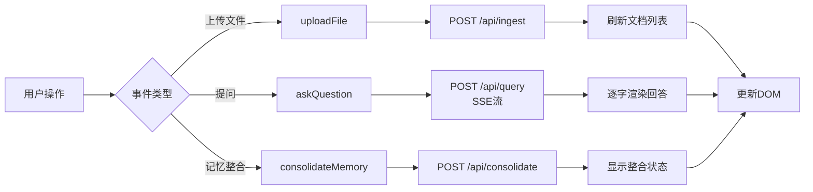

# 模块 3：HTML 前端 —— 单页问答界面

## 学习目标

完成本模块后，你将能够：

1. 理解 **HTML 文档的基本结构**：DOCTYPE声明、根元素、头部与正文的作用，以及`<script>`标签的加载时机。
2. 掌握 **HTML标签与属性**的核心概念，能够构建包含输入控件、按钮、容器和表单的页面骨架。
3. 区分 **BOM与DOM**，并熟练使用 `getElementById`、`createElement`、`appendChild` 等DOM API进行页面元素的增删改查。
4. 理解 **事件驱动编程模型**，使用 `addEventListener` 绑定用户交互，并处理 `submit` 事件的默认行为。
5. 掌握 **Fetch API** 的三种典型用法（GET、POST JSON、POST表单），并理解 `Headers` 与 `Request Body` 的正确设置。
6. 区分 **同步与异步**执行，使用 `async/await` 语法优雅处理网络请求等耗时操作。
7. 理解 **SSE (Server-Sent Events)** 协议的工作原理，并能够手写流式解析器，实现服务器数据的逐步渲染。

---

## 模块结构

本模块采用**单页应用（SPA）** 架构，由两个文件紧密协作完成：

| 文件 | 职责 | 关键内容 |
|------|------|----------|
| `index.html` | **页面骨架**，声明静态结构。 | 4个功能区容器、引入`app.js`。 |
| `app.js` | **交互逻辑**，实现动态行为。 | DOM操作、事件绑定、`fetch`请求、SSE解析。 |

**文件位置**：前端代码放在项目根目录下、与 `backend/` 同级的 `frontend/` 文件夹里，`index.html` 和 `app.js` 都在该文件夹内实现。 `frontend/` 与 `backend/` 两个目录平级、职责分离、互不嵌套——后端是 uv 项目（`backend/src/agentic_search/`），前端是零构建的原生 HTML/JS，各自独立。

前端与后端（`localhost:8000`）**跨端口运行**，通过CORS机制打通。整个应用的**数据流**如下：



---

## 核心设计

### 单页布局

本应用没有页面跳转，所有功能集成在一个页面中，通过**DOM动态更新**实现内容切换。这种设计符合现代Web应用的"单页应用"理念，用户操作流畅，无需等待页面刷新。

四个功能区从上至下布局，通过`<hr>`分隔线清晰划分：

```
控件区（文件上传 + 记忆整合按钮）
────────────────────────────────
聊天区（用户与Agent对话气泡）
────────────────────────────────
问题输入区（文本框 + 发送按钮）
────────────────────────────────
文档列表区（已上传文件名列表）
```

### 数据驱动渲染

前端不存储业务数据，所有数据来自后端API。页面初始加载时，`getDocuments()`拉取文档列表；上传成功后，再次调用该函数刷新显示。这种"**数据驱动**"模式确保前端与后端状态同步。

### SSE契约：前后端协作的关键

后端`/api/query`端点使用SSE协议推送两类事件，前端必须严格解析：

| SSE帧格式 | 含义 | 前端处理逻辑 |
|-----------|------|--------------|
| `data: "\u4f60\u597d"` | 文本Token（JSON编码） | `JSON.parse(dataLine)` → 追加到对话气泡 |
| `event: tool`<br/>`data: {"name": "search_paper"}` | 工具调用事件 | 解析JSON对象，显示工具名状态行 |

**注意**：`data:`行内容永远是JSON字符串，直接显示会出现`\uXXXX`转义字符，必须先解析。

---

## 第一步：HTML骨架构建

HTML文件是前端应用的"地基"，负责定义页面结构。我们先理解其基本构成，再逐区构建。

### 1.1 文档基本结构

一个标准的HTML5文档始终包含以下部分：

```html
<!DOCTYPE html>
<html lang="zh">
<head>
    <meta charset="UTF-8">
    <title>Agentic Search with Memory</title>
</head>
<body>
    <!-- 页面内容在这里 -->
    <script src="app.js"></script>
</body>
</html>
```

这份骨架读起来是一棵嵌套的「树」：`<html>` 是根，往下分出 `<head>` 和 `<body>` 两个子节点，`<head>` 里再挂 `<meta>` 和 `<title>`。理解这个树形结构很重要，因为后面 JavaScript 操作 DOM 时，页面正是被当作一棵节点树来遍历的。

`<!DOCTYPE html>` 是文档类型声明，告诉浏览器「按 HTML5 标准解析这个文件」；它写在第一行、没有结束标签，是历史遗留的固定写法，照抄即可。

`<html lang="zh">` 是整页的根元素，`lang="zh"` 声明页面主要语言为中文——浏览器会依据这个属性做翻译提示、屏幕阅读器朗读和拼写检查，写对语言能让无障碍体验更好。

`<head>` 放的是「元信息」，即描述文档本身、但不直接显示在页面正文里的内容：

`<meta charset="UTF-8">` 声明字符编码为 UTF-8。

`<body>` 是正文，页面上所有看得见的内容都写在这里。

`<script src="app.js">` 引入 JavaScript 文件，`src` 属性指向要加载的脚本路径；通常放在html文档末尾，当浏览器解析完所有html标签后，js的dom操作才能找到对应的节点。

> **Tip：标签的完整组成与属性**。初学时最容易把「标签」和「元素」混为一谈，这里一次说清。一个完整的元素由四部分组成：开始标签、属性、内容、结束标签。以 `<input type="file" id="file-input" accept=".pdf">` 为例，`<input` 是开始标签，`type="file"`、`id="file-input"`、`accept=".pdf"` 是三个属性，`<input>`没有内容和结束标签。

>**属性**就是写在开始标签里、以 `属性名="属性值"` 形式出现的「配置项」，用来告诉浏览器这个元素长什么样、叫什么名字。最常用的三个属性是 `id`、`class`、`type`;`id` 是元素的**全页面唯一**身份证，同一页面里一个 `id` 只能出现一次，JS 正是靠 `getElementById("xxx")` 凭它精确锁定元素；`class` 是**分类标签**，一个元素可以同时挂多个 class（用空格隔开，如 `class="message user"`），同一个 class 也能贴在多个元素上，主要供 CSS 和 JS 批量选择；`type` 决定控件的**具体形态**（`type="file"` 是选文件、`type="text"` 是文本框、`type="submit"` 是提交按钮），它的取值由 HTML 标准预先规定，**不能自定义**；写成 `type="abc"` 这类标准之外的未知值，浏览器会按默认形态处理。

### 1.2 控件区：文件上传与记忆整合

```html
<div>
    <input type="file" id="file-input" accept=".pdf">
    <button id="upload-btn">上传 PDF</button>
    <br>
    <button id="consolidate-btn">整合会话记忆（L2）</button>
</div>
```

`<div>` 是块级容器（division 的缩写），本身不渲染特定外观，主要作用是把相关的几个元素**分组**、便于统一管理和布局；块级元素默认占满一整行，所以它会和后面的内容上下排列。

这个 `<div>` 不需要js做任何dom操作，所有没有设置 `id` 属性。

`<input type="file">` 是文件选择控件，点击会弹出系统的文件选择框：`type="file"` 决定它是「选文件」控件而不是「输文字」控件（后者要写 `type="text"`）；`accept=".pdf"` 将可选文件类型限定为 PDF，但它只是「提示性过滤」，用户仍可在部分系统中手动切换为其他类型，真正的校验应在后端完成；`id="file-input"` 是它的唯一标识，JS 靠它拿到用户选中的文件。

`<button>` 是按钮，两个按钮分别用 `id="upload-btn"` 和 `id="consolidate-btn"` 命名，供 JS 绑定点击事件。这里有一个易错点：两个 `<button>` 都未指定 `type` 属性，浏览器默认按 `type="submit"` 处理；但它们不在任何 `<form>` 内，因此点击不会提交表单、不会刷新页面，只会触发 JS 绑定的 `click` 事件，这正是本项目期望的行为。

`<br>` 是换行（break），属于空标签，作用是把「上传 PDF」和「整合会话记忆」两个按钮上下排开。

### 1.3 聊天区：对话气泡容器

```html
<div id="messages"></div>
```

这是一个**空容器**，内部没有任何标签，所有对话气泡由JavaScript动态创建并插入。`id="messages"`是JS的"挂载点"。

对话后，JavaScript 往这个空容器里插进了几条对话气泡，它在浏览器里的实际样子就变成了：

```html
<div id="messages">
    <div class="message user">这篇论文的主要贡献是什么？</div>
    <div class="message assistant">
        <div>调用工具：search_paper</div>
        这篇论文提出了一种新的记忆整合机制……
    </div>
</div>
```

把前后两份代码放在一起看，就能理解「静态骨架」与「动态渲染」的分工：HTML 文件里写死的只是那个空 `<div>`，里面每一条气泡都是 JS 在运行时 `createElement` 出来、再 `appendChild` 进去的。

气泡上的 `class="message user"` 和 `class="message assistant"` 也是 JS 加的，用来区分「用户」和「AI」两类气泡——本项目不涉及 CSS，所以这个 `class` 暂时只起标记作用，如果加了样式表，就能按 class 给两类气泡上不同的样式。

### 1.4 问题输入区：表单与提交

```html
<form id="query-form">
    <input type="text" id="question" placeholder="问一个问题...">
    <button type="submit">发送</button>
</form>
```

`<form>`（表单）是 HTML 专门用来「收集并提交用户输入」的容器。它内置了一套**提交（submit）**机制：当用户在表单内按回车、或点击表单内的提交按钮时，浏览器触发一次「提交」，默认行为是把表单内所有控件的值按「`name=value`」键值对打包，发往 `action` 属性指定的地址（不写 `action` 则发往当前页面地址），然后刷新页面。

本项目希望点击发送后**不刷新页面**、由 JS 自己发请求，之所以仍用 `<form>`，是因为它白送了两个语义能力：一是**回车即提交**——光标在输入框里按回车，浏览器自动触发提交；二是 **`submit` 事件整合**——无论回车还是点按钮，最终都汇聚成一次 `submit` 事件，JS 只需监听这一个事件，再用 `e.preventDefault()` 拦下「打包提交 + 刷新页面」的默认行为，改由 `askQuestion()` 接管问答逻辑。

`<input type="text">` 是单行文本框，`id="question"` 供 JS 读取输入内容（`questionInput.value`），`placeholder="问一个问题..."` 是输入框为空时显示的灰色提示文字——它只是提示，不是真正的值。

`<button type="submit">` 是提交按钮，`type="submit"` 表示点它触发所在表单的提交；在表单里，点这个按钮和按回车效果完全一样，都会触发 `submit` 事件。

> **Tip：`name` 属性与表单数据的关系**。表单在「提交」时，浏览器会把内部每个控件的值收集起来，打包成一组「键值对」发给服务器——而这组键值对里的「键」就来自控件的 `name` 属性，「值」来自控件里填的内容。**标签没有 `name` 的控件，它的值不会被包含在提交的数据里**。

> 本项目的问题输入框 `<input type="text" id="question">` 只写了 `id` 没写 `name`，这是有意为之：本项目不走表单默认提交，而是用 `fetch` 自己发 JSON 请求，输入框的`value`由 JS 通过 `id` 读出来、靠`fetch`函数发往后端。 `name` 属性只在「让浏览器代劳提交」时才需要。

### 1.5 文档列表区：数据展示容器

```html
<div id="documents"></div>
```

另一个空容器，用于显示从后端获取的文档列表。数据完全由`getDocuments()`函数动态渲染。

页面加载后，`getDocuments()` 从后端拉回文档列表，把每个文件名渲染成一个 `<p>`（段落）塞进这个容器，它就长成了：

```html
<div id="documents">
    <p>TiMem Temporal-Hierarchical Memory Consolidation.pdf</p>
    <p>另一篇论文.pdf</p>
</div>
```

`<p>` 是段落标签，一个文件一行。注意 HTML 里没有任何写死的文件名，列表内容完全来自后端数据。

### 1.6 完整 index.html

把前面 1.1～1.5 拆解的四个区块拼在一起，就是本项目的完整页面骨架。建议对照每一节的讲解通读一遍，看每个标签最终落在什么位置：

```html
<!DOCTYPE html>
<html lang="zh">

<head>
    <meta charset="UTF-8">
    <title>Agentic Search with Memory</title>
</head>

<body>
    <hr><!-- 分隔线标签 -->
    <div>
        <input type="file" id="file-input" accept=".pdf">
        <button id="upload-btn">上传 PDF</button>
        <br><!-- 换行标签 -->
        <button id="consolidate-btn">整合会话记忆（L2）</button>
    </div>

    <hr>
    <div id="messages"><!-- JS 动态插入对话气泡 --></div>

    <hr>
    <form id="query-form">
        <input type="text" id="question" placeholder="问一个问题...">
        <button type="submit">发送</button>
    </form>

    <hr>
    <div id="documents"></div>
    <hr>
    
    <script src="app.js"></script>
</body>

</html>
```

`<script src="app.js">` 被放在 `<body>` 最末尾，原因如下：浏览器从上往下解析 HTML，当解析到尾部脚本标签时，上面四个区块的 DOM 已经全部加载完成，`app.js` 里一上来就执行的 `getElementById(...)` 才能拿到元素。若把它挪到`<body>`正文之前，脚本执行时 DOM 还没生成，就会取到 `null` 报错。

---

## 第二步：JavaScript交互逻辑

`app.js`负责所有动态行为，遵循"**获取元素 → 定义函数 → 绑定事件**"的三段式结构。

### 2.1 基础概念：BOM与DOM

浏览器向 JavaScript 暴露了两套对象模型。

**BOM（Browser Object Model，浏览器对象模型）** 代表「浏览器窗口本身」的能力，典型成员有 `window`（全局对象，一切 BOM/DOM 的根）、`location`（地址栏）、`history`（前进后退）、`navigator`（浏览器与设备信息）、`setTimeout`（定时器）等——本项目没有页面跳转、没有定时器，所以用不到 BOM。

**DOM（Document Object Model，文档对象模型）** 代表「页面文档的结构」，入口是全局的 `document`，它把整页 HTML 解析成一棵节点树：每个标签是一个「元素节点」，标签里的文字是「文本节点」，节点之间有父子、兄弟关系。JS 通过 DOM API 增删改查这棵树的节点，页面就会实时变化。

本项目的交互**全部通过 DOM 完成**，核心 API 就四个动词——查、增、改、删：

```javascript
// 查找元素
const box = document.getElementById("documents");
// 创建元素
const p = document.createElement("p");
p.textContent = "示例文本";
// 插入元素
box.appendChild(p);
// 清空内容
box.innerHTML = "";
```

**重要原则**：设置文本内容时用 `textContent` 而不是 `innerHTML`。`textContent` 把内容当作**纯文本**原样显示，即使里面含有 `<script>` 这样的字符串也只会被显示、不会被执行；`innerHTML` 则会把内容当 HTML 解析，一旦内容是用户输入或外部数据，就可能被注入恶意脚本——这就是著名的 **XSS（跨站脚本攻击）** 风险。渲染用户输入或后端返回的数据时，坚持用 `textContent` 是廉价而有效的防线。

### 2.2 事件处理机制

用户交互通过事件驱动。绑定事件的标准流程：

```javascript
// ① 获取元素
const btn = document.getElementById("upload-btn");
// ② 定义事件处理函数（异步）
async function uploadFile() {
    // 业务逻辑
}
// ③ 绑定事件
btn.addEventListener("click", uploadFile);
```

**注意**：事件名不带`on`前缀（是`"click"`，不是`"onclick"`）。

按钮这类元素能触发多种事件类型，常见的有：`click`（单击）、`dblclick`（双击）、`mouseover` / `mouseout`（鼠标移入 / 移出）、`mousedown` / `mouseup`（按下 / 松开鼠标键）、`mouseenter` / `mouseleave`（进入 / 离开元素）、`focus` / `blur`（获得 / 失去焦点）等。

这些事件浏览器都已定义好，你只需把 `addEventListener` 的第一个参数换成对应事件名，就能监听相应动作。本项目只用了其中两个：按钮的 `click`（上传、整合）和表单的 `submit`（发送问题）。这些事件属于标准化的 HTML 事件类型，开发中按需查阅文档即可，无需逐一记忆。

### 2.3 网络请求：Fetch API

`fetch(url, options)` 是浏览器内置的「发 HTTP 请求」函数，真实位置是window.fetch(浏览器中可以省略`window.`直接使用`fetch()`)，作用是向指定地址发起网络请求并取回服务器响应，返回值是一个 Promise（一个「将来才会有结果」的对象）。

`fetch`接收两个参数：第一个 `url` 是请求地址（字符串）；第二个 `options` 是可选配置对象，用来描述「这个请求怎么发」，最常用的三个字段是 `method`（HTTP 方法，如 `GET`/`POST`，不写时默认 `GET`）、`headers`（请求头，一组 `"键": "值"`，告诉服务器请求体的格式等元信息）、`body`（请求体，真正要发给服务器的数据，GET 请求没有请求体）。请求发出后，`fetch` 返回的响应要先经 `res.json()` 把 JSON 字符串解析成 JS 对象才能使用。

**本项目用到的三种典型用法**：

1. **GET请求**（无请求体）：向服务器**取**数据，参数拼在 URL 里，因此不写 `method` 也不写 `body`。

   ```javascript
   const res = await fetch(`${base_url}/api/documents`);
   const data = await res.json();
   ```

2. **POST JSON**：向服务器**提交**结构化数据，把 JS 对象用 `JSON.stringify` 转成 JSON 字符串放进请求体，并用 `headers` 声明 `Content-Type: application/json`，让服务器知道「请求体里是一段 JSON」。

   ```javascript
   const res = await fetch(`${base_url}/api/query`, {
       method: "POST",
       headers: { "Content-Type": "application/json" },
       body: JSON.stringify({ question: "你好" }),
   });
   ```

3. **POST表单（上传文件）**：向服务器**提交文件**（二进制数据），用 `FormData` 打包，`body` 直接放这个对象。

   ```javascript
   const form = new FormData();
   form.append("file", fileInput.files[0]);
   const res = await fetch(`${base_url}/api/ingest`, {
       method: "POST",
       body: form, // 注意：不手动设置Content-Type
   });
   ```

**关键点**：上传文件时，**不要手动设置`Content-Type`**，浏览器会自动生成包含`boundary`的`multipart/form-data`头。

> **Tip：HTTP 协议与 fetch 的关系**。fetch 在底层做的事，就是替你把一个「HTTP 请求包」拼装好发出去、再把服务器的「HTTP 响应包」取回来。

> 一个 HTTP 请求包由三部分构成：**请求行**（如 `POST /api/query HTTP/1.1`，声明方法、路径、协议版本）、**请求头**（若干行 `键: 值`，描述请求的元信息）、**请求体**（真正要传输的数据，GET 通常为空）。这三部分正好对应 `fetch` 的三个参数——`method` 写进请求行，`headers` 就是请求头，`body` 就是请求体。服务器处理完会返回一个同样结构（状态行 + 响应头 + 响应体）的响应包，`fetch` 把它包装成 Response 对象交给你，`res.json()` 读的正是响应体。

### 2.4 异步编程：async/await

JavaScript 是**单线程**语言，同一时刻只能执行一段代码。如果发网络请求时像「同步」那样干等——代码停在那里、页面所有交互都冻结，直到网络返回——用户体验会非常糟糕。所以浏览器把耗时操作设计成**异步**：发起请求后不干等，先继续往下执行，等结果回来了再回头处理，这个过程由**事件循环（event loop）** 调度。

`fetch` 就是异步的，它不直接返回数据，而是返回一个 **Promise**——可以理解为一张「将来才会有结果的欠条」。拿到这张欠条，你告诉它「结果到了之后该做什么」，等到结果真正回来，浏览器就会兑现。早期写法是用 `.then()` 层层回调，嵌套深了就成了「回调地狱」；现代写法 `async/await` 把这件事变得像同步代码一样直白：

```javascript
async function getDocuments() {
    const res = await fetch("..."); // await：在这里等 Promise 兑现，拿到响应
    const data = await res.json();   // await：再等响应体解析成对象
    // 处理数据
}
```

两条规则：`async` 加在函数定义前，声明「这个函数里有异步操作、会返回 Promise」；`await` 写在 Promise 前面，表示「在这里挂起当前函数、把控制权交还给事件循环，等 Promise 解决后再恢复执行」。需要强调的是，「挂起」并非阻塞等待——函数上下文被保存后，主线程照常处理其他任务；直到 Promise 解决，事件循环才把恢复执行的续体推入微任务队列继续往下走，这正是「异步非阻塞」的含义。它们总是成对出现——函数里用了 `await`，外层就必须是 `async function`。本项目所有 `fetch` 都包在 `async function` 里（`uploadFile`、`getDocuments`、`askQuestion`、`consolidateMemory`），原因就在这里。

---

## 第三步：功能实现详解

### 3.1 文档列表渲染

对应后端`GET /api/documents`。

```javascript
// 获取容器
const documentsEl = document.getElementById("documents");

async function getDocuments() {
    const res = await fetch(`${base_url}/api/documents`);
    const data = await res.json(); // 形如：[{doc_id: "001", filename: "论文1.pdf"}, ...]
    documentsEl.innerHTML = ""; // 清空旧内容
    data.forEach(doc => {
        const p = document.createElement("p");
        p.textContent = doc.filename; // 只显示文件名
        documentsEl.appendChild(p);
    });
}

// 首屏渲染
getDocuments();
```

**设计说明**：每次渲染前先清空容器，避免重复累积。

`forEach` 是数组自带的方法，作用是把数组里的每一个元素**依次**交给一个回调函数去处理。它接收的回调形如 `(元素, 下标, 整个数组) => {...}`，`forEach` 会自动遍历数组、每次取一个元素调用回调，直到全部处理完；**回调的返回值会被忽略**，所以它适合「对每个元素做一件有副作用的事」。

这里后端返回的 `data` 是一个文档对象数组，`data.forEach(doc => {...})` 的意思就是：对每一个 `doc`，创建一个 `<p>`、写入文件名、挂进容器——循环n遍，列表就画出n行。

> **Tip：字符串模板（模板字面量）**。代码里到处可见 `` `${base_url}/api/documents` `` 这种写法，它叫**模板字符串**：用反引号（键盘上数字 1 左边的那个键）包裹字符串，用 `${...}` 表示「插值占位符」，运行时先算出花括号里表达式的值、再嵌入字符串。于是 `` `${base_url}/api/documents` `` 的效果等同于 `base_url + "/api/documents"` 的字符串拼接。传统写法用 `+` 号，模板字符串用 `${}`，结果一样，但后者在变量多、需要换行时更清晰易读。**注意只有反引号包裹时 `${}` 才会被解析，用单引号或双引号包裹则原样输出**。

### 3.2 文件上传实现

对应后端`POST /api/ingest`。

```javascript
// 获取元素
const fileInput = document.getElementById("file-input");
const uploadBtn = document.getElementById("upload-btn");

async function uploadFile() {
    const file = fileInput.files[0]; // 获取第一个选中文件
    if (!file) {
        alert("请先选择PDF文件");
        return;
    }
    const form = new FormData();
    form.append("file", file); // 字段名必须与后端一致

    const res = await fetch(`${base_url}/api/ingest`, {
        method: "POST",
        body: form,
    });
    const data = await res.json(); // {doc_id: "...", filename: "..."}
    alert(`上传成功: ${data.filename}`);
    getDocuments(); // 刷新列表
}

uploadBtn.addEventListener("click", uploadFile);
```

**关键点**：`FormData`正确封装文件，字段名`"file"`与后端`UploadFile`参数名匹配。

为什么上传文件要用 `FormData`（表单）打包，而不能像提问那样发 JSON？**根本原因在后端接口的契约**：后端 `routes.py` 里这个端点的签名是 `async def ingest(file: UploadFile)`，`UploadFile` 是 FastAPI 专门用来接收文件的类型，它要求请求以 `multipart/form-data` 编码发送，而`FormData`正是浏览器里生成 `multipart/form-data` 格式的工具 。

如果需要JSON传递二进制数据，可以将二进制串编码为`base64`格式，后端以json格式接收并解码为原始二进制数据。`base64`是一种将二进制串编码为ASCII字符串方法。编码后的字符串不会影响json解析，所以能够以json作为载体传输，代价是编码后长度将多出1/3。


### 3.3 记忆整合请求

对应后端`POST /api/consolidate`。

```javascript
const consolidateBtn = document.getElementById("consolidate-btn");
const currentSessionId = "demo-session"; // 模块4将实现真实会话

async function consolidateMemory() {
    const res = await fetch(`${base_url}/api/consolidate`, {
        method: "POST",
        headers: { "Content-Type": "application/json" },
        body: JSON.stringify({ session_id: currentSessionId }),
    });
    const data = await res.json(); // {status: "pending", l2_id: ""}
    if (data.status === "ok") {
        alert("L2记忆整合完成");
    } else if (data.status === "pending") {
        alert("已发送整合请求（模块4接入）");
    } else {
        alert("整合失败：" + JSON.stringify(data));
    }
}

consolidateBtn.addEventListener("click", consolidateMemory);
```

这里值得解释两点。一是 `body: JSON.stringify({ session_id: currentSessionId })`——`JSON.stringify` 把 JS 对象序列化成 JSON 字符串，因为 `fetch` 的 `body` 只接受字符串或二进制，不能直接放对象；后端收到的就是一个含 `session_id` 字段的 JSON 请求体。二是响应处理用了三分支：`status === "ok"` 表示整合真正完成（模块 4 接入后走这条），`status === "pending"` 表示后端目前还是占位实现（模块 2 阶段恒返回这个），其余情况按失败提示。前端把这两种状态都提前写好，等模块 4 后端返回 `ok` 时，前端无需改动就能正确响应——这就是「前后端按约定好的数据契约各写各的、互不阻塞」的协作方式。

### 3.4 问答与SSE流式渲染

这是本模块的核心，实现Agent回答的逐字显示。

动手之前，先彻底理解 SSE 是什么、以及它解决什么问题。普通的 HTTP 交互是「一问一答」：浏览器发一次请求，服务器把整份响应一次性返回，连接随之结束。但 Agent 生成回答需要数秒甚至更久，如果等整段生成完再一次性返回，用户就要面对一片空白干等很久。**SSE（Server-Sent Events，服务器推送事件）** 解决的正是这个体验问题：它让服务器在**同一条连接上保持不关闭、把数据分成一块块地持续推送**，浏览器每收到一块就立刻渲染，于是用户看到回答「逐字长出来」。

SSE 在 HTTP 层面的实现原理是**基于长连接的流式传输**：服务器先发送响应头 `Content-Type: text/event-stream`，之后**保持 TCP 连接不断开**，在同一条连接上以流的形式持续发送事件帧。每个事件由若干行组成，事件之间用**一个空行 `\n\n`** 分隔；事件内部，`event:` 开头的那行声明事件类型，`data:` 开头的那行携带数据。SSE 是**单向**推送（服务器 → 浏览器）；连接可能因超时或网络错误断开，浏览器会借助 `Last-Event-ID` 自动重连，这与 WebSocket 的全双工通信有本质区别。浏览器原生 `fetch` 只负责发起请求，不会帮你把 `event:`/`data:` 按事件拆好，所以下面要手写一个解析器 `streamSSE`，它的职责就是：读字节流 → 按 `\n\n` 切出完整事件 → 抽出每个事件的 `event` 和 `data` → 交给回调处理。

#### 3.4.1 SSE协议解析器

下面是本项目手写的一个**最小 SSE 解析器**，它只处理「回答文字」和「工具事件」这两类最简单的帧：

```javascript
async function streamSSE(url, options, onEvent) {
    const res = await fetch(url, options);
    const reader = res.body.getReader(); // 获取可读流
    const decoder = new TextDecoder(); // 字节解码器
    let buffer = ""; // 缓冲区，存储不完整事件

    while (true) {
        const { done, value } = await reader.read();
        if (done) break;
        buffer += decoder.decode(value, { stream: true }); // 解码并累积

        let idx;
        while ((idx = buffer.indexOf("\n\n")) !== -1) { // 按事件分隔
            const rawEvent = buffer.slice(0, idx); // 取出一个完整事件
            buffer = buffer.slice(idx + 2); // 剩余部分回缓冲

            let eventType = "";
            let dataLine = "";
            for (const line of rawEvent.split("\n")) {
                if (line.startsWith("event: ")) {
                    eventType = line.slice(7);
                } else if (line.startsWith("data: ")) {
                    dataLine = line.slice(6);
                }
            }
            onEvent(eventType, dataLine); // 回调处理
        }
    }
}
```

**关键技术点**：

1. **流式读取**：`reader.read()`逐块读取，避免内存溢出。
2. **解码处理**：`{ stream: true }`处理多字节字符（如中文），防止乱码。
3. **事件分割**：以`\n\n`为界，确保只处理完整事件。

> **Tip：生产环境请用成熟的库**。生产项目通常改用 `@microsoft/fetch-event-source` 这类成熟库，这些边界它都封装好了。但该库由 npm 分发、需要 Node/npm 工具链才能安装，配置稍复杂，由于本前端使用原生html+js，故不在考虑范围内。

#### 3.4.2 问答主流程

```javascript
const messagesEl = document.getElementById("messages");
const queryForm = document.getElementById("query-form");
const questionInput = document.getElementById("question");

// 创建对话气泡
function appendMessage(role, text) {
    const div = document.createElement("div");
    div.className = `message ${role}`;
    div.textContent = text;
    messagesEl.appendChild(div);
    return div; // 返回节点，供后续追加
}

// 主问答函数
async function askQuestion() {
    const question = questionInput.value.trim();
    if (!question) return;

    appendMessage("user", question); // 用户气泡
    const aiEl = appendMessage("assistant", ""); // 空AI气泡
    const textNode = document.createTextNode(""); // 文本节点，可逐步追加
    aiEl.appendChild(textNode);

    await streamSSE(
        `${base_url}/api/query`,
        {
            method: "POST",
            headers: { "Content-Type": "application/json" },
            body: JSON.stringify({ question }),
        },
        (eventType, dataLine) => {
            if (eventType === "tool") { // 工具调用事件
                const toolData = JSON.parse(dataLine);
                const statusDiv = document.createElement("div");
                statusDiv.textContent = `调用工具: ${toolData.name}`;
                aiEl.insertBefore(statusDiv, textNode); // 插在正文前
            } else if (dataLine) { // 文本Token
                textNode.data += JSON.parse(dataLine); // 追加文字
            }
        }
    );
}

// 绑定表单提交事件
queryForm.addEventListener("submit", (e) => {
    e.preventDefault(); // 阻止默认提交行为（刷新页面）
    askQuestion();
});
```

`appendMessage` 创建一个气泡 `<div>`，设好 `class` 和文本，挂进聊天区，并返回这个节点的引用，`askQuestion` 后续要拿它继续追加内容。

`askQuestion` 里有一个容易被忽略的细节：它先 `appendMessage("assistant", "")` 建一个空 AI 气泡，又单独 `document.createTextNode("")` 创建一个**文本节点**、`appendChild` 进去，之后流式追加写的是 `textNode.data`。为什么要单独建一个文本节点？因为流式渲染需要「一个可以反复追加的落脚点」——`textNode.data += ...` 每次把新到的文字片段拼到文本节点末尾，浏览器会自动重绘，于是回答一个字一个字地长出来。这里体现了元素节点与文本节点的分工：元素节点（`<div>`）负责结构，文本节点负责承载文字。

回调里的分支对应「核心设计」里那张 SSE 契约表：`eventType === "tool"` 时，`JSON.parse(dataLine)` 得到工具对象，取 `.name` 显示成「调用工具：xxx」状态行，并用 `insertBefore(status, textNode)` 把它插在正文文本节点**之前**——所以状态行会显示在已生成文字的上方；否则 `dataLine` 是文字 token，`JSON.parse(dataLine)` 得到字符串，追加进文本节点。整条链路串起来就是：用户提问 → 用户气泡上屏 → 空 AI 气泡上屏 → SSE 流陆续发来工具事件和文字片段 → 前端边收边插状态行、边追加文字 → Agent 答完，气泡也长完了。

---

## 完整代码示例

把前面拆解的所有片段拼起来，就是完整的 `app.js`。

```javascript
// 这是教学示例，展示组织方式
const API = "http://localhost:8000";   // 后端地址，集中定义

// --- 获取 DOM 元素 ---
const fileInput   = document.getElementById("file-input");
const uploadBtn   = document.getElementById("upload-btn");
const consolidateBtn = document.getElementById("consolidate-btn");
const messagesEl = document.getElementById('messages')
const queryForm   = document.getElementById("query-form");
const questionInput  = document.getElementById("question");
const documentsEl = document.getElementById("documents");


const currentSessionId = "demo-session"; // 会话 ID，模块 4 替换为真实会话管理

const base_url = 'http://localhost:8000'

// 追加消息列表
function appendMessage(role, text) {
  const div = document.createElement("div"); //新建<div>节点
  div.className = "message " + role; //设置节点基本信息（可选）
  div.textContent = text; //设置文本属性
  messagesEl.appendChild(div); //插入到dom树
  return div //返回引用
}


// 实现处理SSE流的函数，实际情况一般使用@microsoft/fetch-event-source库代替（需要配置nodejs）
async function streamSSE(url, options, onEvent) {
  const res = await fetch(url, options);
  const reader = res.body.getReader();
  const decoder = new TextDecoder();
  let buffer = "";

  while (true) {
    const { done, value } = await reader.read();
    if (done) break;

    buffer += decoder.decode(value, { stream: true });

    let idx;
    while ((idx = buffer.indexOf("\n\n")) !== -1) {
      const rawEvent = buffer.slice(0, idx);
      buffer = buffer.slice(idx + 2);

      let eventType = "", dataLine = "";
      for (const line of rawEvent.split("\n")) {
        if (line.startsWith("event: ")) eventType = line.slice(7);
        else if (line.startsWith("data: ")) dataLine = line.slice(6);
      }

      onEvent(eventType, dataLine);
    }
  }
}

// 问答
async function askQuestion() {
  // 获取<input>的输入内容
  const question = questionInput.value;
  if (!question) return;

  // 追加用户消息
  appendMessage("user", question);

  //追加ai消息
  const aiEl = appendMessage("assistant", "");
  const textNode = document.createTextNode("");
  aiEl.appendChild(textNode);

  //接收sse数据
  await streamSSE(
    `${base_url}/api/query`,
    {
      method: "POST",
      headers: { "Content-Type": "application/json" },
      body: JSON.stringify({ question }),
    },
    (eventType, dataLine) => {
      if (eventType === "tool") {
        const toolName = JSON.parse(dataLine).name;
        const status = document.createElement("div");
        status.textContent = `调用工具：${toolName}`;
        aiEl.insertBefore(status, textNode);
      } else if (dataLine) {
        textNode.data += JSON.parse(dataLine);
      }
    }
  );
}

// 上传文件
async function uploadFile() {
  const file = fileInput.files[0];
  if (!file) return alert("请先选择 PDF 文件");
  //将文件放到表单数据里
  const form = new FormData();
  form.append("file", file);

  //以表单的形式上传
  const res = await fetch(`${base_url}/api/ingest`, {
    method: "POST",
    body: form,                  // 注意：不要手动设 Content-Type
  });
  const data = await res.json(); // 后端返回 {doc_id, filename}
  alert(`上传成功：${data.filename}`);
  getDocuments()
}

// 触发记忆整合
async function consolidateMemory() {
  const res = await fetch(`${base_url}/api/consolidate`, {
    method: "POST",
    headers: { "Content-Type": "application/json" },
    body: JSON.stringify({ session_id: currentSessionId }),
  });
  const data = await res.json();   // 后端返回 {status, l2_id}
  if (data.status === "ok") {            // 模块 4 接入真实整合后走这条
    alert("L2 记忆整合完成");
  } else if (data.status === "pending") { // 模块 2 阶段：后端占位返回 pending
    alert("已发送整合请求，L2 整合逻辑将在模块 4 接入后生效");
  } else {
    alert("整合失败：" + JSON.stringify(data));
  }
}

// 渲染文档列表
async function getDocuments(){
  const res = await fetch(`${base_url}/api/documents`, {
    method: "GET",
    headers: { "Content-Type": "application/json" },
  });
  const data = await res.json()

  // 清空
  documentsEl.innerHTML = "";

  // 插入<p>标签
  data.forEach(doc => {
    const p = document.createElement("p");
    p.textContent = `${doc.filename}`;
    documentsEl.appendChild(p);
  });
}


// 绑定事件
uploadBtn.addEventListener("click", uploadFile); //上传文件
consolidateBtn.addEventListener("click", consolidateMemory);//记忆整合
queryForm.addEventListener("submit", (e) => {//发送问题（表单提交事件）
  e.preventDefault();        // 阻止表单默认提交（刷新页面）
  askQuestion();
});


// 页面初始化后调用
getDocuments()
```

顶部集中获取所有 DOM 元素，中部定义 `appendMessage`、`streamSSE`、`askQuestion`、`uploadFile`、`consolidateMemory`、`getDocuments` 六个函数，底部统一绑定三个事件，最后调用一次 `getDocuments()` 做首屏渲染。

---

## 运行与验证

后端启动后（`localhost:8000`），前端有两种运行方式：

1. **直接打开**：双击`index.html`，浏览器直接打开文件。
2. **简单服务器**：在`frontend/`目录执行：

   ```bash
   python -m http.server 3000
   ```

   然后访问 `http://localhost:3000`。

**端到端验证清单**：

1. 打开页面，文档列表区显示已上传文件名。
2. 选择PDF文件，点击"上传PDF"，成功提示，列表更新。
3. 在输入框输入问题，回车或点击"发送"：
   - 用户气泡立即显示。
   - AI气泡逐字生成内容。
   - 中间可能显示"调用工具: xxx"状态行。
4. 点击"整合会话记忆"，收到"已发送整合请求"提示。

**常见问题排查**：

- **CORS错误**：确保后端已配置`CORSMiddleware`，允许前端源。
- **文件上传失败**：检查字段名是否为`file`，后端是否正确接收。
- **SSE解析错误**：检查`data:`行是否为有效JSON，中文是否显示为`\uXXXX`。

---

## 延伸思考与优化

### SSE的替代方案

- **WebSocket**：双向通信，但本场景只需单向推送，SSE更简单。
- **Long Polling**：兼容性好，但效率较低，SSE是更现代的选择。

### 前端框架化

本项目使用原生JavaScript，适合教学理解底层机制。生产环境可考虑：

- **Vue/React**：组件化开发，状态管理更强大。
- **TypeScript**：增加类型安全，减少运行时错误。


---

## 总结

本模块从零构建了一个单页问答界面，核心在于：

1. **HTML定义结构**：通过标签和属性构建页面骨架。
2. **JavaScript驱动行为**：通过DOM API操作元素，响应事件。
3. **Fetch处理网络**：与后端API交互，获取数据。
4. **SSE实现流式**：逐步渲染服务器推送内容。

这些技术是现代Web前端的基础，理解它们后，学习框架只是掌握了更高效的工具，核心原理不变。