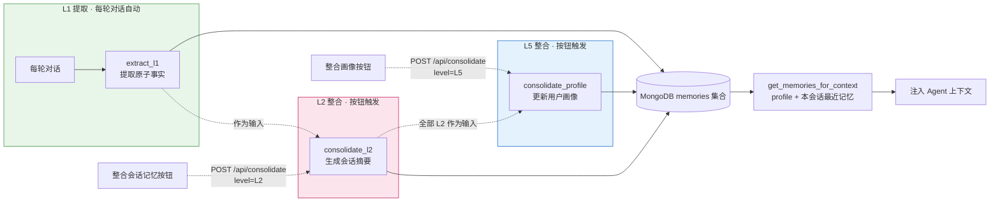

# 模块 4：TMT 三层记忆系统（segment / session / profile）

> 前置模块：[模块 2：LangGraph Agent](./02-LangGraph-Agent.md)、[模块 3：HTML 前端](./03-HTML前端.md)
> 本模块在 TiMem 论文五级 TMT（Segments → Sessions → Daily → Weekly → Profile）中选取
> 三级实现：L1 segment、L2 session、L5 profile。L3/L4 的整合逻辑与 L2 同构
> （下一级摘要 → 更高层摘要），选取首尾三层即可覆盖"细节→会话→画像"的完整链路。

## 学习目标

1. 理解 TMT（时序记忆树）的核心思想——从对话中提取原子事实，按会话压缩为摘要，再跨会话提炼为用户画像
2. 用 Python + LLM + MongoDB 从零实现 **L1 事实提取**（每轮对话后自动触发）、**L2 会话摘要**与 **L5 用户画像**（均手动触发）
3. 理解整合的**两种触发机制**：TiMem 生产实现的空闲超时扫描与本教学项目的手动按钮触发
4. 在 LangGraph 图中集成 `get_memories` 与 `store_memory` 节点：本会话记忆直接注入，跨会话记忆由 profile 承担
5. 实现 `POST /api/consolidate` 端点的两级整合能力（请求体 `level` 区分 L2/L5）与前端按钮，手动、即时地触发整合并保证幂等
6. 理解"直接注入历史"（方案 A）与"检索注入"（方案 B）的取舍，以及提取时对比历史窗口（recent_l1）从源头减少重复

## 模块结构

## 核心思路

TiMem 论文（ACL 2026 Findings, arXiv:2601.02845）提出 TMT（Temporal Memory Tree）五级时序分层记忆。本模块实现其中三级：

| 论文层级 | 内容 | 本模块 | 触发 |
|---|---|---|---|
| L1 Segment | 对话片段的原子事实 | ✅ 每轮对话提取 | 每轮自动 |
| L2 Session | 会话主题摘要 | ✅ 会话全部 L1 → 1 条 | 按钮手动 |
| L3 Daily | 每日模式提炼 | 参考概念 | — |
| L4 Weekly | 每周趋势 | 参考概念 | — |
| L5 Profile | 稳定用户画像 | ✅ 全部 L2 + 旧画像 → 1 条 | 按钮手动 |

存储采用 MongoDB（`agentic_search` 数据库的 `memories` 集合），PyMongo 同步驱动。

### 为什么 L2 可以直接喂 L5（源码证据）

TiMem 的 L5 整合只消费下一层的 `content` 字符串与最近 3 条历史 L5，对下层是 Daily 还是 Weekly 并无结构依赖——
`workflows/nodes/unified_processors.py:810` 在缺少 L4 时会回退用 L3 生成 L5，说明"给一批摘要文本 + 历史画像"
就是 L5 的全部输入约定。因此教学版让 L2 直接作为 L5 的输入，机制上与生产实现同构。

代价：TiMem 原本在 L3/L4 prompt 里完成的"画像分类提炼"（L3 四类：关键事件 / 态度与偏好 / 决策过程 / 情绪变化，
见 `config/prompts.yaml:55-60`）失去载体。教学版用两项补偿：L1 提取带 6 类范围指引（见第 2 步），
L5 整合 prompt 带画像维度指引（见 2.3）。

> ⚠️ 阅读 TiMem 源码时注意：生产链路在 `timem/workflows/` 与 `services/session_memory_scanner.py`；
> `timem/memory/l1~l5_*.py` 是早期带 MockLLM 的实验 stub，仅作历史参考。

### 记忆注入策略（方案 A：直接注入）

| 维度 | 方案 A（本模块采用） | 方案 B（检索注入） |
|------|-------------------|------------------------|
| 原理 | profile（全局 1 条）+ 本会话最近 N 条记忆注入 | 按相关性评分，只注入相关的 |
| 优点 | 简单、零评分噪声、LLM 看到完整背景 | 上下文可控 |
| 缺点 | 记忆多了上下文膨胀 | 评分逻辑有误判风险 |
| 适用 | 记忆量少（教学 Demo） | 记忆量多（长期真实使用） |

**跨会话记忆由 profile 承担**：`get_memories_for_context(session_id)` 只取两类记忆——
全局唯一的 L5 画像 + 该会话的 L1/L2（时间倒序，≤20 条）。开新会话时，Agent 带着画像记忆一切重点，
旧会话的 L1/L2 留在库中作为下次整合画像的素材。将来记忆量级上来（>50 条），
把 `get_memories_for_context` 的函数体换成检索实现即可，图编排不用动——函数名就是为切换预留的接口。

### 整合触发机制

| 维度 | TiMem 生产实现 | 本教学项目 |
|------|---------------|-----------|
| L2 触发器 | `SessionMemoryScanner` 每 10 分钟扫描，会话 idle ≥10 分钟视为结束 | 前端「整合会话记忆」按钮 |
| L5 触发器 | 跨月检测自动回填（`core/catchup_detector.py`） | 前端「整合画像」按钮 |
| 实现位置 | `services/session_memory_scanner.py`、`timem/workflows/` | `api/routes.py` 两个端点 |
| 目的 | 生产自动化 | 教学即时可观察 |

> 💡 **幂等性**：同一会话最多一条 L2（按 `session_id` 定位，有则更新）；全局最多一条 L5（按 `level` 定位，有则更新）。重复点击按钮只会增量更新。
