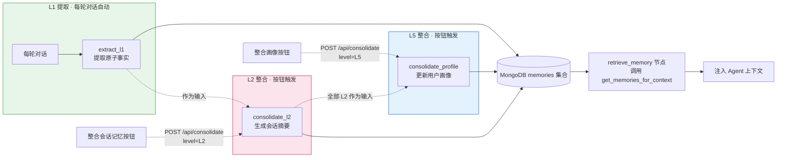

# 模块 4：TMT 三层记忆系统（segment / session / profile）

> 前置模块：[模块 2：LangGraph Agent](./02-LangGraph-Agent.md)、[模块 3：HTML 前端](./03-HTML前端.md)
> 本模块在 TiMem 论文五级 TMT（Segments → Sessions → Daily → Weekly → Profile）中选取
> 三级实现：L1 segment、L2 session、L5 profile。L3/L4 的整合逻辑与 L2 同构
> （下一级摘要 → 更高层摘要），选取首尾三层即可覆盖"细节→会话→画像"的完整链路。

## 学习目标

1. 理解 TMT（时序记忆树）的核心思想——从对话中提取原子事实，按会话压缩为摘要，再跨会话提炼为用户画像
2. 用 Python + LLM + MongoDB 从零实现 **L1 事实提取**（每轮对话后自动触发）、**L2 会话摘要**与 **L5 用户画像**（均手动触发）
3. 理解整合的**两种触发机制**：TiMem 生产实现的空闲超时扫描与本教学项目的手动按钮触发
4. 在 LangGraph 图中集成 `retrieve_memory` 与 `store_memory` 节点：本会话记忆直接注入，跨会话记忆由 profile 承担
5. 实现 `POST /api/consolidate` 端点的两级整合能力（请求体 `level` 区分 L2/L5）与前端按钮，手动、即时地触发整合并保证幂等
6. 理解"直接注入历史"（方案 A）与"检索注入"（方案 B）的取舍，以及提取时对比历史窗口（recent_l1）从源头减少重复

## 模块结构



## 核心思路

TiMem 论文（ACL 2026 Findings, arXiv:2601.02845）提出 TMT（Temporal Memory Tree）五级时序分层记忆。本模块实现其中三级：

| 论文层级 | 内容 | 本模块 | 触发 |
|---|---|---|---|
| L1 Segment | 对话片段的原子事实 | ✅ 每轮对话提取 | 每轮自动 |
| L2 Session | 会话主题摘要 | ✅ 会话全部 L1 → 1 条 | 按钮手动 |
| L3 Daily | 每日模式提炼 | 参考概念 | — |
| L4 Weekly | 每周趋势 | 参考概念 | — |
| L5 Profile | 稳定用户画像 | ✅ 全部 L2 + 旧画像 → 1 条 | 按钮手动 |

存储采用 MongoDB（`agentic_search` 数据库的 `memories` 集合），PyMongo 同步驱动。

### 为什么 L2 可以直接喂 L5（源码证据）

TiMem 的 L5 整合只消费下一层的 `content` 字符串与最近 3 条历史 L5，对下层是 Daily 还是 Weekly 并无结构依赖——
`workflows/nodes/unified_processors.py:810` 在缺少 L4 时会回退用 L3 生成 L5，说明"给一批摘要文本 + 历史画像"
就是 L5 的全部输入约定。因此教学版让 L2 直接作为 L5 的输入，机制上与生产实现同构。

代价：TiMem 原本在 L3/L4 prompt 里完成的"画像分类提炼"（L3 四类：关键事件 / 态度与偏好 / 决策过程 / 情绪变化，
见 `config/prompts.yaml:55-60`）失去载体。教学版用两项补偿：L1 提取带 6 类范围指引（见第 2 步），
L5 整合 prompt 带画像维度指引（见 2.4）。

> ⚠️ 阅读 TiMem 源码时注意：生产链路在 `timem/workflows/` 与 `services/session_memory_scanner.py`；
> `timem/memory/l1~l5_*.py` 是早期带 MockLLM 的实验 stub，仅作历史参考。

### 记忆注入策略（方案 A：直接注入）

| 维度 | 方案 A（本模块采用） | 方案 B（检索注入） |
|------|-------------------|------------------------|
| 原理 | profile（全局 1 条）+ 本会话最近 N 条记忆注入 | 按相关性评分，只注入相关的 |
| 优点 | 简单、零评分噪声、LLM 看到完整背景 | 上下文可控 |
| 缺点 | 记忆多了上下文膨胀 | 评分逻辑有误判风险 |
| 适用 | 记忆量少（教学 Demo） | 记忆量多（长期真实使用） |

**跨会话记忆由 profile 承担**：`get_memories_for_context(session_id)` 只取两类记忆——
全局唯一的 L5 画像 + 该会话的 L1/L2（时间倒序，≤20 条）。开新会话时，Agent 带着画像记忆一切重点，
旧会话的 L1/L2 留在库中作为下次整合画像的素材。将来记忆量级上来（>50 条），
把 `get_memories_for_context` 的函数体换成检索实现即可，图编排保持原样——函数名就是为切换预留的接口。

### 整合触发机制

| 维度 | TiMem 生产实现 | 本教学项目 |
|------|---------------|-----------|
| L2 触发器 | `SessionMemoryScanner` 每 10 分钟扫描，会话 idle ≥10 分钟视为结束 | 前端「整合会话记忆」按钮 |
| L5 触发器 | 跨月检测自动回填（`core/catchup_detector.py`） | 前端「整合画像」按钮 |
| 实现位置 | `services/session_memory_scanner.py`、`timem/workflows/` | `api/routes.py` 同一 /api/consolidate 端点（level 区分） |
| 目的 | 生产自动化 | 教学即时可观察 |

> 💡 **幂等性**：同一会话最多一条 L2（按 `session_id` 定位，有则更新）；全局最多一条 L5（按 `level` 定位，有则更新）。重复点击按钮只会增量更新。

## 第 1 步：理解 TMT 思想

### 1.1 论文阅读引导

> 📖 阅读 Abstract + Figure 2（第 1-3 页）：五层结构（Segments → Sessions → Daily → Weekly → Profile）与三个核心组件。
> 📖 阅读 Section 3.1 Temporal Memory Tree（第 3-4 页）：节点存储时间区间和语义内容——低层级保持细节，高层级存储抽象。
> 📖 阅读 Section 3.2 Memory Consolidation（第 3-4 页）：Child Memories（低层级分组到高层级时间窗口）和 Historical Memories（同层级滑动窗口 w=3 保持连续性）。

### 1.2 理解核心概念

- **L1、L2、L5 的区别**：L1 是原子事实（如「用户在研究注意力机制」），L2 是会话级摘要（如「本次会话讨论了 Transformer 架构」），L5 是跨会话的稳定画像（如「用户是关注注意力机制的 NLP 研究者」）。
- **整合的目的**：压缩信息量，保留要点，丢弃噪音。

## 第 2 步：实现 `memory/store.py`

在 `backend/src/agentic_search/memory/` 下创建 `store.py`，通过包化 import 暴露：
`from agentic_search.memory.store import extract_l1, consolidate_l2, consolidate_profile, get_memories_for_context, save_memory, load_memories`。

### 2.1 数据结构：Memory dataclass

```python
# 教学示例：展示核心字段，非完整实现
from dataclasses import dataclass, asdict

@dataclass
class Memory:
    level: str          # "L1"、"L2" 或 "L5"，标识记忆层级
    content: str        # 记忆的实际内容（L1 一条事实，L2 一段摘要，L5 一段画像）
    timestamp: str      # ISO 8601 时间戳，记录记忆生成时刻
    session_id: str     # 所属会话 ID；L5 为 None——画像属于用户而非任何一次会话
```

**字段含义逐项讲解：**
- `level`：决定该条记忆在 TMT 树中的层级。跳号保留 L1/L2/L5：L3/L4 被省略这件事本身就是一个可讨论的设计决策（见“核心思路”的源码证据）。
- `session_id`：L2 幂等的键——整合时按 `session_id + level` 查询是否已存在 L2，有则更新、无则新建。L5 的 `session_id=None` 表达“画像不属于任何会话”，幂等键只用 `level="L5"`。
- `asdict()`：dataclass 自带的字典转换方法，`save_memory` 用它把对象转为 MongoDB document。

**`@dataclass` 也是装饰器**：它和模块 2 的 `@retry` 是同一种机制——接收 `Memory` 类，返回自动生成 `__init__`/`__repr__` 的「增强版」类。

**验证：** 创建 `Memory` 实例（含 `session_id=None` 的 L5），确认字段可赋值、`asdict()` 输出符合预期。

### 2.2 L1 提取：`extract_l1(dialogue, session_id, recent_l1)`（范围扩展 + 历史去重）

从一轮对话中提取原子事实，**提取范围比原版更广**，并对比历史窗口 `recent_l1` 跳过重复。

**Prompt 设计要点（本版扩展）：**
- 角色：记忆提取器，从对话中提取原子事实
- 输入：一轮对话（user message + assistant message）+ **已有记忆列表（recent_l1，用于去重）**
- **提取范围（6 类，本版扩展）**：
  1. **用户身份与背景**：身份、职业、研究方向
  2. **用户偏好与倾向**：喜欢、不喜欢、倾向
  3. **用户关注的话题**：论文、方法、工具、概念——**允许从用户的问题推断**（原版漏掉的关键类）
  4. **用户决策与计划**：决定用某方案、计划做某事
  5. **用户提供的关键信息**：环境、约束、事实陈述（如"我的 GPU 是 4090"）
  6. **对话确认的领域知识**：可复用的结论、概念（如"KSSE 用 QC-LDPC 图"）
- **统一标准**：可长期复用、对话有依据、原子化（一条事实一件事）；忽略寒暄/一次性信息
- 输出：JSON 数组，每条一个陈述句
- **去重规则**：与已有记忆重复的事实跳过

```
# 教学示例：展示核心流程，非完整实现

def extract_l1(dialogue: dict, session_id: str, recent_l1: list[Memory] = []) -> list[Memory]:
    """从一轮对话提取原子事实，对比历史窗口去重。

    dialogue: {"user": "...", "assistant": "..."}
    recent_l1: 该会话最近 N 条 L1 记忆（历史窗口），用于跳过重复事实
    """

    # 历史窗口：拼进 prompt，让 LLM 判断重复（提取时去重，而非存完再清理）

    recent_block = "\n".join(f"- {m.content}" for m in recent_l1) or "（无）"

    prompt = f"""你是记忆提取器。从以下对话中提取值得长期记住的原子事实。

可提取范围（6 类）：

1. 用户身份与背景：身份、职业、研究方向
2. 用户偏好与倾向：喜欢、不喜欢、倾向
3. 用户关注的话题：论文、方法、工具、概念——允许从用户的问题推断
4. 用户决策与计划：决定用某方案、计划做某事
5. 用户提供的关键信息：环境、约束、事实陈述
6. 对话确认的领域知识：可复用的结论、概念

统一标准：可长期复用、对话有依据、原子化（一条事实一件事）。
忽略：寒暄、过程性内容、一次性临时信息。

已有记忆（若本轮事实与以下已有记忆重复，跳过，不要重复输出）：
{recent_block}

对话：用户：{dialogue["user"]}  助手：{dialogue["assistant"]}
以 JSON 数组输出：["事实1", "事实2", ...]"""
    raw = call_llm(prompt)               # 调用 LLM，返回 JSON 字符串
    facts = json.loads(raw)              # 解析为字符串列表
    return [
        Memory(level="L1", content=f, timestamp=now_iso(), session_id=session_id)
        for f in facts
    ]
```

**逐段讲解：**
- **`recent_l1` 历史窗口（本版新增）**：把该会话最近的 L1 记忆拼进 prompt（`recent_block`），让 LLM **对比后跳过重复**——论文 3.2 的 Historical Memories（w=3 滑动窗口）。用户重复表达同一事实时，只有第一遍被存下来。**去重在提取时就做，而不是存完再清理**——记忆量少时直接注入全部历史（方案 A），重复数据会占据上下文，去重更关键。
  去重依赖 LLM 遵守“跳过已有记忆”的指令，属于软约束而非硬保证——TiMem 生产实现同样只靠 prompt 指令（“Do not repeat any content from historical memories”，`prompts.yaml:8,14`），零算法去重。
- **范围扩展（本版新增）**：原版只提"关于用户的事实（偏好、研究方向、背景、决策）"，漏掉"用户关注了什么"和"对话中的领域知识"。扩展后，一轮"这论文怎么分类的？"能提取出 `"用户关注KSSE谱嵌入"`、`"KSSE用QC-LDPC稀疏图做谱嵌入"`——**第 3 类（关注话题，允许从问题推断）是最大改进**，原版这类一轮提取不出任何东西。
  这一 6 类范围是教学版对 TiMem 的有意偏离：TiMem 的 L1 prompt（`config/prompts.yaml:3-28`）本身无分类体系，分类提炼发生在 L3（四类，`prompts.yaml:55-60`）。省略 L3/L4 后，画像分类的素材需要在 L1 就带方向性，L5 整合才能产出有结构的画像。
- **容错提示**：生产建议用 LangChain 的 `with_structured_output` + Pydantic schema 替代裸 `json.loads`，教学示例保留最简形式。
- **segment 单位**：本模块以一轮对话（user + assistant 各一条）为一个 L1 提取单位；TiMem 生产实现是固定 2 轮对话对（`config/settings.yaml:258` `fragment_size: 2`，`utils/dataset_parser.py:117` 按奇偶索引配对）。每轮提取粒度更细、事实更原子化，代价是 LLM 调用次数翻倍——教学场景优先可读性。

**验证：** 构造一轮测试对话（如「我是做 NLP 的研究生，最近在研究注意力机制」），调用 `extract_l1`，检查：
1. 提取出用户身份（第 1 类）和研究方向（第 3 类）
2. 传入含相同事实的 `recent_l1` 后，重复事实不再被提取（去重生效）

### 2.3 L2 整合：`consolidate_l2(l1_memories)`

将一次会话的所有 L1 整合为一条会话摘要。

```python
# 教学示例：展示核心流程，非完整实现
def consolidate_l2(l1_memories: list[Memory]) -> Memory:
    """将同会话的所有 L1 整合为一条 L2 会话摘要。

    空列表守卫：会话尚无 L1 时直接报错，由调用方（端点）转为 422。
    幂等由调用方（端点）保证：传入前先查是否已有 L2。
    """
    if not l1_memories:
        raise ValueError("该会话没有 L1 记忆，先对话几轮再整合")
    facts = "\n".join(f"- {m.content}" for m in l1_memories)
    prompt = f"""你是记忆整合器。将以下原子事实整合为一段会话摘要。
规则：合并重复、提取主题、保留关键细节，输出 100 字以内的摘要文字。
事实列表：
{facts}"""
    summary = call_llm(prompt)           # 返回一段摘要文字
    return Memory(
        level="L2", content=summary,
        timestamp=now_iso(),
        session_id=l1_memories[0].session_id,  # 继承会话 ID
    )
```

**逐段讲解：**
- 把 L1 记忆的 `content` 用 `- ` 前缀拼成列表喂给 LLM，便于模型逐条审视。
- 输出的 `Memory` 的 `session_id` 取自第一条 L1——L2 属于同一个会话。
- 基础实现可不传 `recent_l2`（滑动窗口），后续优化时再加入历史 L2 作为额外上下文。
- **空列表守卫**：`l1_memories[0]` 在空列表上会抛 IndexError——守卫把它变成语义明确的 ValueError，端点捕获后返回 422，前端提示“先对话几轮”。

**验证：** 构造 3 条 L1 记忆，调用 `consolidate_l2`，检查输出是否是一段包含要点的连贯摘要。

### 2.4 L5 画像整合：`consolidate_profile(l2_memories, previous_profile)`

将跨会话的全部 L2 摘要整合为一条全局唯一的用户画像。与 `consolidate_l2` 同构——都是“下一级记忆 → 一条高层摘要”——区别在输入范围（跨会话）与幂等键（全局一条）。

```python
# 教学示例：展示核心流程，非完整实现
def consolidate_profile(l2_memories: list[Memory], previous_profile: Memory | None = None) -> Memory:
    """将全部 L2 会话摘要整合为一条 L5 用户画像。

    previous_profile: 现有 L5（首次生成时为 None）。传入旧画像让 LLM 做“合并新信息、
    修正过时信息”的增量更新——对应论文 Historical Memories 的思想：高层整合参考同层
    历史保持连续性（TiMem 中 L5 参考最近 3 条历史 L5，`workflows/nodes/unified_processors.py:873`）。
    """
    if not l2_memories:
        raise ValueError("还没有任何 L2 会话摘要，先整合至少一个会话")
    summaries = "\n".join(f"- {m.content}" for m in l2_memories)
    previous_block = previous_profile.content if previous_profile else "（首次生成，尚无画像）"
    prompt = f"""你是画像整合器。基于会话摘要更新用户画像。
画像维度：身份与背景、偏好与倾向、长期关注话题、关键决策、重要事实。
规则：合并新信息、修正已过时的描述、保留仍然成立的内容，输出 150 字以内的画像文字。
历史画像：
{previous_block}

会话摘要：
{summaries}"""
    profile = call_llm(prompt)
    return Memory(level="L5", content=profile, timestamp=now_iso(), session_id=None)
```

**逐段讲解：**
- **画像维度 5 类**：身份与背景、偏好与倾向、长期关注话题、关键决策、重要事实。这是对 L1 提取 6 类的“画像视角”收拢——L1 负责在源头带方向性地记，L5 负责按维度收拢成稳定画像。省略 L3/L4 后，两级 prompt 的维度指引共同承担了原本 L3/L4 的分类提炼职责。
- **`previous_profile` 增量更新**：旧画像全文进 prompt，LLM 在其基础上合并修正，而非每次从零重写——画像稳定性（论文里“从观察到人格”的渐变）靠这一步保持。
- **`session_id=None`**：画像属于用户全局，幂等键就是 `level="L5"`，全库至多一条。

**验证：** 构造 2 条 L2 摘要（不同会话、话题相关），先传 `previous_profile=None` 生成画像 v1；再构造 1 条含新信息的 L2，传 v1 调用，检查输出画像包含新信息且保留 v1 中仍然成立的内容。

### 2.5 MongoDB 存取（PyMongo CRUD）

#### 2.5.1 连接初始化

```python
from pymongo import MongoClient
from agentic_search.configs.config import settings

client = MongoClient(settings.mongo_url)
db = client[settings.mongo_db]
memories_collection = db["memories"]
```

#### 2.5.2 写入单条：`save_memory(memory)`

```python
def save_memory(memory: Memory):
    memories_collection.insert_one(asdict(memory))
```

#### 2.5.3 条件查询：`load_memories(session_id, level)`

```python
def load_memories(session_id: str | None = None, level: str | None = None) -> list[Memory]:
    query = {}
    if session_id is not None:
        query["session_id"] = session_id
    if level is not None:
        query["level"] = level
    docs = memories_collection.find(query)
    memories = []
    for doc in docs:
        doc.pop("_id", None)
        memories.append(Memory(**doc))
    return memories
```

#### 2.5.4 更新单条：`update_one`（幂等更新）

```python
memories_collection.update_one(
    {"session_id": session_id, "level": "L2"},
    {"$set": {"content": new_summary, "timestamp": now_iso()}},
    upsert=True,
)
```

### 2.6 记忆注入：`get_memories_for_context(session_id)`

方案 A 的落地：全局画像 + 本会话最近 N 条，两类一起返回。

```python
# 教学示例：展示核心逻辑，非完整实现
def get_memories_for_context(session_id: str, limit: int = 20) -> list[Memory]:
    """取全局画像 + 该会话最近 N 条记忆（L1+L2），按时间倒序，评分留待方案 B。

    profile 在前（全局唯一一条）；本会话记忆按时间倒序取最近 limit 条。
    跨会话记忆由 profile 承担：其他会话的 L1/L2 留在库中，作为下次整合画像的素材。
    """
    memories = load_memories(level="L5")          # 全局至多一条画像
    docs = memories_collection.find(
        {"session_id": session_id}
    ).sort("timestamp", -1).limit(limit)
    for doc in docs:
        doc.pop("_id", None)
        memories.append(Memory(**doc))
    return memories
```

**逐段讲解：**
- **`load_memories(level="L5")` 在最前**：画像是最稳定的背景知识，放列表头部，注入 prompt 时格式化为独立一段（见第 4 步）。
- **`sort("timestamp", -1)` + `.limit(limit)`**：本会话记忆按时间倒序、最多 20 条——上下文保护线，用户偏好变化时 Agent 优先读到当前状态。
- **其他会话的记忆自然被过滤**：查询条件是 `session_id` 等值匹配，跨会话的记忆只有画像这一条通道进入上下文。

**验证：** 会话 A 存 3 条 L1，会话 B 存 2 条 L1，库里存 1 条 L5。调用 `get_memories_for_context("A")`：返回 4 条（L5 在前 + A 的 3 条），B 的记忆不在其中。

## 第 3 步：手动整合端点（`level` 区分两级）

模块 2 §8.4 在 `api/routes.py` 预留的 `/api/consolidate` 占位（返回 `status="pending"`）在本模块转正。
L2 与 L5 共用这一个端点——请求体的 `level` 字段区分（缺省 `"L2"`，模块 3 的按钮请求原样兼容），
API 总数保持 4 个不变。

### 3.1 schemas.py 增量扩展（api/schemas.py）

```python
class ConsolidateRequest(BaseModel):
    """POST /api/consolidate 的请求体。"""
    session_id: str         # 会话 ID（level="L5" 时仅作占位，画像整合与具体会话无关）
    level: str = "L2"       # 整合级别："L2" 会话摘要 / "L5" 用户画像


class ConsolidateResponse(BaseModel):
    """POST /api/consolidate 的响应。"""
    status: str             # 状态
    l2_id: str = ""         # level="L2" 时为生成的 L2 记忆 ID，否则为空
    profile_id: str = ""    # level="L5" 时为画像记忆 ID，否则为空
```

### 3.2 端点转正（api/routes.py，替换模块 2 的占位函数体）

```python
@router.post("/consolidate", response_model=ConsolidateResponse)
async def consolidate(req: ConsolidateRequest):
    """手动触发记忆整合：level="L2" 整合该会话，level="L5" 整合全局画像。"""
    if req.level == "L5":
        l2_memories = load_memories(level="L2")
        if not l2_memories:
            raise HTTPException(422, "还没有会话摘要，先整合至少一个会话")
        previous = load_memories(level="L5")
        profile = consolidate_profile(l2_memories, previous[0] if previous else None)
        existing = memories_collection.find_one({"level": "L5"})
        if existing is None:
            profile_id = str(memories_collection.insert_one(asdict(profile)).inserted_id)
        else:
            memories_collection.update_one(
                {"_id": existing["_id"]},
                {"$set": {"content": profile.content, "timestamp": profile.timestamp}},
            )
            profile_id = str(existing["_id"])
        return ConsolidateResponse(status="ok", profile_id=profile_id)

    l1_memories = load_memories(session_id=req.session_id, level="L1")
    if not l1_memories:
        raise HTTPException(422, "该会话没有 L1 记忆，先对话几轮再整合")
    l2 = consolidate_l2(l1_memories)
    existing = memories_collection.find_one({"session_id": req.session_id, "level": "L2"})
    if existing is None:
        l2_id = str(memories_collection.insert_one(asdict(l2)).inserted_id)
    else:
        memories_collection.update_one(
            {"_id": existing["_id"]},
            {"$set": {"content": l2.content, "timestamp": l2.timestamp}},
        )
        l2_id = str(existing["_id"])
    return ConsolidateResponse(status="ok", l2_id=l2_id)
```

**逐段讲解：**
- **`level` 分流**：`"L5"` 走画像分支（输入是跨会话全部 L2 + 现有 L5，幂等键 `level="L5"` 全局一条）；
  其余走 L2 分支（输入是 `req.session_id` 的全部 L1，幂等键 `session_id + level`，每会话一条）。
- **幂等检查**：`find_one` 先查已有记录，无则 `insert_one` 新建、有则 `update_one` 增量更新——重复点击按钮只更新。
- **`l2_id`/`profile_id` 返回 MongoDB `_id`**：文档主键全局唯一，比时间戳可靠（同一秒内两次整合会撞车）。
- **空输入守卫**：两个分支各自在整合前检查输入为空 → 422，前端据此提示"先对话/先整合会话"。

## 第 4 步：集成到 Agent 图

```
__start__ → retrieve_memory → [ llm_call ⇄ tool_node ] → store_memory → __end__
```

- **retrieve_memory 节点**（循环开始前）：调用 `get_memories_for_context(state["session_id"])`，
  profile 与本会话记忆分两段格式化为 SystemMessage：

```python
def retrieve_memory(state):
    """注入全局画像 + 本会话历史记忆，相关度检索留待方案 B。"""
    memories = get_memories_for_context(state["session_id"])
    profiles = [m for m in memories if m.level == "L5"]
    session_mems = [m for m in memories if m.level != "L5"]
    if not profiles and not session_mems:
        return {"messages": []}
    sections = []
    if profiles:
        sections.append("用户画像（跨会话长期记忆）：\n" + "\n".join(f"- {m.content}" for m in profiles))
    if session_mems:
        sections.append("本会话历史记忆：\n" + "\n".join(f"- [{m.level}] {m.content}" for m in session_mems))
    memory_msg = SystemMessage(
        content="以下是记忆背景，回答时作为参考：\n\n" + "\n\n".join(sections)
    )
    return {"messages": [memory_msg]}
```

- **store_memory 节点**（循环结束后）：把本轮对话传给 `extract_l1(dialogue, session_id, recent_l1)` 提取原子事实存入 MongoDB。**注意**：`recent_l1` 用 `load_memories(session_id, level="L1")` 取最近几条传入，让历史去重在每轮提取时生效。此节点只产生副作用（写库），返回 `{"messages": []}`。

模块 2 的 `MessagesState` 需扩展：`class MemoryState(MessagesState): session_id: str`。`api/schemas.py` 的 `QueryRequest` 加 `session_id: str = "default"`，`/api/query` 端点把 session_id 传进 graph 的初始 state。

**验证：** 会话 A 连续两轮提问（第二轮应看到第一轮的 L1 注入）；点「新会话」后提问「我是做什么的」——若已点过「整合画像」，Agent 应能基于 profile 回答。
