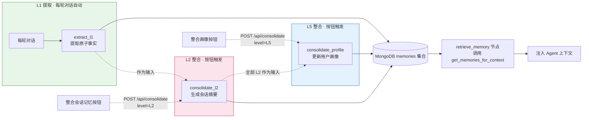

# 模块 4：TMT 三层记忆系统（segment / session / profile）

> 前置模块：[模块 2：LangGraph Agent](./02-LangGraph-Agent.md)、[模块 3：HTML 前端](./03-HTML前端.md)
> 本模块在 TiMem 论文五级 TMT（Segments → Sessions → Daily → Weekly → Profile）中选取
> 三级实现：L1 segment、L2 session、L5 profile。L3/L4 的整合逻辑与 L2 同构
> （下一级摘要 → 更高层摘要），选取首尾三层即可覆盖“细节→会话→画像”的完整链路。

## 学习目标

1. 理解 TMT（时序记忆树）的核心思想——从对话中提取原子事实，按会话压缩为摘要，再跨会话提炼为用户画像
2. 用 Python + LLM + MongoDB 从零实现 **L1 事实提取**（每轮对话后自动触发）、**L2 会话摘要**与 **L5 用户画像**（均手动触发）
3. 理解整合的**两种触发机制**：TiMem 生产实现的空闲超时扫描与本教学项目的手动按钮触发
4. 在 LangGraph 图中集成 `retrieve_memory` 与 `store_memory` 节点：本会话记忆直接注入，跨会话记忆由 profile 承担
5. 实现 `POST /api/consolidate` 端点的两级整合能力（请求体 `level` 区分 L2/L5）与前端按钮，手动、即时地触发整合并保证幂等
6. 理解“分层配额注入”为何是业界标杆做法——以 oh-my-pi（omp）为标杆对照本模块的三层设计，同时理解提取时对比历史窗口（recent_l1）从源头减少重复

## 模块结构



## 核心思路

TiMem 论文（ACL 2026 Findings, arXiv:2601.02845）提出 TMT（Temporal Memory Tree）五级时序分层记忆。本模块实现其中三级：

| 论文层级 | 内容 | 本模块 | 触发 |
|---|---|---|---|
| L1 Segment | 对话片段的原子事实 | ✅ 每轮对话提取 | 每轮自动 |
| L2 Session | 会话主题摘要 | ✅ 会话全部 L1 → 1 条 | 按钮手动 |
| L3 Daily | 每日模式提炼 | 参考概念 | — |
| L4 Weekly | 每周趋势 | 参考概念 | — |
| L5 Profile | 稳定用户画像 | ✅ 全部 L2 + 旧画像 → 1 条 | 按钮手动 |

存储采用 MongoDB（`agentic_search` 数据库的 `memories` 集合），PyMongo 同步驱动。

L5 的输入只有两样：下一层级的摘要文本与现有画像——TiMem 在缺少 L4 时会回退用 L3 的摘要生成 L5，说明摘要来自哪一层并不影响整合方式。因此本模块让 L2 直接作为 L5 的输入；省略 L3/L4 后，画像的结构化提炼由 L5 整合的画像结构指引直接承担（见前置小节的 `l5_profile`——官方 L5 本就自带画像结构与行为证据要求）。

### 记忆注入策略（分层注入，以 omp 为标杆）

本模块以 TiMeM 论文为**参考**——三层结构（提取→整合→画像）的出处；工程上的**标杆**是
oh-my-pi（omp）：它的记忆子系统验证了同样的结构在生产级 agent 里怎么落地。注入方式是
**配额制**：profile（全局唯一 1 条）+ 本会话 L1/L2 最近 N 条（≤20），按固定预算注入上下文。

**标杆对照（omp ↔ 本模块）**：

| omp 的实现（`packages/coding-agent/src/memories/`） | 本模块的对应 |
|---|---|
| Phase 1：启动时逐会话提取事实 | `extract_l1`（每轮对话提取） |
| Phase 2：跨会话整合为 `MEMORY.md` + `memory_summary.md` | `consolidate_l2` / `consolidate_profile`（整合为 L2/L5） |
| 会话开始作为 Memory Guidance 块注入 system prompt | `retrieve_memory` 节点注入 SystemMessage |
| 零向量依赖（向量仅可选 mnemopi 插件后端） | 零向量依赖（配额注入） |

同样的模式在其他一线 agent 中一致出现：

| 工具 | 长期记忆机制 | 记忆召回方式 |
|---|---|---|
| **hermes-agent** | `MEMORY.md`（agent 自记事实）+ `USER.md`（用户画像）纯文本文件，冻结快照注入 system prompt（`tools/memory_tool.py`） | SQLite FTS5 全文检索（`tools/session_search_tool.py`） |
| OpenAI Codex CLI | `AGENTS.md` 逐层拼接注入（`codex-rs/core/src/agents_md.rs`） | ripgrep 字面量搜索（`codex-rs/rollout/src/search.rs`） |
| Claude Code | `CLAUDE.md` 四级层级 + auto memory，`MEMORY.md` 索引前 200 行启动注入 | 模型自行读取 markdown 文件 |
| Cline / Gemini CLI | `.clinerules` / `GEMINI.md` 文件注入 | 文件按需读取 / MemTool 写回 |

与它们相比，TiMeM 的双通道检索（语义向量 ×0.9 + BM25 ×0.1，Qdrant）属于**记忆产品**
在海量记忆长期个性化场景下的路线——hermes 的 `USER.md` 与本模块的 L5 profile 同构，
印证“用户画像”这一层是 agent 与记忆产品的公共结构。

**跨会话记忆由 profile 承担**：`get_memories_for_context(session_id)` 只取两类记忆——
全局唯一的 L5 画像 + 该会话的 L1/L2（时间倒序，≤20 条）。开新会话时，Agent 带着画像记忆一切重点，
旧会话的 L1/L2 留在库中作为下次整合画像的素材。将来记忆量级上来（>50 条），
把 `get_memories_for_context` 的函数体换成检索实现即可，图编排保持原样——函数名就是为切换预留的接口。

### 整合触发机制

| 维度 | TiMem 生产实现 | 本教学项目 |
|------|---------------|-----------|
| L2 触发器 | `SessionMemoryScanner` 每 10 分钟扫描，会话 idle ≥10 分钟视为结束 | 前端「整合会话记忆」按钮 |
| L5 触发器 | 跨月检测自动回填（`core/catchup_detector.py`） | 前端「整合画像」按钮 |
| 实现位置 | `services/session_memory_scanner.py`、`timem/workflows/`（均为 TiMeM 仓库内部路径） | `api/routes.py` 同一 /api/consolidate 端点（level 区分） |
| 目的 | 生产自动化 | 教学即时可观察 |

> 💡 **幂等性**：同一会话最多一条 L2（按 `session_id` 定位，有则更新）；全局最多一条 L5（按 `level` 定位，有则更新）。重复点击按钮只会增量更新。

## 第 1 步：理解 TMT 思想

- **L1、L2、L5 的区别**：L1 是原子事实（如「用户在研究注意力机制」），L2 是会话级摘要（如「本次会话讨论了 Transformer 架构」），L5 是跨会话的稳定画像（如「用户是关注注意力机制的 NLP 研究者」）。
- **整合的目的**：压缩信息量，保留要点，丢弃噪音。

## 第 2 步：实现记忆层 `memory/`——`memory.py`（加工）与 `db.py`（数据库操作）

记忆层拆两个文件，各管一件事：**`memory/memory.py` = 记忆加工**（LLM 提取与整合——三个函数全部纯进出：数据进、Memory 出，不碰数据库），**`memory/db.py` = 数据库操作**（Memory 数据结构、MongoDB 读写、幂等写入、注入取数）。通过包化 import 暴露：

```python
from agentic_search.memory.memory import extract_l1, consolidate_l2, consolidate_profile
from agentic_search.memory.db import Memory, save_memory, load_memories, upsert_l2, upsert_profile, get_memories_for_context, L2_TRIGGER_THRESHOLD
```

### 前置：LLM 客户端提升为共享模块 `services/llm.py`

模块 2 的 LLM 客户端是 `build_graph()` 内部的局部变量（`llm_call` 节点以闭包捕获），模块 4 的记忆层也需要 LLM——`memory.py` 的三个函数（`extract_l1`/`consolidate_l2`/`consolidate_profile`）都要裸调用 LLM（无工具绑定）。此时闭包遇到了第二个消费者：`memory.py` 既被 `/api/consolidate` 端点调用、又被图内的 `store_memory` 节点调用（第 4 步），而图又 import `memory.py`——若 `memory.py` 反向从 `graph.py` 取 LLM 就成了循环导入。解法是把客户端提升为双方都能 import 的共享模块，与 `services/documents.py` 持有 Mongo 客户端同一模式：

```python
# services/llm.py —— 模块级 LLM 客户端，graph 与记忆层共用
from langchain.chat_models import init_chat_model
from agentic_search.configs.config import settings

llm = init_chat_model(
    model=settings.llm_model,
    model_provider=settings.llm_model_provider,
    base_url=settings.llm_base_url,
    api_key=settings.llm_api_key,
    timeout=settings.llm_timeout,
)

def call_llm(prompt: str) -> str:
    """裸 LLM 调用（无工具绑定），记忆提取/整合用。"""
    return llm.invoke(prompt).content
```

`agents/graph.py` 随之两行改动——`init_chat_model(...)` 块从 `build_graph()` 内删除，改为 import；`bind_tools` 留在图内，因为工具绑定是图特有的：

```python
from agentic_search.services.llm import llm

def build_graph():
    tools = [list_papers, read_paper, search_paper, extract_abstract]
    llm_with_tools = llm.bind_tools(tools)   # 共享客户端上绑定工具
    ...
```

`call_llm` 返回值恒为 `str`，消费方用 `json.loads(raw)` 解析（注意是 `loads`——带 s 的吃字符串；`json.load` 吃的是文件对象）。

`memory.py` 文件头部相应引入（本模块后文的 `call_llm(prompt)` / `json.loads` / `datetime.now(timezone.utc)` 均来自这里；`db.py` 只管数据库，不碰 LLM）：

```python
# memory/memory.py 文件头部
import json
from datetime import datetime, timezone

from agentic_search.memory.db import Memory
from agentic_search.services.llm import call_llm
```

依赖方向单一：`memory.py` → `db.py`（只用 Memory 数据结构）→ MongoDB；`api/routes.py` 与图节点按需两者都调——加工找 `memory.py`，存取找 `db.py`。

各函数直接用 `datetime.now(timezone.utc).isoformat()` 生成时间戳。存字符串而非 datetime 对象：`Memory` 四字段全为 `str` 保持类型一致与 JSON 可序列化；BSON Date 读回是无时区的毫秒精度 datetime（时区信息丢失），ISO 字符串存什么读回什么；且 ISO 8601 字符串按字典序排列即按时间排列，`sort("timestamp", -1)` 正确取最近记忆。


### 前置：prompt 集中管理 `configs/prompts.yaml`

本模块的全部 LLM 话术——agent 人设（persona）与三个记忆 prompt——集中放在一个 yaml 文件里，运行时加载注入，调话术零代码改动。TiMem 生产实现同样是 `config/prompts.yaml` 集中管理，教学版与生产同构。三个记忆 prompt 的主体移植自 TiMeM 官方仓库（`config/datasets/default/prompts.yaml` 的 `l1_fragment_summary` / `l2_session_summary` / `l5_high_level_summary`），并吸收两家标杆的去重纪律：JSON 严格输出与「无新事实输出空数组」取自 omp 的 stage-one 提取模板，「保留仍然成立的内容、移除过时或矛盾描述」的原位更新取自 omp 整合层与 hermes 的 memory 工具（add/replace/remove 原位维护）。文件含四个键，占位符用 Python `str.format` 约定（`{recent_block}` 等，由调用方填充）：

```yaml
# configs/prompts.yaml —— 全部 LLM 话术集中于此
persona: |
  你是 Agentic Search，一个论文问答助手。用户会上传论文 PDF，你通过工具
  （list_papers / read_paper / search_paper / extract_abstract）阅读和检索论文，
  回答用户关于论文的问题。始终用中文回答；引用论文内容时注明出自哪篇文件。
l1_extract: |
  你是记忆提取器。任务：从「当前对话」中提取值得长期记住的新事实——
  已被「已有记忆」覆盖的内容一律跳过，不要重复输出。

  核心原则：
  把对话转写为第三人称陈述，尽可能保留原文的实质信息，只剔除确认无信息量的词。

  保留什么：
  - 全部实质信息：人物、事件、时间、地点、原因、结果、数字、具体描述
  - 原始措辞：标题、物品名、方法名、活动描述等保留对话中的具体用词，数字用阿拉伯数字
  - 明确的态度表达：保留对话中明确出现的情绪与偏好（如「喜欢」「担心」），不添加原文没有的主观推断

  剔除什么：
  只剔除纯功能词：寒暄（「你好」「再见」）、附和（「嗯」「好的」「是的」）、无意义口头语。

  时间表达：
  保留对话中的相对时间表述原样（如「昨晚」「这周五」），换算为绝对日期的事不做。

  质量标准：
  - 只记可长期复用、对话中有依据的事实；琐碎、显而易见、随手可再查得的信息跳过
  - 每条事实聚焦一件事，用行为与事实描述而非抽象评价
  - 当前对话没有可记的新事实时，输出空数组 []

  已有记忆（其中已覆盖的内容不要重复输出）：
  {recent_block}

  当前对话：User：{user}  Agent：{agent}

  严格只输出 JSON 数组（无 markdown、无解释）：["事实1", "事实2", ...]
l2_consolidate: |
  你是会话级记忆整合器。任务：把本会话的全部事实记忆整合为一段连贯的
  会话级摘要，供后续画像整合使用。目标是信息密度最大化、冗余最小化。

  内容要求：
  - 按时间顺序呈现：谁在何时何地做了什么、为什么、结果如何，以及关键决策与状态变化
  - 严格基于事实记忆，不编造、不做「合理扩展」
  - 保留具体信息：数字、量词、修饰词、关系表述、并列的具体条目，沿用事实记忆的原始措辞
  - 去重：合并近似重复的事实；多条记忆提到同一事实时，保留信息最完整的版本

  时间处理：
  保留事实记忆中的相对时间表述原样（如「昨晚」「上周」），换算为绝对日期的事不做。

  风格与长度：
  - 中文第三人称叙述，自然连贯的句子，不用列表与编号
  - 200 字左右；为保留关键细节可适度超出，避免空泛

  事实列表：
  {facts}

  请直接生成会话级摘要。
l5_profile: |
  你是深度画像构建器。任务：基于历史画像与会话摘要，为用户维护一份
  长期画像档案，让 agent 清楚理解这个人的独特之处。

  画像结构（按此组织）：
  1. 基本身份：对话中明确提到的角色定位（职业、研究方向等）与背景（所在环境、使用的工具等）
  2. 关键事件：挑选最能反映用户特质的事件，格式为「时间 + 行为 + 细节 + 结果」，优先涉及选择与决策的事件
  3. 核心特质（画像质量的关键）：识别 2-3 个最独特的特质，每个特质必须：
     - 用行为描述而非形容词（「决策前会先查三篇论文对比」而非「谨慎」）
     - 附至少 3 个具体行为证据（何时做了什么、说了什么）
     - 说明与典型做法的差异（一般人会怎么做、此人怎么做）
  4. 决策模式：若存在决策场景，分析用户优先考虑什么、选择标准的独特之处
  5. 近期变化：新出现的行为或话题、态度或频次的变化，具体描述「从什么变成什么」

  更新原则：
  - 在历史画像基础上合并新信息、修正过时描述、保留仍然成立的内容；移除与事实记忆矛盾的旧结论
  - 证据优先、少即是多：无具体行为支撑的特质直接略过，不推测补全
  - 数据支撑：尽量给出次数、频率等具体数据

  风格：中文第三人称，清晰分段，300 字左右。

  历史画像：
  {previous_block}

  会话摘要：
  {summaries}

  请直接生成用户画像。
```

加载器与 `settings` 单例同一模式——模块级加载一次，全项目共享：

```python
# configs/prompts.py —— 模块级 PROMPTS 单例
from pathlib import Path

import yaml

PROMPTS: dict[str, str] = yaml.safe_load(
    Path(__file__).with_name("prompts.yaml").read_text(encoding="utf-8")
)
```

`pyyaml` 需声明为直接依赖（`uv add pyyaml`——它此前作为 uvicorn 的传递依赖已在锁文件里，此处转正）。`memory/memory.py` 文件头部相应加 `from agentic_search.configs.prompts import PROMPTS`（`db.py` 零 LLM 依赖，用不到它）。

### 2.1 数据结构：Memory dataclass

```python
# memory/memory.py —— 教学示例：展示核心字段，非完整实现
from dataclasses import dataclass

@dataclass
class Memory:
    level: str          # "L1"、"L2" 或 "L5"，标识记忆层级
    content: str        # 记忆的实际内容（L1 一条事实，L2 一段摘要，L5 一段画像）
    timestamp: str      # ISO 8601 时间戳，记录记忆生成时刻
    session_id: str     # 所属会话 ID；L5 为 None——画像属于用户而非任何一次会话
```

**字段含义逐项讲解：**
- `level`：记忆在 TMT 树中的层级，取 `"L1"`、`"L2"`、`"L5"`（L3/L4 与 L2 同构，本模块省略）。
- `session_id`：L2 幂等的键——整合时按 `session_id + level` 查询是否已存在 L2，有则更新、无则新建。L5 的 `session_id=None` 表达“画像不属于任何会话”，幂等键只用 `level="L5"`。
- `asdict()`：dataclass 自带的字典转换方法，`save_memory` 用它把对象转为 MongoDB document。

**`@dataclass` 也是装饰器**：它和模块 2 的 `@retry` 是同一种机制——接收 `Memory` 类，返回自动生成 `__init__`/`__repr__` 的「增强版」类。

**验证：** 创建 `Memory` 实例（含 `session_id=None` 的 L5），确认字段可赋值、`asdict()` 输出符合预期。

### 2.2 L1 提取：`extract_l1(history, session_id, recent_l1)`（历史去重）

从一轮对话中提取原子事实，并对比历史窗口 `recent_l1` 跳过重复事实。

**Prompt 设计要点**（正文在 `configs/prompts.yaml` 的 `l1_extract` 键，主体移植自 TiMeM 官方 `l1_fragment_summary`）：
- 角色：记忆提取器——只记「当前对话」里的**新事实**，已被已有记忆覆盖的跳过
- 输入：一轮对话（user 与 agent 各一条消息）+ 已有记忆列表（recent_l1，用于去重）
- **保留**：全部实质信息（人物、事件、时间、数字、具体描述），沿用原始措辞（方法名、物品名原样，数字用阿拉伯数字）
- **剔除**：只剔除纯功能词（寒暄、附和、口头语）；明确的态度表达保留，主观推断不加
- **相对时间原样**：「昨晚」「这周五」不换算为绝对日期
- **质量标准**（取自 omp stage-one 的 durable signal）：只记可长期复用、对话有依据的事实；琐碎、显而易见、可再查得的跳过；无新事实输出空数组 `[]`
- 输出：严格 JSON 数组（无 markdown、无解释），每条一个第三人称陈述句

```python
# memory/memory.py —— 教学示例：展示核心流程，非完整实现

def extract_l1(history: dict, session_id: str, recent_l1: list[Memory] = []) -> list[Memory]:
    """从一轮对话提取原子事实，对比历史窗口去重。

    history: {"user": "...", "agent": "..."}
    recent_l1: 该会话最近 N 条 L1 记忆（历史窗口），用于跳过重复事实
    """

    # 历史窗口：拼进 prompt，让 LLM 判断重复（提取时去重，而非存完再清理）

    recent_block = "\n".join(f"- {m.content}" for m in recent_l1) or "（无）"

    prompt = PROMPTS["l1_extract"].format(recent_block=recent_block, **history)
    raw = call_llm(prompt)               # 调用 LLM，返回 JSON 字符串
    facts = json.loads(raw)              # 解析为字符串列表
    return [
        Memory(level="L1", content=fact, timestamp=datetime.now(timezone.utc).isoformat(), session_id=session_id)
        for fact in facts
    ]
```

**逐段讲解：**
- **`recent_l1` 历史窗口**：把该会话最近的 L1 记忆拼进 prompt（`recent_block`），让 LLM **对比后跳过重复**——对应论文 3.2 的 Historical Memories（同层滑动窗口）。用户重复表达同一事实时，只有第一遍被存下来，重复数据也不会占据注入上下文的名额。去重依赖 LLM 遵守指令，属于软约束——TiMem 生产实现同样只靠 prompt 指令去重。
- **保留实质信息、剔除功能词**（TiMeM 官方 L1 的核心原则）：第一人称转第三人称，方法名、数字、相对时间原样保留——一轮「这论文怎么分类的？」能提取出「用户关注 KSSE 谱嵌入」「KSSE 用 QC-LDPC 稀疏图做谱嵌入」。这与官方生产实现同源：官方 L1 同样按「实质信息全保留、功能词全剔除」运转，无自造的分类体系。
- **容错提示**：生产建议用 LangChain 的 `with_structured_output` + Pydantic schema 替代裸 `json.loads`，教学示例保留最简形式。
- **segment 单位**：本模块以一轮对话（user 与 agent 各一条）为一个 L1 提取单位；TiMem 是固定 2 轮对话对（`fragment_size: 2`）。每轮提取粒度更细、事实更原子化，代价是 LLM 调用次数翻倍——教学场景优先可读性。

**验证：** 构造一轮测试对话（如「我是做 NLP 的研究生，最近在研究注意力机制」），调用 `extract_l1`，检查：
1. 提取出用户身份与研究方向两条事实（第三人称、保留原始措辞）
2. 传入含相同事实的 `recent_l1` 后，重复事实不再被提取（去重生效）

### 2.3 L2 整合：`consolidate_l2(l1_memories)`

将一次会话的所有 L1 整合为一条会话摘要。

```python
# memory/memory.py —— 教学示例：展示核心流程，非完整实现
def consolidate_l2(l1_memories: list[Memory]) -> Memory:
    """将同会话的所有 L1 整合为一条 L2 会话摘要。

    空列表守卫：会话尚无 L1 时直接报错，由调用方（端点）转为 422。
    幂等由 store 层的 upsert_l2 保证（见 2.6）。
    """
    if not l1_memories:
        raise ValueError("暂无 L1 记忆")
    facts = "\n".join(f"- {m.content}" for m in l1_memories)
    prompt = PROMPTS["l2_consolidate"].format(facts=facts)
    summary = call_llm(prompt)           # 返回一段摘要文字
    return Memory(
        level="L2", content=summary,
        timestamp=datetime.now(timezone.utc).isoformat(),
        session_id=l1_memories[0].session_id,  # 继承会话 ID
    )
```

**逐段讲解：**
- 把 L1 记忆的 `content` 用 `- ` 前缀拼成列表喂给 LLM，便于模型逐条审视。
- 输出的 `Memory` 的 `session_id` 取自第一条 L1——L2 属于同一个会话。
- 基础实现可不传 `recent_l2`（滑动窗口），后续优化时再加入历史 L2 作为额外上下文。
- **空列表守卫**：`l1_memories[0]` 在空列表上会抛 IndexError——守卫把它变成语义明确的 ValueError，端点捕获后返回 422，前端提示“先对话几轮”。

**验证：** 构造 3 条 L1 记忆，调用 `consolidate_l2`，检查输出是否是一段包含要点的连贯摘要。

### 2.4 L5 画像整合：`consolidate_profile(l2_memories, previous_profile)`

将跨会话的全部 L2 摘要整合为一条全局唯一的用户画像。与 `consolidate_l2` 同构——都是“下一级记忆 → 一条高层摘要”——区别在输入范围（跨会话）与幂等键（全局一条）。

```python
# memory/memory.py —— 教学示例：展示核心流程，非完整实现
def consolidate_profile(l2_memories: list[Memory], previous_profile: Memory | None = None) -> Memory:
    """将全部 L2 会话摘要整合为一条 L5 用户画像。

    previous_profile: 现有 L5（首次生成时为 None）。传入旧画像让 LLM 做“合并新信息、
    修正过时信息”的增量更新——对应论文 Historical Memories 的思想：高层整合参考同层
    历史保持连续性（TiMem 中 L5 参考最近 3 条历史 L5，`workflows/nodes/unified_processors.py:888`）。
    """
    if not l2_memories:
        raise ValueError("暂无 L2 记忆")
    summaries = "\n".join(f"- {m.content}" for m in l2_memories)
    previous_block = previous_profile.content if previous_profile else "（首次生成，尚无画像）"
    prompt = PROMPTS["l5_profile"].format(previous_block=previous_block, summaries=summaries)
    profile = call_llm(prompt)
    return Memory(level="L5", content=profile, timestamp=datetime.now(timezone.utc).isoformat(), session_id=None)
```

**逐段讲解：**
- **画像结构五段**（移植自官方 `l5_high_level_summary`）：基本身份、关键事件、核心特质、决策模式、近期变化。核心特质段是画像质量的关键——行为描述而非形容词，每个特质至少 3 个行为证据 + 与典型做法的差异。
- **`previous_profile` 增量更新**：旧画像全文进 prompt，LLM 在其基础上合并修正，而非每次从零重写——画像稳定性（论文里“从观察到人格”的渐变）靠这一步保持。
- **`session_id=None`**：画像属于用户全局，幂等键就是 `level="L5"`，全库至多一条。

**验证：** 构造 2 条 L2 摘要（不同会话、话题相关），先传 `previous_profile=None` 生成画像 v1；再构造 1 条含新信息的 L2，传 v1 调用，检查输出画像包含新信息且保留 v1 中仍然成立的内容。

### 2.5 记忆存储 `memory/store.py`（PyMongo CRUD）

#### 2.5.1 连接初始化（store.py 文件头部）

```python
# memory/store.py 文件头部 —— 存储层只管 MongoDB 读写，不碰 LLM
from dataclasses import asdict

from pymongo import MongoClient

from agentic_search.configs.config import settings
from agentic_search.memory.memory import Memory

_client = MongoClient(settings.mongo_url)
_db = _client[settings.mongo_db]
_memories_collection = _db["memories"]   # 私有成员：仅 store.py 内部使用，端点/工具层零引用
```

**逐段讲解：**
- **下划线私有**：`_memories_collection` 与 `services/documents.py` 的 `_documents_collection` 同一规范——集合句柄是存储层（store.py）的实现细节，端点与图节点只调存储函数，从不直接碰集合。

#### 2.5.2 写入单条：`save_memory(memory)`

```python
# memory/store.py
def save_memory(memory: Memory):
    _memories_collection.insert_one(asdict(memory))
```

#### 2.5.3 条件查询：`load_memories(session_id, level, limit)`

```python
# memory/store.py
def load_memories(session_id: str | None = None, level: str | None = None,
                  limit: int | None = None) -> list[Memory]:
    query = {}
    if session_id is not None:
        query["session_id"] = session_id
    if level is not None:
        query["level"] = level
    docs = _memories_collection.find(query).sort("timestamp", -1)
    if limit is not None:
        docs = docs.limit(limit)
    memories = []
    for doc in docs:
        doc.pop("_id", None)
        memories.append(Memory(**doc))
    return memories
```

`sort`/`limit` 在 MongoDB 服务端执行（按 `timestamp` 倒序、最多取 N 条），只把最终结果拉回 Python——查询三要素（过滤/排序/限量）全收在存储层这一个函数里，上层组合调用即可。

#### 2.5.4 更新单条：`update_one`（幂等更新）

```python
# memory/store.py
_memories_collection.update_one(
    {"session_id": session_id, "level": "L2"},
    {"$set": {"content": new_summary, "timestamp": datetime.now(timezone.utc).isoformat()}},
    upsert=True,
)
```

该示例展示 `update_one` 原子操作本身；实际项目中的幂等更新由 `upsert_l2`/`upsert_profile` 封装（见 2.6）。

### 2.6 幂等写入：`upsert_l2(l2)` 与 `upsert_profile(profile)`（`memory/store.py`）

端点需要的“有则更新、无则新建”逻辑封装在存储层（store.py），返回落库文档的 `_id` 字符串：

```python
# memory/store.py —— 教学示例：展示核心流程，非完整实现
def upsert_l2(l2: Memory) -> str:

    existing = _memories_collection.find_one(
        {"session_id": l2.session_id, "level": "L2"}
    )

    if existing is None:
        return str(_memories_collection.insert_one(asdict(l2)).inserted_id)
    else:
        _memories_collection.update_one(
            {"_id": existing["_id"]},
            {"$set": {"content": l2.content, "timestamp": l2.timestamp}},
        )
        return str(existing["_id"])


def upsert_profile(profile: Memory) -> str:
    """按 level="L5" 全局幂等写入画像：已有则更新 content/timestamp，返回 _id。"""
    existing = _memories_collection.find_one({"level": "L5"})
    if existing is None:
        return str(_memories_collection.insert_one(asdict(profile)).inserted_id)
    _memories_collection.update_one(
        {"_id": existing["_id"]},
        {"$set": {"content": profile.content, "timestamp": profile.timestamp}},
    )
    return str(existing["_id"])
```

**逐段讲解：**
- 与 `services/documents.py` 的分层一致：MongoDB 访问全部收在存储层（store.py）函数里，`api/routes.py` 只调用函数。
- 两个函数只差幂等键（`session_id + level` vs 全局 `level`），对应 L2 每会话一条、L5 全局一条的定位。
- 这两个函数属于第 2 步开头 import 清单的 store.py 一行（`save_memory, load_memories, upsert_l2, upsert_profile`）。

```python
# memory/memory.py —— 教学示例：展示核心逻辑，非完整实现
def get_memories_for_context(session_id: str, limit: int = 20) -> list[Memory]:
    """取全局画像 + 该会话最近 N 条记忆（L1+L2），按时间倒序，配额注入，业界同构。

    profile 在前（全局唯一一条）；本会话记忆按时间倒序取最近 limit 条。
    跨会话记忆由 profile 承担：其他会话的 L1/L2 留在库中，作为下次整合画像的素材。
    """
    memories = load_memories(level="L5")                            # 全局至多一条画像
    memories += load_memories(session_id=session_id, limit=limit)   # 本会话 L1+L2，时间倒序取前 N
    return memories
```

**逐段讲解：**
- **纯组合，零集合访问**：两次 `load_memories` 调用分别取「全局画像」与「本会话最近 N 条」——过滤/排序/限量全是存储层 `load_memories` 的能力，本函数只做配额编排，不碰 `_memories_collection`（分层与 `agents/tools.py` 薄委托同一规范）。
- **`load_memories(level="L5")` 在最前**：画像是最稳定的背景知识，放列表头部，注入 prompt 时格式化为独立一段（见第 4 步）。
- **`limit=20` 是上下文保护线**：本会话记忆按时间倒序取最近 20 条，用户偏好变化时 Agent 优先读到当前状态。
- **其他会话的记忆自然被过滤**：第二次调用查询条件是 `session_id` 等值匹配，跨会话的记忆只有画像这一条通道进入上下文。

**验证：** 会话 A 存 3 条 L1，会话 B 存 2 条 L1，库里存 1 条 L5。调用 `get_memories_for_context("A")`：返回 4 条（L5 在前 + A 的 3 条），B 的记忆不在其中。

## 第 3 步：手动整合端点（`level` 区分两级）

模块 2 §8.4 在 `api/routes.py` 预留的 `/api/consolidate` 占位（返回 `status="pending"`）在本模块转正。
L2 与 L5 共用这一个端点——请求体的 `level` 字段区分（缺省 `"L2"`，模块 3 的按钮请求原样兼容），
API 总数保持 4 个不变。

### 3.1 schemas.py 增量扩展（api/schemas.py）

```python
class ConsolidateRequest(BaseModel):
    """POST /api/consolidate 的请求体。"""
    session_id: str         # 会话 ID（level="L5" 时仅作占位，画像整合与具体会话无关）
    level: str = "L2"       # 整合级别："L2" 会话摘要 / "L5" 用户画像


class ConsolidateResponse(BaseModel):
    """POST /api/consolidate 的响应。"""
    status: str             # 状态
    l2_id: str = ""         # level="L2" 时为生成的 L2 记忆 ID，否则为空
    profile_id: str = ""    # level="L5" 时为画像记忆 ID，否则为空
```

### 3.2 端点转正（api/routes.py，替换模块 2 的占位函数体）

```python
@router.post("/consolidate", response_model=ConsolidateResponse)
async def consolidate(req: ConsolidateRequest):
    """手动触发记忆整合：level="L2" 整合该会话，level="L5" 整合全局画像。"""
    if req.level == "L5":
        l2_memories = load_memories(level="L2")
        if not l2_memories:
            raise HTTPException(422, "还没有会话摘要，先整合至少一个会话")
        previous = load_memories(level="L5")
        profile = consolidate_profile(l2_memories, previous[0] if previous else None)
        profile_id = upsert_profile(profile)
        return ConsolidateResponse(status="ok", profile_id=profile_id)

    l1_memories = load_memories(session_id=req.session_id, level="L1")
    if not l1_memories:
        raise HTTPException(422, "该会话没有 L1 记忆，先对话几轮再整合")
    l2 = consolidate_l2(l1_memories)
    l2_id = upsert_l2(l2)
    return ConsolidateResponse(status="ok", l2_id=l2_id)
```

**逐段讲解：**
- **`level` 分流**：`"L5"` 走画像分支（输入是跨会话全部 L2 + 现有 L5，幂等键 `level="L5"` 全局一条）；
  其余走 L2 分支（输入是 `req.session_id` 的全部 L1，幂等键 `session_id + level`，每会话一条）。
- **幂等由存储层保证**：`upsert_l2`/`upsert_profile` 封装“查—增改”逻辑——端点只组数据、调函数、返结果，与模块 2 的分层铁律一致。
- **`l2_id`/`profile_id` 返回 MongoDB `_id`**：文档主键全局唯一，比时间戳可靠（同一秒内两次整合会撞车）。
- **空输入守卫**：两个分支各自在整合前检查输入为空 → 422，前端据此提示“先对话/先整合会话”。

## 第 4 步：集成到 Agent 图

```
__start__ → retrieve_memory → [ llm_call ⇄ tool_node ] → store_memory → __end__
```

本步同时给 agent 补上人设（persona）——模块 2 的 `llm_call` 直接 `invoke(state["messages"])`，回答语言与角色边界全靠模型默认。人设来自 `prompts.yaml` 的 `persona` 键，在 `llm_call` 每轮调用时前置为 SystemMessage：

```python
from langchain_core.messages import SystemMessage
from agentic_search.configs.prompts import PROMPTS

@retry(max_attempts=3)
def llm_call(state):
    messages = [SystemMessage(content=PROMPTS["persona"])] + state["messages"]
    response = llm_with_tools.invoke(messages)
    return {"messages": [response]}
```

人设存于调用而不入 state：它与 `retrieve_memory` 注入的记忆 SystemMessage 职责正交——人设是**恒定身份**（每轮相同，前置在消息序列最前），记忆是**动态背景**（随会话与画像变化，由节点注入）。消息序恒为 `[persona, 记忆, 对话...]`。`store_memory` 提取事实时取最后一对 user/agent 消息，人设消息互不干扰。


- **retrieve_memory 节点**（循环开始前）：调用 `get_memories_for_context(state["session_id"])`，
  profile 与本会话记忆分两段格式化为 SystemMessage：

```python
def retrieve_memory(state):
    """注入全局画像 + 本会话历史记忆，配额注入，业界同构。"""
    memories = get_memories_for_context(state["session_id"])
    profiles = [m for m in memories if m.level == "L5"]
    session_mems = [m for m in memories if m.level != "L5"]
    if not profiles and not session_mems:
        return {"messages": []}
    sections = []
    if profiles:
        sections.append("用户画像（跨会话长期记忆）：\n" + "\n".join(f"- {m.content}" for m in profiles))
    if session_mems:
        sections.append("本会话历史记忆：\n" + "\n".join(f"- [{m.level}] {m.content}" for m in session_mems))
    memory_msg = SystemMessage(
        content="以下是记忆背景，回答时作为参考：\n\n" + "\n\n".join(sections)
    )
    return {"messages": [memory_msg]}
```

- **store_memory 节点**（循环结束后）：把本轮对话传给 `memory.py` 的 `extract_l1(history, session_id, recent_l1)` 提取原子事实，经 `save_memory` 存入 MongoDB。**注意**：`recent_l1` 用 `load_memories(session_id, level="L1")` 取最近几条传入，让历史去重在每轮提取时生效。此节点只产生副作用（写库），返回 `{"messages": []}`。

模块 2 的 `MessagesState` 需扩展：`class MemoryState(MessagesState): session_id: str`。`api/schemas.py` 的 `QueryRequest` 加 `session_id: str = "default"`，`/api/query` 端点把 session_id 传进 graph 的初始 state。

**验证：** 会话 A 连续两轮提问（第二轮应看到第一轮的 L1 注入）；点「新会话」后提问「我是做什么的」——若已点过「整合画像」，Agent 应能基于 profile 回答。再问「你是谁」——Agent 应以论文问答助手身份用中文自我介绍（persona 生效）。


## 第 5 步：前端

### 5.1 会话管理（替换模块 3 的写死值）

模块 3 在 `app.js` 里写死了 `const currentSessionId = "demo-session"` 并注明“模块 4 接入会话管理后替换”——本步兑现：

```javascript
// 页面加载：从 localStorage 取，取不到才生成（刷新保持同一会话）
let currentSessionId = localStorage.getItem("session_id") || crypto.randomUUID();
localStorage.setItem("session_id", currentSessionId);

// 「新会话」按钮（new-session-btn）：显式重置会话边界
function newSession() {
  currentSessionId = crypto.randomUUID();
  localStorage.setItem("session_id", currentSessionId);
  messagesEl.innerHTML = "";   // 清空聊天区（messagesEl 是模块 3 已取的元素引用）
}
```

**设计意图**：会话边界完全由用户显式控制——刷新页面继续同一会话（L1/L2 继续累积到同一 session_id 下），
点「新会话」才切换。切换后注入上下文的记忆只剩全局画像一条，跨会话记忆由 profile 承担。

### 5.2 两个整合按钮（沿用模块 3 的 consolidateMemory，新增 consolidateProfile）

控件区在模块 3 的基础上新增两个按钮（对齐 03 §1.2 的控件区写法）：

```html
<div id="controls">
  <button id="new-session-btn">新会话</button>
  <button id="consolidate-btn">整合会话记忆（L2）</button>
  <button id="profile-btn">整合画像（L5）</button>
</div>
```

三个按钮的 `id` 与后文 JS 绑定一一对应：`consolidate-btn` 是模块 3 已有按钮（沿用），`new-session-btn` 与 `profile-btn` 是本模块新增。

```javascript
async function consolidateMemory() {   // 「整合会话记忆」（consolidate-btn，模块 3 已有）
  const res = await fetch('http://localhost:8000/api/consolidate', {
    method: 'POST',
    headers: { 'Content-Type': 'application/json' },
    body: JSON.stringify({ session_id: currentSessionId })   // level 缺省即 "L2"，模块 3 的请求体原样兼容
  });
  if (res.status === 422) { alert('该会话还没有可整合的记忆，先对话几轮'); return; }
  const { l2_id } = await res.json();
  alert(`L2 整合完成（${l2_id}）`);
}

async function consolidateProfile() {   // 「整合画像」（profile-btn，本模块新增）
  const res = await fetch('http://localhost:8000/api/consolidate', {
    method: 'POST',
    headers: { 'Content-Type': 'application/json' },
    body: JSON.stringify({ session_id: currentSessionId, level: "L5" })
  });
  if (res.status === 422) { alert('还没有会话摘要，先整合至少一个会话'); return; }
  const { profile_id } = await res.json();
  alert(`画像更新完成（${profile_id}）`);
}
```

## 第 6 步：编写 `tests/test_memory.py`

重点测试零 LLM 依赖的部分：

- Memory 数据结构字段完整性（含 L5 的 `session_id=None`）
- MongoDB 存取往返一致性（save_memory → load_memories → 对比）
- `get_memories_for_context`：profile 在前 + 本会话 L1/L2 时间倒序 + limit 生效 + **其他会话记忆被隔离**
- L2 幂等：同一会话二次 consolidate 更新而非新增
- L5 幂等：二次 consolidate_profile 更新而非新增（全库仍只有一条 L5）
- 端点空输入守卫（无 L1 的会话 / 无 L2 的库 → 422）
- PROMPTS 四键就位（persona / l1_extract / l2_consolidate / l5_profile）+ 占位符与调用点参数集匹配（`.format()` 静态验证，零 LLM）

L1 / L2 / L5 的 LLM 调用涉及真实模型，标记为集成测试（对齐 `test_graph.py` 打真 LLM 的做法）。

**验证：**

```bash
cd backend && uv run pytest tests/test_memory.py -v
```

全部通过。

## 完成检查

- [ ] `memory/memory.py` 实现 `Memory`、`extract_l1`（官方移植 + recent_l1 去重）、`consolidate_l2`（守卫）、`consolidate_profile`、`get_memories_for_context`；`memory/store.py` 实现 `save_memory`/`load_memories`/`upsert_l2`/`upsert_profile`
- [ ] Agent 图扩展为含 `retrieve_memory` / `store_memory` 节点，同会话连续对话能引用历史记忆
- [ ] `POST /api/consolidate`（`level` 区分 L2/L5）实现且幂等，空输入返回 422
- [ ] 前端「新会话」「整合会话记忆」「整合画像」三按钮工作正常
- [ ] `uv run pytest tests/test_memory.py -v` 全部通过
- [ ] `configs/prompts.yaml` 四键就位，`PROMPTS` 单例可加载；问「你是谁」Agent 以论文问答助手身份中文自述（persona 生效）
- [ ] 对话几轮 → 点「整合会话记忆」→ Compass 中 `memories` 出现该会话 L2；再点「整合画像」→ 出现全局唯一 L5（`session_id: null`）
- [ ] 点「新会话」后问「我是做什么的」→ Agent 基于 profile 回答（跨会话记忆生效）
- [ ] 同一事实重复表达多轮，L1 中重复明显减少（prompt 级软去重，非硬保证）
- [ ] 二次点「整合画像」→ L5 仍只有一条，content 被更新

## 常见问题

**L1 提取返回空列表？** 对话中可能没有可长期复用的事实；或对话过于寒暄。调整 prompt 的提取规则再试。

**注入的历史记忆太多撑爆上下文？** `get_memories_for_context` 的 `limit`（默认 20）已限制；确需更多可调大，注意上下文窗口。

**多轮对话后 memories 集合文档数越来越多？** `extract_l1` 的 recent_l1 历史窗口让重复事实在提取时即被跳过；已被 L2 覆盖的旧 L1 可定期 `delete_many` 清理。

**连续点击多次整合按钮会生成多条 L2 / L5 吗？** 只做增量更新。L2 按 `session_id` 幂等、L5 全局唯一，重复点击只更新已有条目。

**L5 画像什么时候更新？** 每次点「整合画像」都用当前全部 L2 + 旧 L5 重新合成——新会话的信息在它的 L2 生成后，下次点按钮就会进入画像。

**刷新页面后记忆还在吗？** 在。记忆存 MongoDB；刷新保持同一 session_id（localStorage），本会话 L1/L2 继续累积。

**将来记忆多了怎么办？** 两条路线，按产品形态选。**agent 路线（标杆做法，omp/hermes 同款）**：压缩与全文检索——hermes 用 SQLite FTS5 全文检索跨会话对话（`tools/session_search_tool.py`），omp 在上下文逼近上限时用 LLM 摘要压缩历史，全程零向量依赖。**记忆产品路线（可选）**：TiMeM 式双通道检索——语义向量（权重 0.9）+ BM25 关键词（0.1）；即便选这条路，omp 的 mnemopi 后端也只把向量存进自有 SQLite，而非引入独立向量数据库。无论哪条，`get_memories_for_context` 的函数名都是为切换预留的接口，图编排保持原样。

**为什么 `call_llm` 不做重试？** 模块 2 手写的 `@retry` 装饰器包在图的 `llm_call` 上——那是 agent 回答用户的主链路，失败要兜底。记忆的提取与整合是后台/手动操作，失败时重按一次按钮或下一轮对话即可，教学从简。

**为什么 prompt 放 yaml 而不是写在代码里？** 话术是调参对象——提取范围、画像维度、人设口吻都要反复试，放 yaml 改起来零代码改动、一目了然。TiMem 生产实现同样是 `config/prompts.yaml` 集中管理。注意占位符走 `str.format` 约定：prompt 里要出现字面 `{`/`}` 时双写成 `{{`/`}}`。


**三个记忆 prompt 是自己写的吗？** 主体移植自 TiMeM 官方仓库 `config/datasets/default/prompts.yaml`（`l1_fragment_summary` / `l2_session_summary` / `l5_high_level_summary`），本地化只做了三处：中文叙述、单人（官方面向 Locomo 双人对话）、L1 输出改 JSON 数组（教学契约，便于逐条入库与去重）。JSON 严格输出与「无新事实输出空数组」取自 omp 的 stage-one 提取模板；「保留仍然成立的内容、移除过时或矛盾描述」的原位更新与 hermes memory 工具的 add/replace/remove 同构。


## 教学版与 TiMeM 实现的差异说明

| 差异点 | TiMeM 生产实现 | 本教学版 | 为什么偏离仍然合理 |
|---|---|---|---|
| 层级数量 | L1-L5 五级 | L1/L2/L5 三级 | L3/L4 与 L2 同构；L5 只吃摘要文本，三层已覆盖“细节→会话→画像”全链路 |
| L1 输出形态 | 一段第三人称叙事（片段记忆） | JSON 数组（多条原子事实） | 逐条入库便于 recent_l1 去重与 Compass 观察；主体思想（只记新事实、保留实质信息）与官方一致 |
| L5 画像结构 | 画像档案（身份/事件/特质/决策/变化） | 同左（官方移植，单人版） | 输入从 L4 周报改为 L2 会话摘要（跳级），画像结构不变 |
| segment 单位 | 2 轮对话对（fragment_size=2） | 每轮对话 | 粒度更细、事实更原子；LLM 调用翻倍但教学场景可接受 |
| 整合触发 | 空闲超时扫描 + 跨月回填 | 两个手动按钮 | 即时可观察、可调试；机制对比本身就是学习目标 |
| 存储 | PostgreSQL + Qdrant + 连接池 | MongoDB 单集合 | 教学调试与 Compass 可视化优先 |
| 检索 | 双通道：语义向量 + BM25（Qdrant） | 配额注入（零向量依赖） | 与标杆 omp 及 hermes/Codex/Claude Code 核心记忆链路同构；向量检索属于记忆产品的可选插件层 |
| 去重 | prompt 指令级（无算法） | 同样 prompt 指令级 | 与生产一致；教学文档明确这是软约束 |

## 延伸阅读

- **TiMem 论文与源码**：https://github.com/TiMEM-AI/TiMEM （ACL 2026 Findings, arXiv:2601.02845）。读源码认准生产链路（均为 TiMeM 仓库内部路径）：`timem/workflows/` 与 `services/session_memory_scanner.py`；`timem/memory/l1~l5_*.py` 是早期实验 stub，仅作历史参考。
- **Python dataclasses**：https://docs.python.org/zh-cn/3/library/dataclasses.html
- **PyMongo 官方教程**：https://www.mongodb.com/zh-cn/docs/languages/python/pymongo-driver/current/
