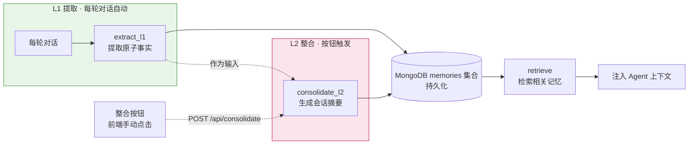

# 模块 4：TMT 记忆系统最小实现

> 前置模块：[模块 2：LangGraph Agent](./02-LangGraph-Agent.md)、[模块 3：HTML 前端](./03-HTML前端.md)

---

## 学习目标

完成本模块后，你将能够：

1. 理解 TMT（时序记忆树）的核心思想——从对话中提取原子事实，再按会话整合压缩为高层摘要
2. 用 Python + LLM + MongoDB 从零实现 **L1 事实提取**（每轮对话后自动触发）和 **L2 会话摘要**（手动触发）
3. 理解 L2 整合的**两种触发机制**：TiMem 生产实现的空闲超时扫描与本教学项目的手动按钮触发
4. 在 LangGraph 图中集成 `retrieve_memory` 与 `store_memory` 节点，让 Agent 具备跨会话记忆能力
5. 实现 `POST /api/consolidate` 端点与前端整合按钮，手动、即时地触发 L2 整合并保证幂等性

---

## 模块结构



---

## 核心思路

[TiMem](https://github.com/TiMEM-AI/TiMEM) 论文（ACL 2026 Findings）提出了 TMT（Temporal Memory Tree，时序记忆树）——一个五级时序分层记忆模型。论文的工程实现（PostgreSQL + Qdrant + 连接池 + 重试）属于生产级基础设施，对理解 TMT 核心思想而言不是必备的。

本模块从论文中提取核心思想，只实现两级：

```
L1 原始事实（Fragment）—— 每轮对话的原子事实（每轮对话后自动触发）
     ↓ 整合
L2 会话摘要（Session）—— 一次会话的主题和要点（前端手动点击按钮触发）
```

论文的 L3-L5（日 / 周 / 月）与 L2 逻辑完全相同——都是「将下一级记忆整合压缩为一条更高层级的摘要」，只是时间窗口更大。L1 + L2 已覆盖 TMT 的全部核心概念。

存储采用 MongoDB（`agentic_search` 数据库的 `memories` 集合），用 **PyMongo 同步驱动** 操作，便于教学调试与用 MongoDB Compass 人工查看。

### L2 触发机制说明

这是本模块与 TiMem 论文实现之间**最关键的设计差异**，务必理解清楚：

| 维度 | TiMem 生产实现 | 本教学项目 |
|------|---------------|-----------|
| 触发器 | `SessionMemoryScanner` 定期扫描 | 前端「整合会话记忆」按钮 |
| 触发条件 | 会话**最后一次交互超过配置超时**（默认 `interaction_timeout_minutes=10`，即 10 分钟无交互）视为会话结束 | 用户**手动点击**按钮，即时触发 |
| 实现位置 | `services/session_memory_scanner.py` | `api/routes.py` 的 `POST /api/consolidate` 端点 |
| 目的 | 生产环境自动化、无需人工介入 | 教学环境便于测试与演示，不空等 10 分钟 |

**为什么教学项目不直接照搬空闲超时？** 因为教学场景需要「即时可观察」——学生连续对话几轮后点击按钮，立刻能在 MongoDB Compass 中看到 L2 记忆，验证记忆整合逻辑是否正确。TiMem 的空闲超时机制作为**背景概念**讲解：学生应理解其原理（扫描器周期性检查、`exclude_recent_minutes=1` 排除正在进行中的会话、每会话最多一个 L2 的幂等保证），但教学实现用更直接的手动触发替代。

> 💡 **幂等性**是两种机制共享的关键性质：无论触发来源是空闲超时还是手动按钮，同一会话最多只产生一条 L2 记忆。若该会话已有 L2，再次触发时执行**增量更新**而非新建——这与论文 Section 3.2 的 Historical Memories（同层级滑动窗口保持连续性）思想一致。

---

## 第 1 步：理解 TMT 思想

### 1.1 论文阅读引导

> 📖 **论文阅读：Abstract + Figure 2（第 1-3 页）**
> 打开 `./TiMem Temporal-Hierarchical Memory Consolidation for Long-Horizon Conversational Agents.pdf`，阅读 Abstract 和 Figure 2。重点关注 TMT 五层结构（Segments → Sessions → Daily → Weekly → Profile）和三个核心组件。

> 📖 **论文阅读：Section 3.1 Temporal Memory Tree（第 3-4 页）**
> 重点关注 TMT 的形式化定义。理解每个节点存储时间区间和语义内容——低层级保持细节，高层级存储抽象。

> 📖 **论文阅读：Section 3.2 Memory Consolidation（第 3-4 页）**
> 重点关注 Child Memories（低层级如何被分组到高层级时间窗口）和 Historical Memories（同层级滑动窗口保持连续性）。这两点直接对应你要实现的 L1 → L2 整合逻辑。

### 1.2 理解核心概念

回答以下问题（参考论文）：

- **L1 和 L2 的区别是什么？** L1 是原子事实（如「用户在研究注意力机制」），L2 是会话级摘要（如「本次会话讨论了 Transformer 架构，用户偏好理论分析」）。
- **整合的目的是什么？** 压缩信息量，保留要点，丢弃噪音。

---

## 第 2 步：实现 `memory/store.py`

在 `backend/src/agentic_search/memory/` 下创建 `store.py`。全部记忆逻辑集中在这一个文件中，通过包化 import 暴露：`from agentic_search.memory.store import extract_l1, consolidate_l2, retrieve`。

> 包化布局下，`memory/` 是 `agentic_search` 包内的一个子模块，与 `agents/`、`services/`、`api/` 平级。这种分层让记忆逻辑与 Agent 逻辑、HTTP 路由逻辑彻底解耦——后续若把存储引擎从 MongoDB 换成其他数据库，只需改动 `store.py`，不影响其他文件。

### 2.1 数据结构：Memory dataclass

定义 `Memory` dataclass，包含 `level`（`"L1"` / `"L2"`）、`content`（记忆内容）、`timestamp`（ISO 时间戳）、`session_id`（所属会话）。这是后续所有函数的基础数据类型。

```python
# 教学示例：展示核心字段，非完整实现
from dataclasses import dataclass, asdict

@dataclass
class Memory:
    level: str          # "L1" 或 "L2"，标识记忆层级
    content: str        # 记忆的实际内容（L1 为一条事实，L2 为一段摘要）
    timestamp: str      # ISO 8601 时间戳，记录记忆生成时刻
    session_id: str     # 所属会话 ID，用于按会话聚合 L1 并保证 L2 幂等
```

**字段含义逐项讲解：**
- `level`：决定该条记忆在 TMT 树中的层级。检索时可根据查询复杂度选择只看 L1（细节）或 L2（摘要）。
- `session_id`：是 L2 幂等的关键——整合时先按 `session_id` 查询是否已存在 L2，有则更新、无则新建。
- `asdict()`：dataclass 自带的字典转换方法，后续 `save_memory` 会用它把对象转为 MongoDB document 写入。

**`@dataclass` 也是装饰器**：它和[模块 2](./02-LangGraph-Agent.md) 的 `@retry` 是同一种机制——接收 `Memory` 类，返回一个自动生成了 `__init__`/`__repr__` 等方法的「增强版」类。区别只在提供者：`@retry` 是我们手写的，`@dataclass` 是标准库给的。以后看到 `@` 就想到「有东西在给下面的函数/类套一层加工」即可。

**验证：** 在 Python REPL 中创建 `Memory` 实例，确认字段可正常赋值，且 `asdict()` 输出符合预期。

### 2.2 L1 提取：`extract_l1(dialogue)`

从一轮对话中提取原子事实。论文 `l1_fragment_summary` prompt 的核心逻辑是：给定对话，提取值得长期记住的事实——用户是谁、在做什么、偏好什么。

**Prompt 设计要点：**
- 角色：记忆提取器，从对话中提取原子事实
- 输入：一轮对话（user message + assistant message）
- 提取规则：只提取可长期复用的事实（用户偏好、研究方向、关键决策），忽略一次性信息
- 输出：JSON 数组，每条一个陈述句

```python
# 教学示例：展示核心流程，非完整实现
def extract_l1(dialogue: dict, session_id: str) -> list[Memory]:
    """从一轮对话提取原子事实。

    dialogue: {"user": "...", "assistant": "..."}
    """
    prompt = f"""你是记忆提取器。从以下对话中提取值得长期记住的原子事实。
提取规则：只提取关于用户的事实（偏好、研究方向、背景、决策），忽略一次性问答。
对话：用户：{dialogue["user"]}  助手：{dialogue["assistant"]}
以 JSON 数组输出：["事实1", "事实2", ..."""
    raw = call_llm(prompt)               # 调用 LLM，返回 JSON 字符串
    facts = json.loads(raw)              # 解析为字符串列表
    return [
        Memory(level="L1", content=f, timestamp=now_iso(), session_id=session_id)
        for f in facts
    ]
```

**逐段讲解：**
- `call_llm(prompt)`：封装的 LLM 调用函数（模型名、超时等从 `configs/config.py` 读取）。
- `json.loads(raw)`：将 LLM 返回的 JSON 文本解析为 Python 列表。注意生产环境需做异常处理（LLM 可能返回非法 JSON）。
- 列表推导式把每条事实包装成 `Memory(level="L1")`，附上当前时间戳和会话 ID。

> 💡 论文 Section 3.2 描述了 L1 需要区分「可复用事实」和「上下文依赖信息」。「忽略一次性信息」这条规则就是这个思想的简化版。

**验证：** 构造一轮测试对话（如「我是做 NLP 的研究生，最近在研究注意力机制」），调用 `extract_l1`，检查是否提取出用户身份和研究方向。

### 2.3 L2 整合：`consolidate_l2(l1_memories)`

将一次会话的所有 L1 整合为一条会话摘要。论文 `l2_session_summary` prompt 的核心逻辑是：合并重复信息、提取主题、保留关键细节，输出一段连贯摘要。论文还提到 Historical Memories（滑动窗口 w=3）——整合时参考最近几条 L2 保持连续性。

```python
# 教学示例：展示核心流程，非完整实现
def consolidate_l2(l1_memories: list[Memory]) -> Memory:
    """将同会话的所有 L1 整合为一条 L2 会话摘要。

    幂等由调用方（端点）保证：传入前先查是否已有 L2。
    """
    facts = "\n".join(f"- {m.content}" for m in l1_memories)
    prompt = f"""你是记忆整合器。将以下原子事实整合为一段会话摘要。
规则：合并重复、提取主题、保留关键细节，输出 100 字以内的摘要文字。
事实列表：
{facts}"""
    summary = call_llm(prompt)           # 返回一段摘要文字
    return Memory(
        level="L2", content=summary,
        timestamp=now_iso(),
        session_id=l1_memories[0].session_id,  # 继承会话 ID
    )
```

**逐段讲解：**
- 把 L1 记忆的 `content` 用 `- ` 前缀拼成列表喂给 LLM，便于模型逐条审视。
- 输出的 `Memory` 的 `session_id` 取自第一条 L1——因为 L2 属于同一个会话。
- 基础实现可不传 `recent_l2`（滑动窗口），后续优化时再加入历史 L2 作为额外上下文。

**验证：** 构造 3 条 L1 记忆（如「用户是 NLP 研究生」「用户在研究注意力机制」「用户偏好理论分析」），调用 `consolidate_l2`，检查输出是否是一段包含这些要点的连贯摘要。

### 2.4 MongoDB 存取（PyMongo CRUD）

记忆存储采用 MongoDB（`agentic_search` 数据库的 `memories` 集合），用 **PyMongo 同步驱动** 操作。每条记忆是集合中的一个 document，字段与 `Memory` dataclass 一一对应（`level` / `content` / `timestamp` / `session_id`），MongoDB 自动为每条 document 补一个 `_id` 主键。

教学项目量级下，PyMongo 的同步阻塞对 FastAPI 事件循环的影响可接受，且 API 成熟稳定、文档丰富，适合教学。

#### 2.4.1 连接初始化

在模块导入时建立一次连接，进程内全局复用：

```python
# 教学示例：展示连接初始化核心逻辑，非完整实现
from pymongo import MongoClient
from agentic_search.configs.config import settings

client = MongoClient(settings.mongo_url)        # 连接 mongodb://localhost:27017
db = client[settings.mongo_db]                  # 选中 agentic_search
memories_collection = db["memories"]            # 记忆集合
```

**逐段讲解：**
- `MongoClient(settings.mongo_url)`：用 `config.py` 中的 `mongo_url`（默认 `mongodb://localhost:27017`）建立连接。PyMongo 内部维护连接池，无需手动开关连接。
- `db["memories"]`：按名取集合；集合不存在时，首次写入会自动创建。

#### 2.4.2 写入单条：`save_memory(memory)`（`insert_one`）

```python
# 教学示例：展示核心逻辑，非完整实现
from dataclasses import asdict

def save_memory(memory: Memory):
    memories_collection.insert_one(asdict(memory))
```

**逐段讲解：**
- `asdict(memory)`：把 `Memory` 对象转为 `{"level":..., "content":..., "timestamp":..., "session_id":...}` 字典——MongoDB 的 document 本质就是一组键值对，与 dict 同构。
- `insert_one`：PyMongo 的单条插入 API，返回 `InsertOneResult`（含自动生成的 `_id`）。

#### 2.4.3 条件查询：`load_memories(session_id, level)`（`find`）

按可选条件过滤，两个参数都缺省时返回全部记忆：

```python
# 教学示例：展示核心逻辑，非完整实现
def load_memories(session_id: str | None = None, level: str | None = None) -> list[Memory]:
    query = {}
    if session_id is not None:
        query["session_id"] = session_id
    if level is not None:
        query["level"] = level
    docs = memories_collection.find(query)          # 返回游标（lazy）
    memories = []
    for doc in docs:
        doc.pop("_id", None)                        # 丢弃 MongoDB 主键
        memories.append(Memory(**doc))              # dict → dataclass
    return memories
```

**逐段讲解：**
- `query = {}`：空查询条件等价于「无过滤」，`find({})` 返回集合全部 document。
- 条件累加：`query["session_id"] = session_id` 是**等值查询**——只返回该字段等于给定值的 document；多个键并存即为 AND 关系。
- `find(query)`：PyMongo 的查询 API，返回一个**游标**（遍历时才实际取数），便于处理大量结果。
- `doc.pop("_id", None)`：MongoDB 为每条 document 自动生成 `ObjectId` 主键 `_id`，而 `Memory` dataclass 没有该字段，`pop` 移除后才能用 `Memory(**doc)` 重建对象。

#### 2.4.4 更新单条：`update_one`（幂等更新）

L2 幂等逻辑（「有则更新」）依赖 `update_one` 按条件定位 document 并改写字段：

```python
# 教学示例：展示幂等更新核心逻辑，非完整实现
memories_collection.update_one(
    {"session_id": session_id, "level": "L2"},                     # 查询条件
    {"$set": {"content": new_summary, "timestamp": now_iso()}},    # 更新字段
    upsert=True,                                                   # 不存在则插入
)
```

**逐段讲解：**
- 第一个参数是**查询文档**，与 `find` 用法一致——用 `session_id` + `level` 精确定位同会话的 L2。
- 第二个参数是**更新操作符** `$set`，只改写指定字段，保留其余字段不变。
- `upsert=True`：找不到匹配 document 时自动插入一条新的——这正是 L2 幂等（有则更新、无则新建）的最简实现。

**验证：** 打开 MongoDB Compass 连接 `localhost:27017` → 选择 `agentic_search` → `memories` 集合，调用 `save_memory` 后能看到新写入的 document；再调用 `load_memories(level="L1")` 验证条件过滤生效。

### 2.5 相关性检索：`retrieve(query)`

从 MongoDB 加载所有记忆，过滤出与查询相关的条目。

最简实现是**关键词重叠匹配**——将 query 和 memory content 分词，计算交集大小作为相关性分数，按分数降序排列，截断到 `max_results`。

```python
# 教学示例：展示核心逻辑，非完整实现
def retrieve(query: str, max_results: int = 5) -> list[Memory]:
    memories = load_memories()
    scored = [(score(query, m.content), m) for m in memories]
    scored.sort(key=lambda x: x[0], reverse=True)          # 按分数降序
    return [m for s, m in scored[:max_results] if s > 0]   # 过滤零分，截断
```

> 💡 论文 Section 3.3 使用了双通道评分（语义相似度 + 词汇匹配）和 Recall Gating（阈值过滤）。关键词重叠是词汇匹配的极简版，`max_results` 截断是 gating 的极简版。后续可用 LLM 做语义评分替代。

**验证：** 保存 4 条记忆（2 条 L1 + 2 条 L2），调用 `retrieve("注意力机制")`，检查相关记忆排在前面。

---

## 第 3 步：手动整合端点 `POST /api/consolidate`

这是本模块相对 TiMem 论文实现的**新增设计**——用 HTTP 端点 + 前端按钮替代生产环境的空闲超时扫描器，便于教学即时触发与观察。

### 3.1 端点定义（api/routes.py）

在 [模块 2](./02-LangGraph-Agent.md) 实现的 `api/routes.py` 中新增第 4 个端点：

```python
# 教学示例：展示端点核心逻辑，非完整实现
from agentic_search.memory.store import (
    save_memory, load_memories, consolidate_l2
)
from agentic_search.memory.store import memories_collection

@app.post("/api/consolidate")
def consolidate(request: ConsolidateRequest):
    session_id = request.session_id
    l1_memories = load_memories(session_id=session_id, level="L1")  # 按条件查 L1
    l2 = consolidate_l2(l1_memories)

    # 幂等：用 find_one 检查该会话是否已有 L2
    existing = memories_collection.find_one({"session_id": session_id, "level": "L2"})
    if existing is None:
        save_memory(l2)                       # 新建
    else:
        memories_collection.update_one(       # 增量更新
            {"_id": existing["_id"]},
            {"$set": {"content": l2.content, "timestamp": l2.timestamp}},
        )
    return {"status": "ok", "l2_id": l2.timestamp}
```

**逐段讲解：**
- 用 `load_memories(session_id, level="L1")` 按条件从 MongoDB 查出本次会话的全部 L1 原子事实。
- **幂等检查**：`find_one({"session_id": ..., "level": "L2"})` 精确定位同会话的 L2。无则 `save_memory` 新建，有则 `update_one` 增量更新内容与时间戳——这正是 TiMem 每会话最多一条 L2 的保证。
- `l2_id` 返回时间戳作为标识，前端可据此提示用户。

### 3.2 前端按钮（frontend/app.js）

在 [模块 3](./03-HTML前端.md) 实现的前端中，「整合会话记忆（L2）」按钮绑定 `consolidateMemory()`：

```javascript
// 教学示例：展示按钮逻辑，非完整实现
async function consolidateMemory() {
  const res = await fetch('http://localhost:8000/api/consolidate', {
    method: 'POST',
    headers: { 'Content-Type': 'application/json' },
    body: JSON.stringify({ session_id: currentSessionId })
  });
  const { l2_id } = await res.json();
  alert(`L2 整合完成（${l2_id}）`);
}
```

用户点击按钮 → `fetch POST /api/consolidate` → 后端执行 L2 整合 → 前端提示完成。整个链路即时生效，无需等待空闲超时。

---

## 第 4 步：集成到 Agent 图

[模块 2](./02-LangGraph-Agent.md) 的 Agent 图是一个 **ReAct 循环**：`llm_call`（LLM 决策）与 `tool_node`（执行工具）之间靠条件边 `should_continue` 往返，直到 LLM 不再调工具、给出最终答案。现在把两个记忆节点挂在这个循环的**前后**——`retrieve_memory` 在循环开始前注入历史记忆，`store_memory` 在循环结束后提取本轮事实。记忆像一层外壳，把 agent 循环包裹在中间：

```
__start__ → retrieve_memory → [ llm_call ⇄ tool_node ] → store_memory → __end__
```

方括号内是模块 2 的 agent ReAct 循环：条件边 `should_continue` 看到 `tool_calls` 就走 `tool_node` 继续循环，否则走出循环到 `store_memory`（再由 `store_memory → __end__` 收尾）。原本循环结束直接到 `__end__`，插入记忆节点后多走一站 `store_memory`。

**retrieve_memory 节点**（循环**开始前**）：
拿到用户问题后，调用 `memory.retrieve(query)` 检索相关 L1/L2 记忆，把它们格式化为一条 `SystemMessage`（如「这是关于该用户的已知事实：...」）追加进 State 的 `messages`。这样 agent 进入 `llm_call` 时，LLM 在 `messages` 里既能看到用户问题，也能看到历史记忆，回答时便可引用过去的偏好与背景。

**store_memory 节点**（循环**结束、`__end__` 前**）：
agent 给出最终答案、循环终止后，把本轮对话（用户问题 + agent 最终回答）传给 `extract_l1` 提取原子事实，存入 MongoDB `memories` 集合。此节点不修改 `messages`，只产生副作用（写库）。

模块 2 的 agent 状态用 `MessagesState`（LangGraph 预置基类，只含 `messages` 字段）。挂记忆节点时，需扩展出一个带 `session_id` 的子类，供 `store_memory` 给提取出的 L1 事实打上会话标签（L2 幂等也靠它定位）。标准做法是继承：`class MemoryState(MessagesState): session_id: str`——`messages` 字段自动继承，只加自己的字段。记忆本身不再单独占字段——它们直接混入 `messages`，对 agent 透明。

> 注意：L1 提取在每轮对话后**自动**触发（`store_memory` 节点内），而 L2 整合由**手动按钮**触发。两者触发时机不同——L1 是细粒度的实时记录，L2 是粗粒度的人为压缩。

**验证：** 连续发两次请求，第二次应能检索到第一次存入的 L1 记忆。

---

## 第 5 步：编写 `tests/test_memory.py`

在 `backend/tests/` 下创建 `test_memory.py`。重点测试不需要 LLM 的部分：

- MongoDB 存取往返一致性（save_memory → load_memories → 对比）
- `retrieve` 排序逻辑（构造测试数据，检查相关性排序）
- `Memory` 数据结构字段完整性
- L2 幂等逻辑（同一会话二次 consolidate 应更新而非新增）

L1 / L2 涉及 LLM 调用，用 mock 或标记为集成测试。

**验证：**

```bash
cd backend && uv run pytest tests/test_memory.py -v
```

全部测试通过。

---

## 完成检查

- [ ] `memory/store.py` 实现 `Memory`、`extract_l1`、`consolidate_l2`、`save_memory/load_memories`、`retrieve`
- [ ] Agent 图扩展为含 `retrieve_memory` / `store_memory` 节点，连续对话能引用历史记忆
- [ ] `POST /api/consolidate` 端点实现且幂等（同会话二次调用更新而非新增）
- [ ] 前端「整合会话记忆」按钮可触发 L2 整合并提示完成
- [ ] `uv run pytest tests/test_memory.py -v` 全部通过
- [ ] 连续对话几轮后点击「整合会话记忆」按钮，MongoDB Compass 中 `memories` 集合出现 L2 记录
- [ ] 再次提问「我之前问了什么」→ Agent 能基于记忆回答

---

## 常见问题

**L1 提取返回空列表？**
对话中可能没有可长期复用的事实。调整 prompt 中的提取规则，或检查对话内容是否过于泛化。

**retrieve 结果不相关？**
关键词重叠匹配对中文效果较差（中文分词问题）。可改用 LLM 做相关性评分，或对中文文本做简单的字符级匹配。

**多轮对话后 MongoDB `memories` 集合文档数越来越多？**
基础实现不做清理。生产环境中 L2 整合会压缩 L1 的信息量，长期来看 L2 条数远少于 L1。若文档数过多，可定期用 `delete_many` 清理已被 L2 整合的旧 L1。

**连续点击多次整合按钮会生成多条 L2 吗？**
不会。端点实现了幂等检查——同一 `session_id` 最多一条 L2，重复点击只做增量更新。这正是 TiMem 每会话最多一个 L2 保证的对应实现。

---

## 延伸阅读

- **TiMem 论文与源码**：https://github.com/TiMEM-AI/TiMEM （ACL 2026 Findings, arXiv:2601.02845）——TMT 时序记忆树的原始论文与生产级实现，包含 `SessionMemoryScanner` 空闲超时扫描器源码。
- **LangGraph 官方文档**：https://langgraph.com.cn/ ——StateGraph、节点、边的概念与 API，用于理解记忆节点如何插入工作流图。
- **Python dataclasses 官方文档**：https://docs.python.org/zh-cn/3/library/dataclasses.html ——`@dataclass` 装饰器、`asdict()` 序列化的标准用法，本模块 `Memory` 数据结构的基础。
- **PyMongo 官方教程**：https://www.mongodb.com/zh-cn/docs/languages/python/pymongo-driver/current/ —— `MongoClient`、`insert_one`、`find`、`update_one` 的标准用法，本模块 MongoDB 存取的基础。
